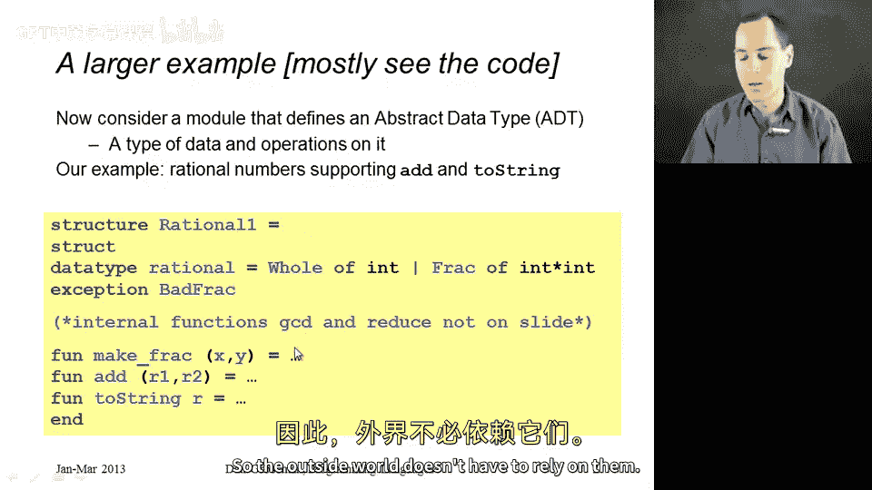
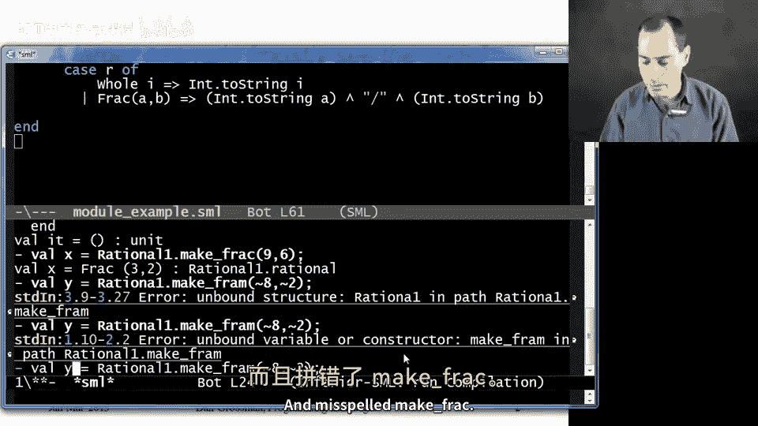
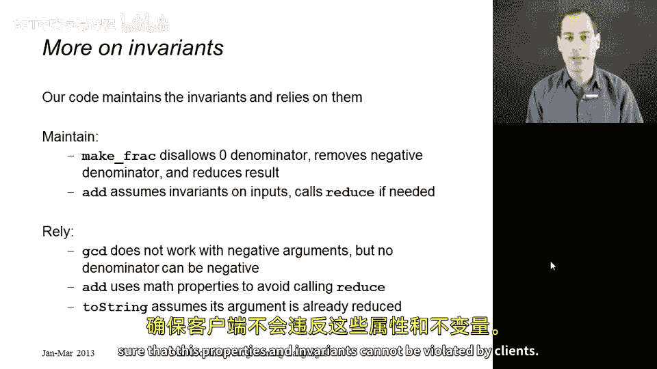

# 【编程语言 A⧸B⧸C CSE341 Coursera】华盛顿大学—中英字幕 p88 87_10_a-module-example -BV1bw4m1D7MM_p88-

This segment is going to introduce an example that we are going to use for the rest of our study of module systems so we'll get very used to it and it's worth going through the code before we get started。

 the example is going to implement an abstract data type it's just a module that exports some new type of data and some operations on it and for a simple example that doesn't take too long to implement I have a little library for rational numbers So these are numbers that can have a numerator and a denominator were both the numerator and the denominator are integers and the operations I'm going to support are making these things these fractions if you will。

 adding two of them together and then converting them to a string So for example you know if you had the number three halves it would print out a three slash2 when you convert it to a string So I'll show you the code in just a second let me give you a high levelve picture of it I'm going have a structure named rational one because in later segments I'm going to define rational2 and rational three I'm going have a little data type。

For my rational numbers that has either the constructor hole for whole numbers carries one int or frac for fractions that carries two ins I have an exception bad frac in case someone tries to make a fraction with a denominator of zero because I want those to be undefined and to raise an exception I have a function make frac that takes in aummerator and a denominator and returns a rational add for adding two rationals and two string for taking a rational and returning a string。

 Now the implementation of my module is going to have local helper functions that I'll show you what those do in just a second。

 and in the next segment when we give this structure a signature。

 it will not surprise you that we will choose to hide those so that the outside world doesn't have to rely on them。

So next let's go over and show you the code。 So here it is。

 it has the data type definition just like I promised you and the exception just like I promised you。

 And as we're going to talk about more in a minute。

 the implementation of this module is going to keep a couple in variance because it's going to promise a few things but I didn't tell you yet about this module that I'm going to make sure that we always return strings that are in reduced form so we would never return the string 9 slash6 we would instead return three slash2 and we wouldn't return the string 8 slash2。

 we would return the string4 So we're going to do that。By having a couple helper functions。

 the key helper function is this one reduce， reduce takes in a rational and returns a rational。

 And what it does is it returns something in reduced form。 So if it starts with a whole number。

 just return the whole number， those are always reduced， Otherwise if it's a fraction of it x and Y。

 if x is0， the numerator is0。 then the whole thing is0。0 over anything should be0。

 remember we're not going to allow zero denominators。

 Otherwise it turns out what we need to do is can compute the greatest common divisor of x and y。

 but my GCD function assumes that x and y are positive。 So I'm going take the absolute value of x。

 my denominators will always be positive。 That's another invariant that this module is going to enforce。

 then if D， the greatest common divisor divides y， then we should be a whole number。 x div d。

 Otherwise we should be the fraction x div d Y div D。

 and I will leave it to you to either trust me or check。

Me on the arithmetic that this does reduce a fraction to reduced form。

 As long as GCD is implemented correctly。 I had that right up here。

 This is another algorithm that I will not convince you is correct。 But if x and y are greater than0。

 This will do the right thing。 And believe it or not。

 this is a recursive algorithm that is over 2000 years old。 It goes back to ancient Greece。

 I believe， And so humankind is fairly convinced that this algorithm is correct。

 So that's kind of neat。 These are just helper functions。 Now。

 let's talk about the functions that our clients are going to use。 I have make frac。

 which is going to take in and x and a Y。 If y is 0。

 you're trying to grade a fraction with a0 denominator， I'll raise an exception。 if y is less than 0。

 I don't want negative denominators。 That's one of the invariance， this module is going to maintain。

 So instead， I'm going to return the fraction， negative x negative Y。

 So that's going to make Y positive。😊，And X will have the opposite sign of whatever it did when it was passed in。

 And then I need to reduce that because maybe you call make frack with 9 and 6 or 9 and negative 6。

 And then I want to return negative3 over 2 otherwise， Y is positive。

 So we'll just reduce the fraction X and Y。 So now we've created fractions that are in reduced form。

 If we want to add the two together。 We're going to assume they're in reduced form and make sure the result is in reduced form。

This is a great example for nested pattern matching。 If you have two whole numbers。

 return the whole number。 that's the sum of those two numbers。

 If you have a whole number and a fraction。 it turns out if that fraction is already in reduced form。

 then so will be the result of adding a whole number so we can just return j plus K times I over K。

 if you have two fractions then we can compute a new fraction is a times d plus B times C over B times D but then we need to reduce the result。

 And again， this is primary school arithmetic， but I know I am always a little forgetful on these things。

 it's okay if the exact arithmetic is a little surprising to you。

 it's not really the point of studying module systems and then finally we have this thing that prints out the string Now this is very interesting because we keep all our rationals in reduced form we can just go ahead and print it So if it's a whole number just convert it to a string excuse me we're not actually printing here。

 we're just converting to strings， but then the repel prints out our results So that's why I keep say printing and if you。

Of a fraction， then just convert a to a string， concatenate that with a slash and convert B to a string。

 So let me show you an example of using all this。And then we'll talk a little bit more about the structure of our module。

 so there we go I've defined my whole module， and now I could say Val X equals rational 1 do make frac。

 how about9 comma 6。All right， and how about v y equals rational 1 do make frac of how about negative8 and negative 2？

And I'm just misspelled rational one in here。And misspelled makeFrac。

Okay， there we go。 Now I could say rational 1 dot add of x and y。

And I could just immediately have about rational 1。2 string。Of that。And I get 11 over 2， which is。

 in fact，3 halves plus 4， which is the reduced form of 9 over 6 and negative8 over negative2。

 So this is how I would use the module as a clamant。

So that's the idea we see the structure here we define our data type our exception and these public functions make FRArack add in two string Now I want to talk more about how abstract data types are typically implemented with modules and I want to focus on the specification of the library in terms of properties and how it's implemented in terms of invariance。

So what I'm calling properties are externally visible guarantees。

 things that the library writer is promising any clients of the library。😡。

Some of the things that this module that I just showed you is promising are the following。

We will disallow any denominators of0。 If you go to make such a fraction， we will raise an exception。

 You will never see a rationalal with a denominator of 0。

That all the strings we return are in reduced form while we see4， not4 over1， and3 slash 2。

 not9 slash6。And that except for disallowing denominators of0， anytime you call function。

 it will terminate， it won't raise an exception。 It always produces the correct answer。

 So there are additional properties。 This is not a full specification。

 but these are particular things I want to emphasize that I'm going to say our library must do。

 even though it's not in the types of the functions we're providing like add and two string。

Now that's all the outside world should care about。Internally。

 our implementation is maintaining some important invariance。

 and what this means is that all of the functions are going to have to guarantee these extra things or other functions might do the wrong thing。

 Now， the outside world should not care about this。 these are implementation details。

 but they're things that are across the module so that one function can rely on another function doing it correctly。

😡，So the first thing we're going to require is， in fact， that all denominators are positive。

 so the outside world can make a fraction with negative8 and negative2。

 but will return the fraction that doesn't have a negative denominator。

 Okay And so all of our functions can assume that。😊。

Second thing that's internal invariant is that all of the rational values are already reduced。

 so we never even create a9 over6。 We immediately create a three over two。

So let me emphasize that our functions are maintaining these invaris and relying on them in several places。

 so if you look back at the code， you'll see a number of things。

 so you see that make frack when we get started and we build a rational number。

 explicitly disallows a zero， it had a special case to remove a negative denominator。

 it immediately negated both the numerator and the denominator and it calledRuce on the result to make sure that we created a rational and reduced form。

Then our add function assumed that the two arguments were in reduced form。

 and it actually used that to avoid calling reduce in some cases where it did not need to。

But in other cases， to be careful and to make sure it preserved the invariance， it did call reduce。

We're relying on these invariants in several other places as well。

 the GCD function is not correct for negative arguments。

 and there are certain places where we call GCD with arguments that we only know our non- negativegative because all of our module is maintaining this invariant and similarly in two string。

 remember two string， we promise the outside world would always return things in reduced form。

 but two stringing didn't check for that and did not call reduce because it's relying on the invariant in the rest of the module。

So that's our example， and now what we want to do is use signatures to make sure that these properties and invariants cannot be violated by clients。

