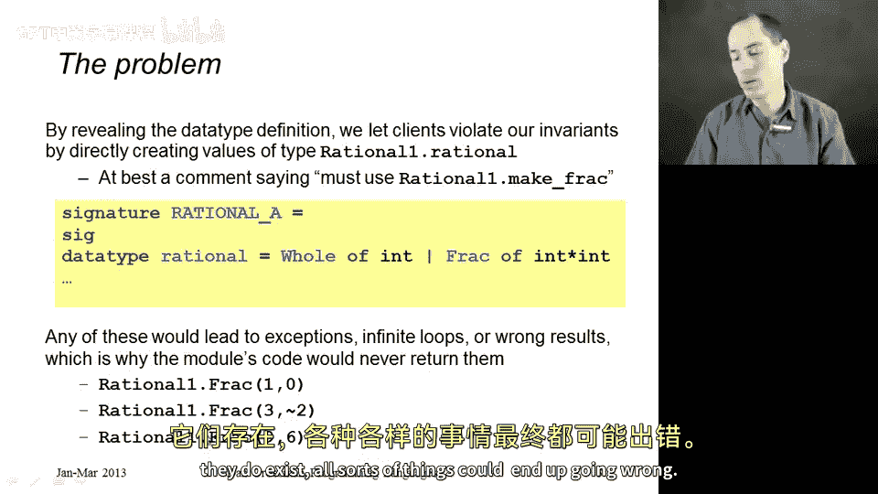
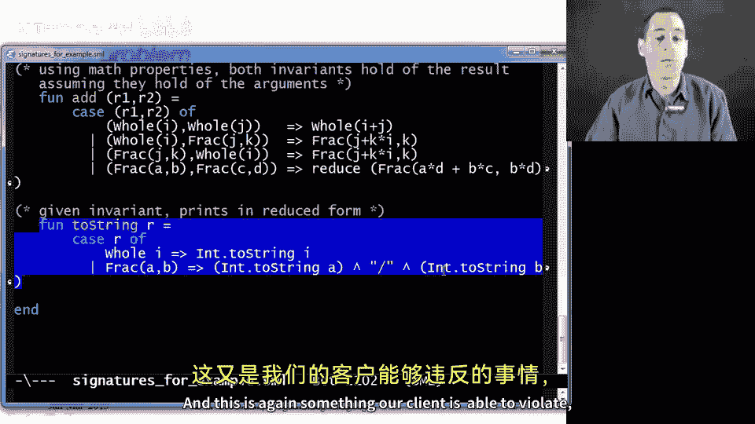
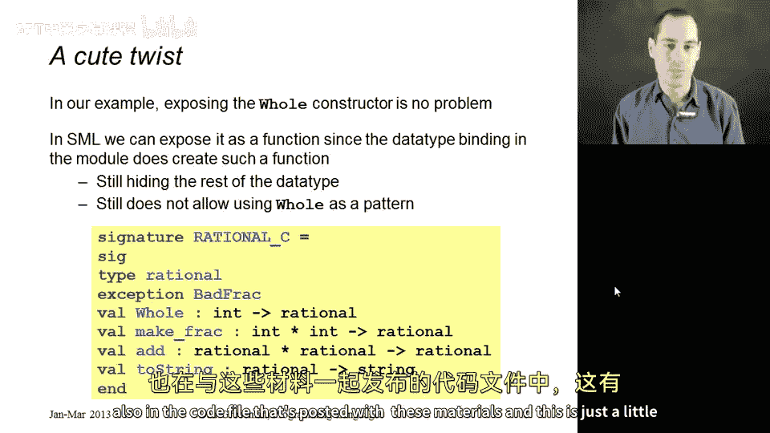
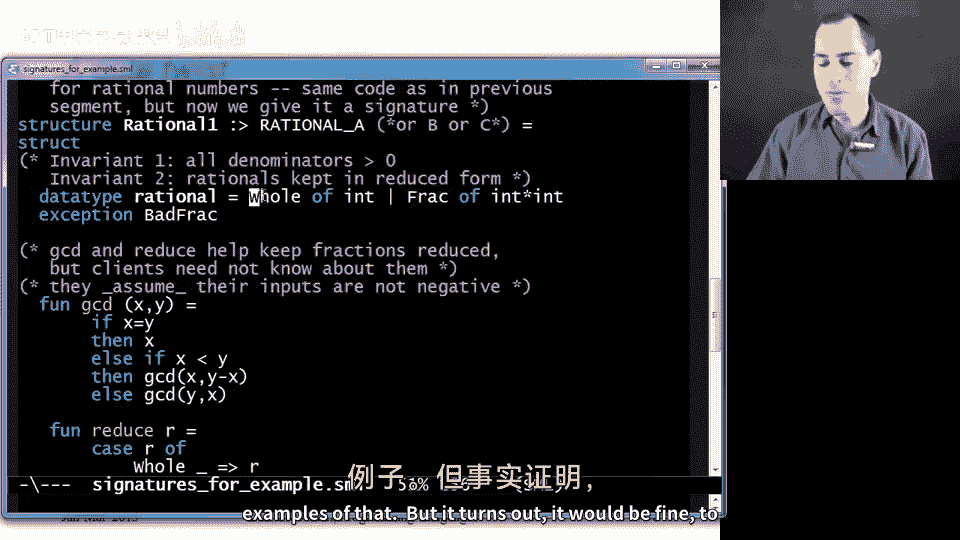
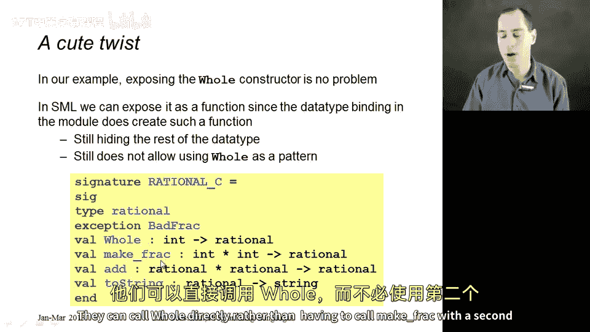

# 【编程语言 A⧸B⧸C CSE341 Coursera】华盛顿大学—中英字幕 p89 88_11_signatures-for-our-example -BV1bw4m1D7MM_p89-

It's now time to take our module example from the previous segment and figure out a good signature to give it。

 and I think this will be much more interesting than you might imagine。So from what we know so far。

 what would be natural is define a signature like you see on the slide that hides the two helper functions that we don't want the outside world to know about。

 so we'd make no mention of GCD and reduce， but the outside world does need to know there is a type rational that can be holes or fracs that there is an exception bad frac。

 there's a make frac that takes a numerator and a denominator and returns aration a takes two rationals。

 returns irration into string takes irration and returns a string and this signature is something we can give to our structure。

 it will type check， and then the outside world will not be able to use GCD or reduced directly。

So that's okay， it's not a bad start。😡，But it turns out we made a crucial error。

And that is that by revealing the data type definition。

 this first line here where we told the outside world how rational was implemented。

 clients can violate all of our invariants and they'll be able to use the library in the way that will not lead to the results and the behavior that we want。

Now we could include a comment or we could ask clients to please please promise not to build their own rationals to always call make Frac because make Frac checks for certain things and institutes our invariance when we get started。

 but I don't know about you， I have certainly found that when I put things in comments and documentation in my library。

 clients don't always follow those rules， and it would be much better if my language had a way to enforce those rules and it does。

 and I'll show that to you in just a second。 But first。

 let me emphasize what goes wrong here under this first signature rational A。

The key problem is the clients will be able to call the frac constructor directly。

 They could make a frac out of1 in 0 or3 a negative 2 or 9 and 6。

 And these are all forms of values that the functions in my library， assume do not exist。

 And once they do exist， all sorts of things can end up going wrong。

 So let me show some slightly different examples。 I've already included everything here。

 exactlyact as you've seen it。 So I have this structure。

 rational one that has the signature you see right here。

 Okay and now let me just write some things that work and some things that don't work。

 So suppose I wanted to add。

2 rationals。 And suppose first， I do this correctly。 And I call make frac。 So one comma 0 and。

Make frac。Of， say， two thirds。if I do this， I get the exception bad frack。

 which is the correct behavior， but if my client。Does not follow the rules。 It makes a frac directly。

Then it goes in an infinite loop， it turns out， and we could try to figure out why I think it's related to GCD。

 but we don't want to figure this out。 We want to keep clients from doing something like this。

 here's something else they might do if I just had negative denominator。

 I think I end up overflowing again， because the arithmetic just assumed in the module。

 there wouldn't be a negative denominator and if there is certain things are not behaving correctly and as a final even simpler example。

 remember one of the things we promise clients is that we would always print everything in reduced form。

 but if they just call to string with a frac directly。

 we're just going to get nine/lash6 because you may recall that our two string code。

 which you see here assumes its argument was already reduced and this is again something our client is able to violate。

Okay， so this is what we want to try to prevent。 And here's the intuition。The intuition。

Is that an ADT should hide the concrete representation of a type。That way。

 clients will never be able to make anything of the type without going through our functions like make Frack。

 That way we can get those invaris installed， and then our functions can keep them。

 So here's how you might think to do this。 Let's just take the signature we had before and take out the data type definition。

 Don't tell clients that it can be built from a whole constructor or a frac constructor。

 So this does not work here。 And the reason is that type checker sees these types rational and says I've never heard of such a thing。

 right It'll just give an error that says you you can' you can't just make up type names like that。

 I need to know there's a type rational。 otherwise， I think you just。

 you know how to  typepo All right， So that's good。 The type checker is helping us。

 somehow what we want to do is tell the type checker that for this signature， Yes。

 rational is a type。But no， I don't want clients to know anything more about it。

And that is an absolutely crucial idea， which is known as an abstract type。

 You can know the type exists， but you can't know its definition。So this is how we do this in ML。

 this is a feature provided by ML， which is in signatures。

 you can just write type and the name of a type， and if you have no equals and no more information。

 it means what I just said the type exists， but the outside world can't know what it is。

So here is a signature I like very much。 I'll call it rational B。

 and it tells clients what they can know about rationals。

 It says you can know there's a type rational。 you can know there's an exception bad f。

 You can know that make Frac returns a rational given to ins。

 add can take two rationals and return a rational to string can take a rational and return a string。

 And if we gave rational one， this signature。 We will still be able to try all the examples that use make frac correctly。

😊，But the outside world no longer knows there is a frac constructor， capital F， R。

 and so it won't be able to create any of those values that violate our invariance。

So this is a really big deal。There is nothing a client can do now to violate our invariance。

 We could take the structure we studied carefully in the previous segment and this signature and convince ourselves that all of our properties will always hold。

Here's the intuition of the argument。How are we going to make it rational？

The first rational a client ever makes has to be made with MakeFrac because this is all they have to create rationals。

 You can't call add until you already have a rational。

 you can't call it to string until you have a rational。

 so you're gonna to have to start with MakeFrac we could study the code for makeFrac and convince ourselves that it gets all the invariants and properties correctly。

 no zero denominator， no negative denominator fraction and reduced form。After that。

 the only thing you can do with rationals is add them together and convert them to strings。

 and we would similarly convince ourselves that those functions were implemented correctly。

Now to the outside world。It can do what it wants with the rational values， it can put them in lists。

 it can pass them to functions， it can put them in topples。

 but the only operations it can perform that access the pieces are those provided in our library。Now。

 the reason why our structure actually has this signature is because it does define everything。

 defines MakeFrack add into string and can have these types， and it does define a type rational。

 It doesn't with a data type binding that is a perfectly good way to define a type the outside world just doesn't know that it did it with a data type binding。

 and it certainly doesn't know the details of that data type binding。

 and this is how you use signatures with abstract types to properly enforce abstractions and implement abstract data types。

So。What we have now are two powerful ways to use a signature to hide things from clients。

The first one is the to die bindings exist that if you leave Val bindings， fund bindings。

 constructors and so on out of your signature， they simply don't exist to clients。

 But the second more sophisticated and more exciting way to hide things is to take a type definition。

Tell the outside world that yes， you have defined this type， but I'm not going to tell you how I did。

 And that's important so that we can say that make frac returns irrational。

 a takes too rationals and returns irrational without revealing what the rational actually is。

We'll see some other things that signatures can hide in one of the later segments on modules。

 But these are the two things I hope you'll always remember。Now， before we finish up this segment。

 I want to show you a third signature that's also in the code file that's posted with these materials。

 and this is just a little bit cute。

So it turns out that if you look at the data type binding for this module， which I have right here。

It was a problem for our invariance to export the frac constructor。

 and I showed you a bunch of examples of that， but it turns out it would be fine to export the whole constructor that our library doesn't mind any int past the hole。

 so you can't get in trouble that has to do with our particular properties and invariance。

 but it turns out you can convince yourself it would be okay if clients used whole directly。

Okay。So we actually can export it， and we can do it with this signature。

It turns out we could go ahead and tell clients that there is a function hole with a capital W of type intarrowrational。

And if you take this structure as we've already defined it and type check it against this signature。

 ML allows it。And that's kind of surprising perhaps。

 but the reason why is when it sees this data type binding。

 it remembers all the way back from when we first learn data types that this defines a number of things。

 it defines a type rational Yes， but also a function whole of type interrational f of instar int arational as well as whole and frac being allowed to be used in patterns Signs let us hide some things and reveal some things。

 and in this particular example， M will allow us to expose that there is a function whole of type inerration。

 there is a type rational， but still hide all the other things that the data type binding gave us。

 there's a bit of a peculiarity to M。 I don't think this is the most important feature in a language。

 but I do find it cute， and I find it that it emphasizes that signatures get to expose some things and hide other things and there's just a particular way we could let clients do a little bit more they can call。

Hold directly， rather than having to call make Frac with a second argument of int。

