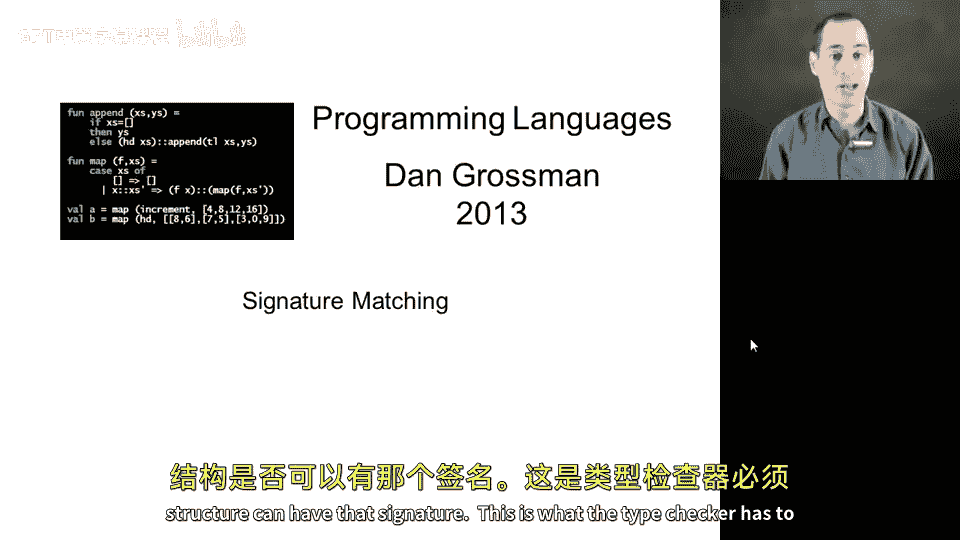
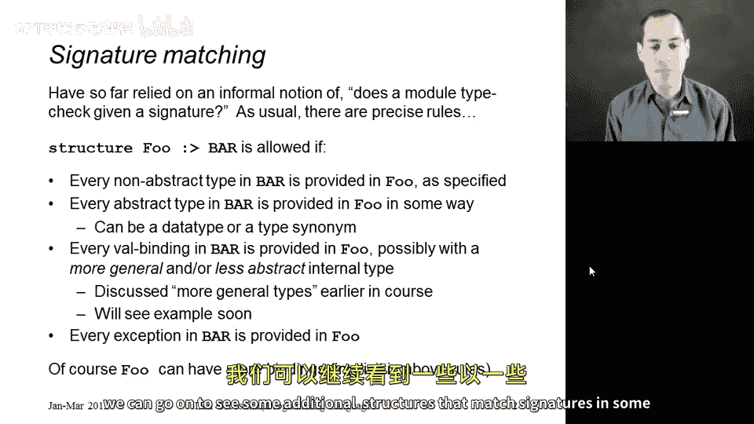

# 【编程语言 A⧸B⧸C CSE341 Coursera】华盛顿大学—中英字幕 p90 89_12_signature-matching -BV1bw4m1D7MM_p90-

At this point in our study of module systems， I just want to give a more precise definition of what is called signature matching。

 so we have a structure。 we have a signature。 We want to know if the structure can have that signature。

 This is what the type checker has to check and that's the process of signature matching。

 So as usual we had our informal notion of well， the structure has to have everything the signature says it has。

 but we can give it a more precise and elegant definition of exactly what the rules are。

 so I have the basic idea here on the slide， if you have some structure fo and you want to know if it has signature bar。

 you go through everything in bar and make sure that foo provides it in an appropriate way。

 So let's go through the various possibilities。

If in the signature bar， there's a full type definition， not just an abstract type。

 but maybe say a data type binding or a type synonym。

 well then the module better provide that data type binding。

 it better have all of those constructors。On the other hand。

 if the signature bar just has an abstract type like we built up to in the previous segment。

 something like T rational， then all we have to check is that indeed the structure fo defines such a type。

It could define it with a type synym。 It could define it with a data type binding。

 We've seen a data type binding。 I'll show you a types synonym in a couple segments。Now。

 if barr has a valve binding。😡，Then the structure better provide that valve binding。

 It could do it with a valve binding。 It could do it with a function binding。 That doesn't matter。

 It does have to provide it， and it has to have something of the appropriate type。 Now。

 this is the interesting part。 Okay， so the type that that binding has inside the module does not have to be the same as the type it has outside the module。

 It has to be related。Now， inside the module， it could have a more general type back in section 2。

 we actually studied the idea of one type being more general than another。 For example。

 inside the module， it could have type alpha arrow Al a arrow quote a。

 and in this signature we could say it has type string arrow string。

 Since string arrow string is less general than alpha arrow Al。 that would be okay。

 I'll show you an example soon where that's actually useful。Also。

The type in the module doesn't deal with abstract types。Okay， so inside the module。

 maybe we know that what irrational is or what some type synonym is。

 but out in the signature it might just be abstract。

And I'll show you an example of that as well in a future segment。

 So really what you have to do is take the type the signature claims。

 take the type that it has in the module based on type checking and type inference and see if the relation between those two types are okay。

 It does not have to be exactly the same type。 It just has to be something that is that it makes sense as a way to expose that at a possibly more restrictive type。

 tell clients less about how the function can be used。

 but everything you tell clients has to be true enough the clients can use it that way。

And then as the final details here， if an exception is declared in the signature bar。

 then food needs to declare that exception that makes sense。

 and these are really the rules Now the thing that's not in any of these bullet points。

Is that the structure fo can have bindings that aren't mentioned in bar at all。

 And we know that's true。 and that's actually implied by these bullets。

 All you do is you take everything that's in bar and you make sure food defines it appropriately。

 Whatever else fo happens to define is just fine。And that's our more precise definition of signature matching。

 and now we can go on to see some additional structures that match signatures in some interesting ways。

