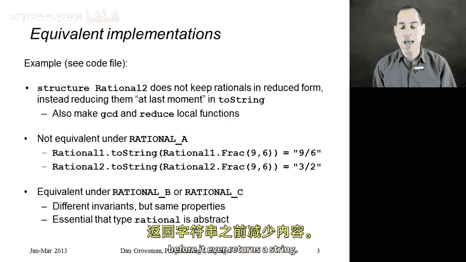
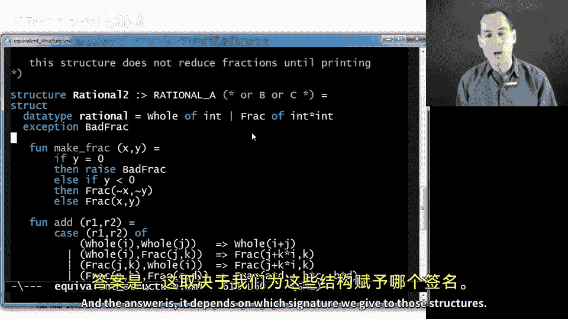
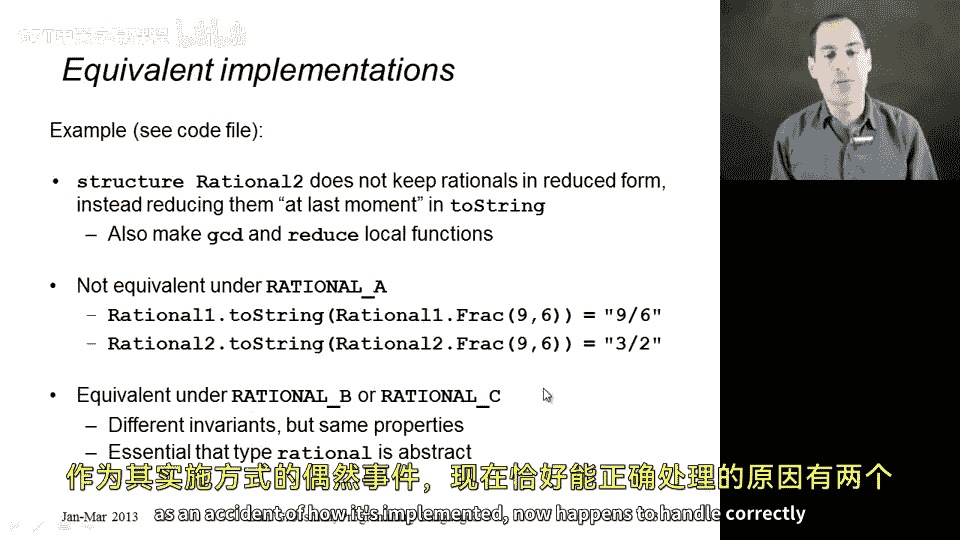

# 【编程语言 A⧸B⧸C CSE341 Coursera】华盛顿大学—中英字幕 p91 90_13_an-equivalent-structure -BV1bw4m1D7MM_p91-

I want to continue emphasizing the importance of abstractions。

 signatures and abstract types by now showing you other structures that have the same signatures as the ones we've seen already for our rational numbers。

So a key purpose of abstraction and of using signatures and abstract data types is to allow different implementations of some functionality to be equivalent。

What I mean by equivalent is no client will ever be able to tell which one you are using。

If you can guarantee via abstraction that clients can't tell。

 then you can take one implementation and replace it with another one。

 maybe that one has additional functionality that doesn't change the old functionality。

 maybe it's faster， maybe you just want to be able to delay your choice of which implementation to use until later。

 and have a guarantee that clients won't break when you make the change。This is easier to do。

 It is more likely that two structures are equivalent under a signature that reveals less compared to a signature that reveals more。

 So I'm going to show you two examples of that。 one in this segment， one in the next。

 the one in this segment is going to be a structure that like our rational one structure can have all three signatures we saw previously。

 It can have signature rational A， rational B or rational C。

And it will be equivalent to the previous structure under rational B or rational C。

 it won't be equivalent under rational A。So let me tell you how this is different。

 it's a fun example using rational numbers， I'll show you the code in just a second。

The idea is thatstruct rational2， compared tostruct rational one。

 does not keep rationals in reduced form。It goes ahead and lets the numerator and the denominator be something like9 and six。

 but then the two string function always reduces things before it ever returns a string。

Okay so let me show you the code Here it is。 Here is astruct rational 2。

 It's a lot like the structure rational one has the same data type binding， the same exception。

 make frac still raises an exception of y is 0， still make sure there's no zero denominator。

 but it doesn't reduce the fraction。 So if you call it with 4 and 2， it'll just return frac4 comma 2。

Similarly， add never reduces anything either。 You add two whole numbers。

 you get a whole number for any of the fraction cases， we just multiply appropriately， in particular。

 frack of A B and frack of Cd， we just return a times D plus B times C over B times D。

 not worrying that， for example， two thirds plus one third， we would just end up saying， I believe。

9 ninth。Okay。It's fine。 We'll deal with it later。 In particular。

 a two string is now the only function that's using GCD and reduce。

 So I've gone ahead and made GCD and reduce local helper functions up to string。

 And all to string does down here in the body of this lead expression is reduce its argument before it converts it to a string。

😊，And I would argue that under the properties of our specification。

 we're still doing everything correctly， we're not allowing denominators of zero。

 and when we return a string， it is always in reduced form。And this structure。

 which is different in its implementation than our earlier structure。

 can have all three signatures we've seen previously。 Here's our first signature。

 and it does provide all of these things at the correct type。Here is our second signature。

 it does provide all these things if it provides everything in rational A。

 it provides everything in rational B， all we've done now is made this type abstract。

 and in terms of rational C， which is like rational B。

 except that it has this function whole of type interrational。

 our structure does provide that because it has the same data type binding as our previous structure。

😡，So now let's think about if I had some program out there that was using rational one。

And I went and replaced， I went into that program， and I replaced all uses of rational one with rational2。

 could the program behave any differently？And the answer is it depends on which signature we give to those structures。

So if we give both structures the signature rational A。😡，Then clients might behave differently。

And this is because rational A， as we know， allows too much。

 It allows clients to use the frac constructor to build their own fractions directly。

So if you had some client out there， they called rational 1。2 stringing on rational 1。

 frac of 9 and6， by violating the abstraction， it would get9/lash6。

But if you replace all the rational ones with rational twos。

 you'll get three slash two because to string in our new structure reduces its argument。

So if you have two modules that give different answers to the same argument。

 they're not equivalent and you have to be much more careful about replacing one with the other。

But the fascinating thing is if you use rational B or rational C。

 there is no use of one module that leads to any different result than the same use of the other module。

And that basically follows from the fact that the type rational is abstract。

And given that the type is abstract， both modules enforce the same properties and given the same arguments always return the same result。

 So being able to replace one module with another one becomes easier when you expose less in particular when you make types abstract and now we've seen an example of that。

😡，As one final point， you might be wondering if under rational 2。

 it's okay to go ahead and expose the frac constructor since two stringing is going to reduce things to reduce form and the answer is no。

 this would still allow negative denominators or denominators of zero so rational 2 is also incorrect if you expose the frac constructor for most of the reasons that rational  one was。

 there's just a couple reasons that rational2 as an accident of how it's implemented now happens to handle correctly。

