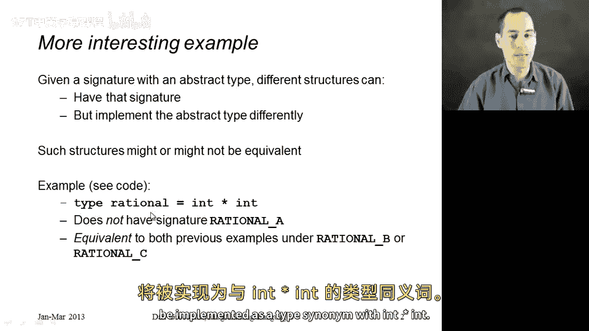
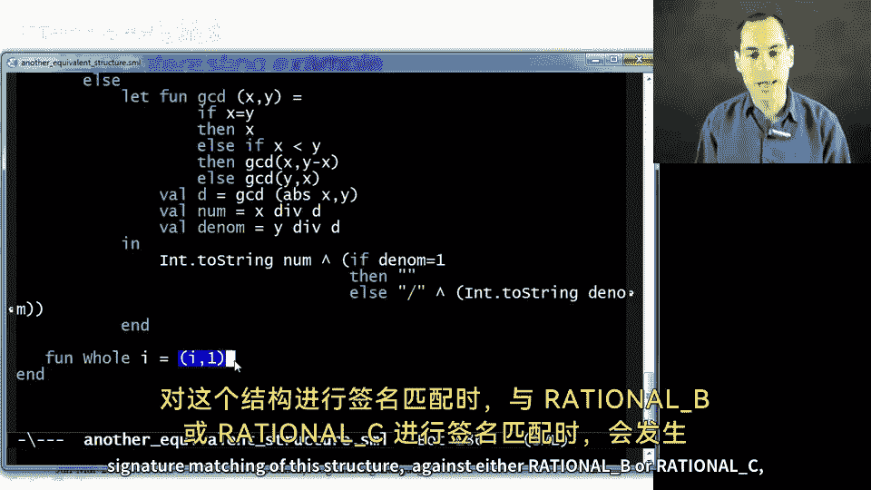
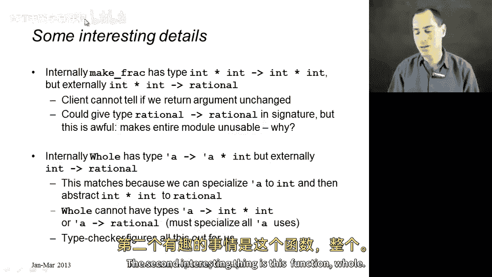
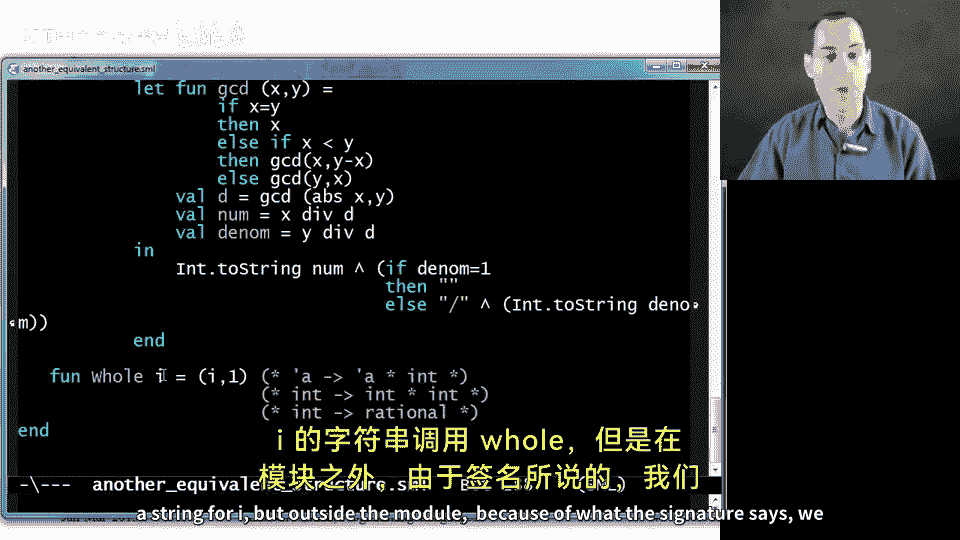
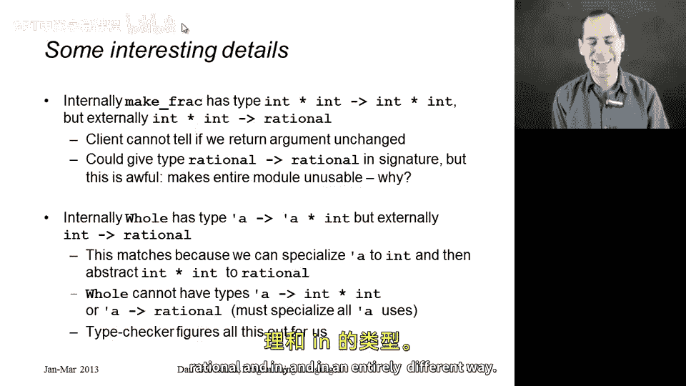

# 编程语言 A/B/C CSE341 Coursera：92：另一种等价结构

在本节中，我们将学习有理数的第三种实现方式。只要保持类型抽象，这种实现将与之前介绍的两种实现完全等价。我们将通过改变有理数类型的实现来强调一个观点：当类型是抽象的时候，等价的结构可以自由地改变类型的实现方式。

给定一个包含抽象类型的签名，不同的结构可以实现该签名，同时以不同的方式实现该类型。这些结构可能等价，也可能不等价。接下来，我将展示一个等价的例子，即第三种实现 `rational3`。在 `rational3` 中，有理数类型将实现为 `int * int` 的类型同义词。



让我们开始详细讲解。

## 结构定义与签名匹配

以下是 `rational3` 的结构定义。请注意，这里使用了类型同义词 `type rational = int * int`。这意味着在该模块内部，`rational` 和 `int * int` 是相同的类型。然而，外部世界无需知道这一点。

在展示具体函数之前，我们先回顾一下三种签名的要求。

*   **签名 rational A**：要求模块将 `rational` 实现为一个特定的数据类型。由于我们的 `rational3` 模块没有使用这种数据类型，如果尝试赋予它这个签名，类型检查器会拒绝。
*   **签名 rational B**：要求模块定义一个 `rational` 类型，并提供 `make_frac`、`add` 和 `to_string` 函数。我们的 `rational3` 符合这个签名，因为它将 `rational` 定义为 `int * int`，并提供了相应类型的函数。外部世界不会知道 `rational` 就是 `int * int`。
*   **签名 rational C**：除了包含 `rational B` 的所有内容外，还要求一个类型为 `int -> rational` 的函数 `whole`。我们将在最后展示如何实现它。

现在，让我们看看 `rational3` 是如何实现的，以及它如何能够拥有 `rational B` 签名。

## 核心函数实现

在 `rational3` 中，所有有理数都只是整数对。以下是关键函数的实现细节。

以下是具体函数的实现步骤：

1.  **`make_frac` 函数**：
    *   如果分母为 `0`，则引发异常。
    *   如果分母 `y` 小于 `0`，则返回 `(~x, ~y)`。
    *   否则，返回 `(x, y)`。
    *   注意：这里没有像之前那样特殊处理整数（即分母为 `1` 的情况），我们直接返回 `(x, 1)`。

2.  **`add` 函数**：
    *   该函数接收两个 `rational` 类型（即 `int * int`）的参数。
    *   我们使用模式匹配 `(a, b)` 和 `(c, d)` 来提取分子和分母。
    *   计算结果为 `(a*d + c*b, b*d)`。
    *   与 `rational2` 类似，我们选择暂不约分，等到 `to_string` 时再处理。

3.  **`to_string` 函数**：
    *   如果分子 `x` 为 `0`，则返回字符串 `"0"`。
    *   否则，需要利用最大公约数（GCD）进行约分。
    *   使用辅助函数 `gcd` 计算 `abs x` 和 `abs y` 的最大公约数。
    *   令约分后的分子 `num = x div gcd`，分母 `den = y div gcd`。
    *   返回的字符串格式为：`Int.toString(num)` 连接上（如果 `den=1` 则为空字符串，否则为 `"/" ^ Int.toString(den)`）。

综上所述，对于签名 `rational B`，我们提供了所有正确类型的绑定：`make_frac` 返回 `int * int`，`add` 接收两个 `int * int` 并返回 `int * int`，`to_string` 接收 `int * int` 并返回 `string`。外部世界并不知道 `rational` 就是 `int * int`。

## 实现扩展签名 rational C

如果我们希望 `rational3` 也能实现签名 `rational C`，我们还需要一个类型为 `int -> rational` 的函数 `whole`。

在之前使用数据类型的结构中，数据类型绑定本身隐式提供了这个构造函数。但在新的结构中，我们没有数据类型绑定，因此没有自动生成的函数。不过，我们仍然可以通过显式定义来实现这个签名。



以下是如何定义 `whole` 函数：

```sml
fun whole i = (i, 1) : rational
```
这个函数接收一个整数 `i`，并返回一个有理数 `(i, 1)`。它完全满足签名 `rational C` 的要求。

## 签名匹配的深入探讨



当我们将 `rational3` 结构与 `rational B` 或 `rational C` 签名进行匹配时，有几个有趣的点值得强调。

首先，关于 `make_frac` 的类型。在模块内部，它的类型是 `int * int -> int * int`。这可以匹配签名中声明的 `int * int -> rational` 类型，因为 `rational` 在模块内就是 `int * int`。客户端永远无法察觉我们返回的类型与参数类型在内部是相同的，因为客户端不知道它们是同一种类型。

一个有趣的现象是，我们理论上可以（但极其不明智地）在签名 `rational B` 中将 `make_frac` 的类型声明为 `rational -> rational`。类型检查器会接受这个签名匹配，但这样的结构将变得毫无用处。因为外部世界只知道这些绑定，却永远无法获得第一个 `rational` 来调用 `make_frac`、`add` 或 `to_string` 函数。这说明了存在一些能通过类型检查但毫无用处的程序。

其次，关于 `whole` 函数的类型推断与匹配。根据类型推断规则，我们定义的 `fun whole i = (i, 1)` 在模块内部会具有多态类型 `'a -> 'a * int`。然而，在签名 `rational C` 中，我们要求它的类型是 `int -> rational`。

类型检查器在签名匹配时，能够将多态类型实例化为一个具体的、灵活性较低的类型。它首先推断出 `'a` 可以是 `int`，因此该函数也可以具有 `int -> int * int` 这个类型。然后，由于模块内的 `rational` 就是 `int * int`，它就能像往常一样，将这个内部类型与签名中的 `int -> rational` 类型进行匹配。ML 语言能为我们完成这个匹配，这非常巧妙。

需要注意的是，`whole` 函数并不具有像 `'a -> int * int` 或 `int -> 'a * int` 这样的类型。当你将一个泛型（多态）类型变得不那么通用时，必须将所有类型变量一致地替换为另一个类型。在模块内部，我们实际上可以用字符串调用 `whole`（返回 `string * int`），但在模块外部，由于签名的限制，我们只能用它接收整数，因此它返回的将是一个 `rational`。



## 总结



本节课中，我们一起学习了有理数的第三种实现 `rational3`。其高层次的核心观点是：在 `rational B` 或 `rational C` 签名下，尽管 `rational3` 以完全不同的方式（使用类型同义词 `int * int`）实现了 `rational` 类型，但它与之前两种实现是等价的。这充分展示了抽象类型如何隐藏实现细节，允许不同的模块在满足相同接口的前提下，采用各自不同的内部数据表示方式。我们还深入探讨了签名匹配过程中关于类型推断和多态类型实例化的有趣细节。