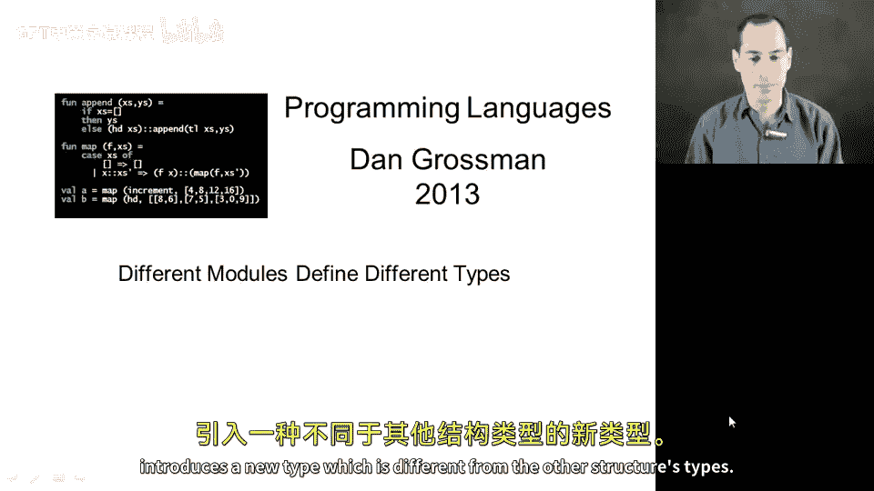
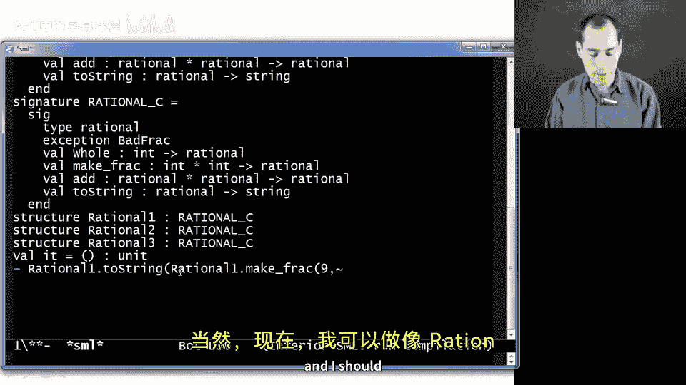
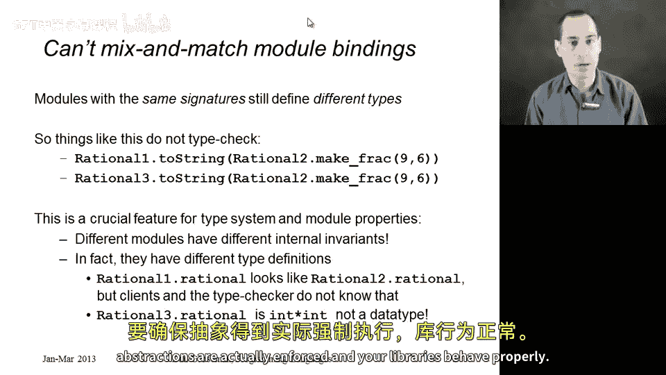

# 【编程语言 A⧸B⧸C CSE341 Coursera】华盛顿大学—中英字幕 p93 92_15_different-modules-define-different-types -BV1bw4m1D7MM_p93-

Let's finish our study of module systems in this segment by just avoiding one common misunderstanding about multiple structures with the same signature。

We've seen you can have multiple structures with the same signature that signature can have an abstract type。

 but each implementation of the signature introduces a new type。

 which is different from the other structures types。

 So let me show you what's going on here in the Reple。

 I've already loaded a file that defines all three signatures。

 So here's signature A then signature B than signature C。 and it defines all three structures。

 which I've already shown you。 and I made each of them specifically say that they provide signature rational C。

 So they all provide the same signature。 Now， of course。

 I can do something like rational  one do2 string rational one dot make f of9 comma negative6。

 and I should get back negative3 over2。 and I could use the other structures as well。

 Like here's maybe rational three which we。

Implements the fractions in a different way， but their equivalent structures。

 I always get the same result。What you cannot do is mix and match your modules。

 This is simply not going to type check。 You cannot take the result of rational ones make frac and pass it to rational3s2 string。

 After all， that better not type check， they're not even implemented the same way。

 This would be passing an instar int where we expect a data type。

But even if they were implemented the same way， like with rational 2 and rational  one。

 it still doesn't type check。 That is also a good thing。 If we allowed this。

 we would be breaking our abstractions。 I believe something like this。

 especially if I flipped it around and did it the other way。

Would not do what we want because we know that rational2 do make f doesn't reduce the fraction。

 and we know rational 1 do2 string doesn't reduce the fraction。 So if we allowed this。

 it would it would print out negative9 slash 6， which is not what is supposed to happen。

And the reason why this doesn't type check is entirely straightforward， if I look at rational 1。

2 string， it has type rational 1。 rational arrow string， whereas rational 2。2 string。

Has type rational two dot rational arrowero stringing。 They are not the same type。

 They are two abstract types。 We do not know if they are the same or different。

 They may be different。 They are not allowed to be confused with each other。

 and that's essential for enforcing our abstractions so。Moddules with the same signature。Can。

Both two modules can have the same signature， but they still define different types as a result。

 if you try to mix and match， things don't type check and that's good because each library expects the values it past to be from itself。

 not from some other library that can be enforcing different properties are different invaris。

 this is a crucial feature for your type system and in fact it's essential both for ML's type system to not allow confusing ins and strings as well as for making sure that abstractions are actually enforced and your libraries behave properly。

