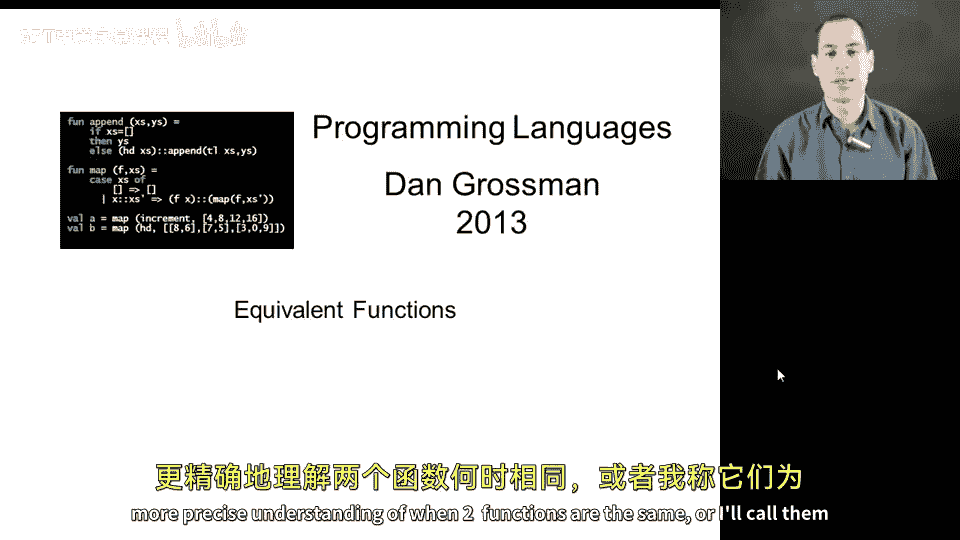
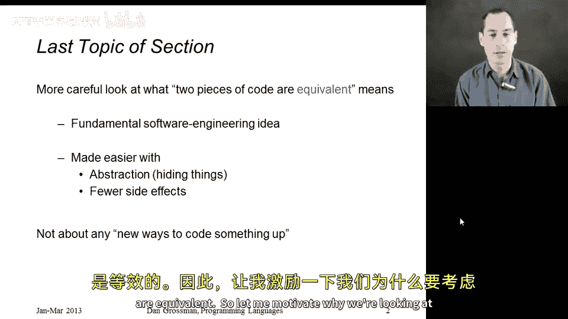
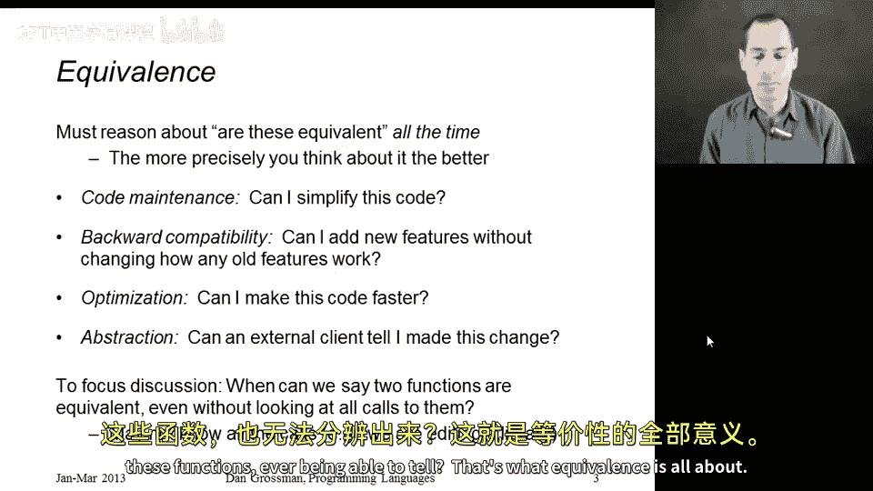
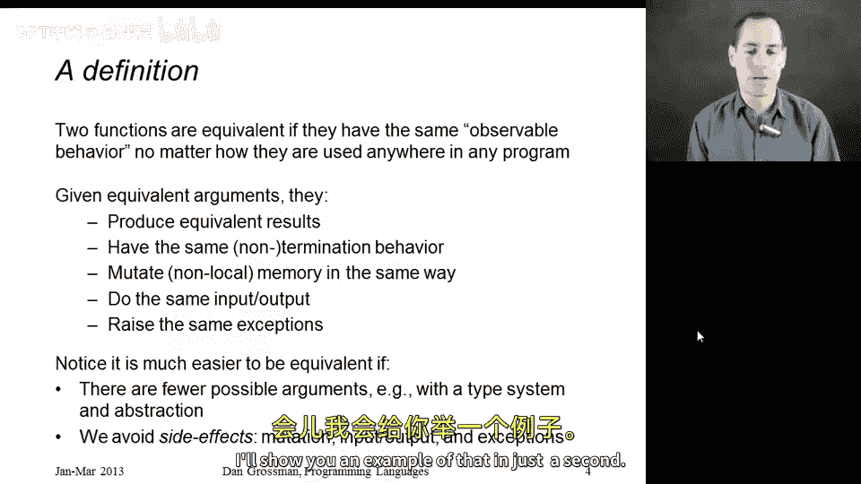
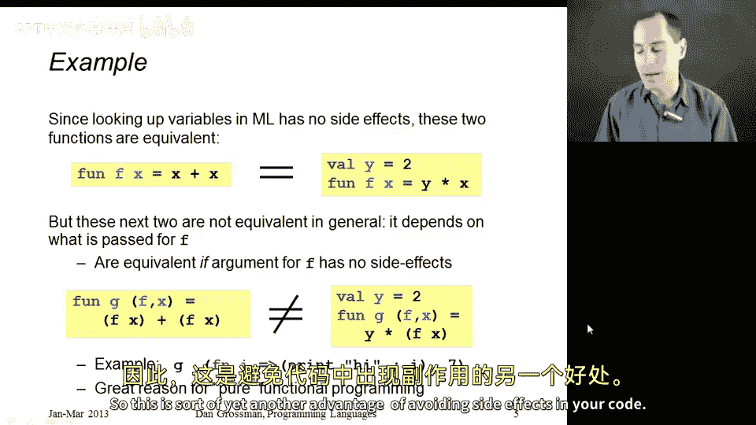
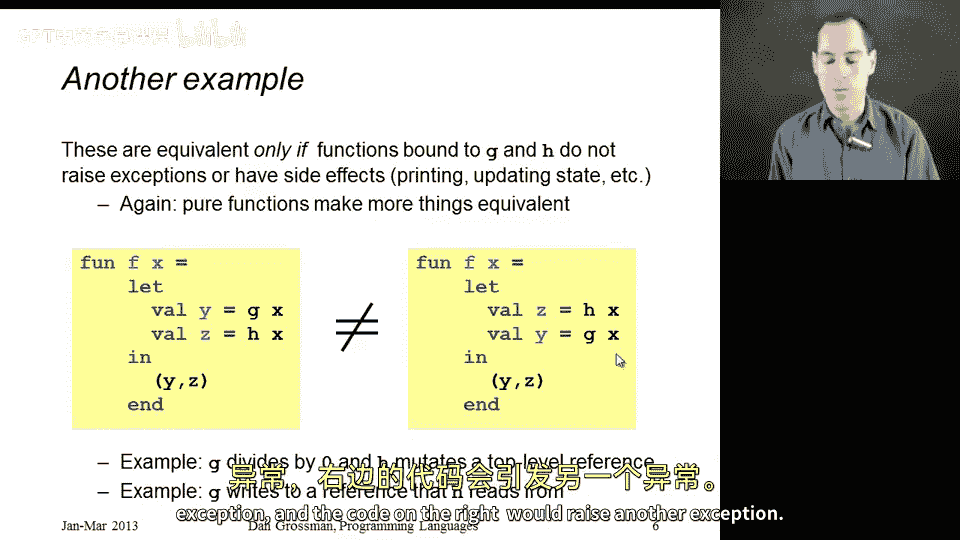

# 编程语言 A/B/C CSE341：94：函数等价性 🔄

在本节中，我们将探讨最后一个重要主题：如何更深入、更精确地理解两个函数何时是相同的，或者说它们是等价的。

仔细审视这个概念非常重要。本节不会介绍新的编码习惯、巧妙技巧或语言结构，但它是软件工程中的一个基本思想，值得重点关注。

我们将看到，如果你非常小心，并且知道两个事物等价意味着什么，那么你可以用一个函数替换另一个函数。我们还会发现，当你使用更多抽象、产生更少副作用时，函数更可能等价。如果你能假设其他计算不会执行诸如改变引用或打印输出等操作，那么更多事物将是等价的。

让我解释一下为什么要探讨这个主题。我相信开发者们在编程时总是在思考等价性。

当你维护代码并认为“我有一个更优雅的方式来表达这个”时，你实际上是在说表达相同或等价的事物。没有人能察觉到你进行了代码清理。

在考虑向后兼容性时，你也在思考这个问题：我能否在不改变软件对任何旧功能行为的情况下添加新功能？对于所有旧的可能性，它的行为仍然等价。

代码优化，无论是手动编写代码时还是实现语言时，都关乎等价性：我能否在不改变其在任何输入上行为的情况下加速这段代码？

最后，在研究模块系统时，我们也涉及了这一点：外部客户端能否察觉到我用另一个实现替换了这个实现？😊

现在，我们在这里要探讨的并不一定与模块或抽象类型相关。相反，我们将提出：这里有两个函数，对于所有可能的调用，它们是否等价？

例如，我可能正在实现一个库。😡 我不知道库的所有客户端。我可能将这段代码发布到互联网上供人们使用。我需要能够思考：我能否用另一个函数替换这个函数，而任何对这些函数的调用都无法察觉？这就是等价性的核心。

现在我们需要定义两个函数行为相同意味着什么。我会说，如果给定等价的参数，它们具有相同的可观察行为，即满足幻灯片上列出的所有要点。

显然，它们需要始终返回相同的答案。如果一个函数输入3返回7，另一个输入3返回8，这就不行。但这还不够。

它们还必须具有相同的非终止行为。如果一个函数在输入9时不终止，另一个也必须在输入9时不终止。同样，它们必须在所有相同的参数上终止。

它们对可变引用的任何影响（程序其他部分可见的）必须相同。如果一个函数将引用更新为与另一个函数不同的值，那么在调用完成后，程序中的其他代码可能能够察觉你替换了第一个函数。

它们必须具有相同的输入输出行为。我们不能让一个函数打印某些内容，而另一个不打印相同的内容。

它们必须引发相同的异常。我们不能让一个函数在某种情况下选择引发异常，而另一个函数不引发。

我可能还遗漏了一些内容，但这是一个相当全面的列表。

现在请注意，如果这些函数的用户不能使用太多参数，那么两个函数更容易等价。例如，如果你有一个强大的类型系统，它将确保这些函数只接受 `string * string` 作为参数，我们就不必考虑如果有人传递一个 `int` 会发生什么，因为不会有这样的调用触及它。

我们还将看到，如果我们的语言是函数式语言，产生副作用的方式更少，那么两个函数更容易等价。有时人们甚至假设你不会产生副作用，即使语言允许。我马上会给你展示一个例子。

好的，让我们用几个例子来结束这一部分，然后我们将继续讨论函数等价性的一些更普遍的概念。

在顶部这里，我有两个等价的函数 F。

左边的函数接受一个参数 `x`，返回 `x + x`。右边的函数接受一个参数 `x`，返回 `y * x`，这是在 `y` 绑定为 `2` 的环境中定义的。这两个函数总是将其参数加倍。它们没有其他副作用，总是终止，在任何方面都是等价的。使用左边函数的任何程序都无法察觉你是否将其替换为右边的函数，反之亦然。这是一个很好的例子。

这里有一个例子，你可能会惊讶地发现这两个函数并不等价。我们对假设不够小心。

左边的函数 `G` 接受一个函数 `F` 和一个参数 `x`，返回 `F(x) + F(x)`。右边的函数将 `F(x)` 乘以 `y`，而 `y` 绑定为 `2`。

假设 `F` 是一个在给定相同参数时总是返回相同结果的函数，那么它们将始终返回相同的答案。但左边的代码调用了 `F` 两次，而右边的代码只调用了一次 `F`。如果 `F` 可能有副作用，这就是一个问题。

假设它每次调用都递增一个引用。那么左边的代码将使该引用增加2，而右边的代码只增加1。一个更简单的例子是，如果 `F` 总是打印输出，比如像这里的这个函数：如果你传递这个函数作为 `F`，它会打印“hi”然后返回其参数。左边的代码会打印两次“hi”，右边的代码会打印一次“hi”。

因此，当你在函数式编程语言中时，我们通常有不做这类事情的函数。如果你假设这些事情不会发生，那么这些函数就是等价的。像 Haskell 这样的语言是一个很好的例子，它强制纯函数式编程的概念。语言中的大多数函数（那些你可以像这样传递给其他函数的函数）不能执行打印输出等操作。因此，在像 Haskell 这样的语言中，左边和右边的相应代码是等价的。所以，这可以说是避免代码中副作用的另一个优势。

让我们再看一个例子，这里有几行代码，实际上非常简单。

左边的函数 `F` 假设在我们的环境中有一些函数 `G` 和 `H`。它用 `x` 调用 `G`，用 `x` 调用 `H`，并返回结果对。

右边的代码完全相同，只是它以相反的顺序调用 `H` 和 `G`。因此，与前面的例子不同，这里没有调用次数的问题。两者都调用 `G` 一次，调用 `H` 一次。那么它们等价吗？

同样，如果 `G` 和 `H` 是纯函数，没有副作用，它们只是计算并返回结果，那么是的，它们是等价的。

但如果 `G` 和 `H` 可能有副作用，那么不一定等价。

假设 `G` 打印一些内容，`H` 也打印一些内容。那么左边的代码将按一种顺序打印这些输出，右边的代码将按相反的顺序打印。

这是另一个例子。假设 `G` 设置某个可变引用，而 `H` 读取同一个可变引用。那么在左边的代码中，`H` 将看到 `G` 写入后的新值；而在右边的代码中，`H` 将在 `G` 执行写入之前看到值，因为 `H` 在 `G` 之前执行。

因此，一旦你有了突变、副作用和打印，我们突然就需要担心执行顺序，不同的顺序会导致函数不等价。但如果我们坚持函数式风格，不编写有副作用的函数，那么我们就不必担心顺序，我们可以以任意顺序执行这些函数。

最后一个需要注意的地方是：如果 `G(x)` 和 `H(x)` 都引发异常，并且引发不同的异常，那么顺序可能再次变得重要。左边的代码会引发一个异常，而右边的代码会引发另一个异常。

在本节课中，我们一起学习了函数等价性的概念。我们了解到，判断两个函数是否等价，需要检查它们是否在相同输入下返回相同结果、具有相同的终止行为、对可变状态产生相同影响、具有相同的输入输出行为以及引发相同的异常。我们还看到，在函数式编程中，由于副作用更少，函数更容易被证明是等价的，这为代码优化、重构和维护提供了更大的灵活性。理解等价性有助于我们编写更可靠、更易于推理的代码。