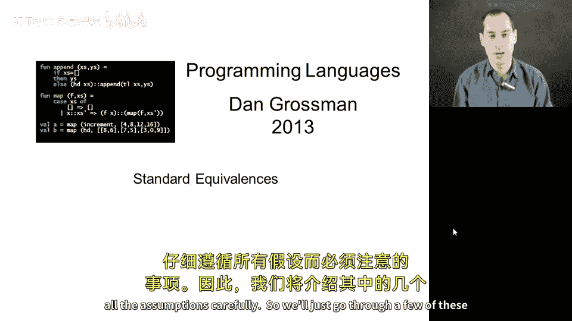
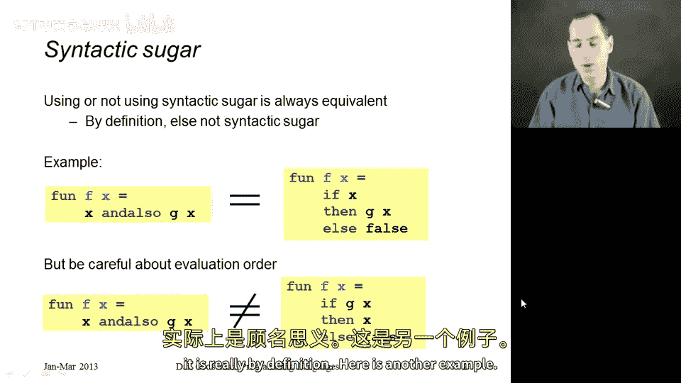
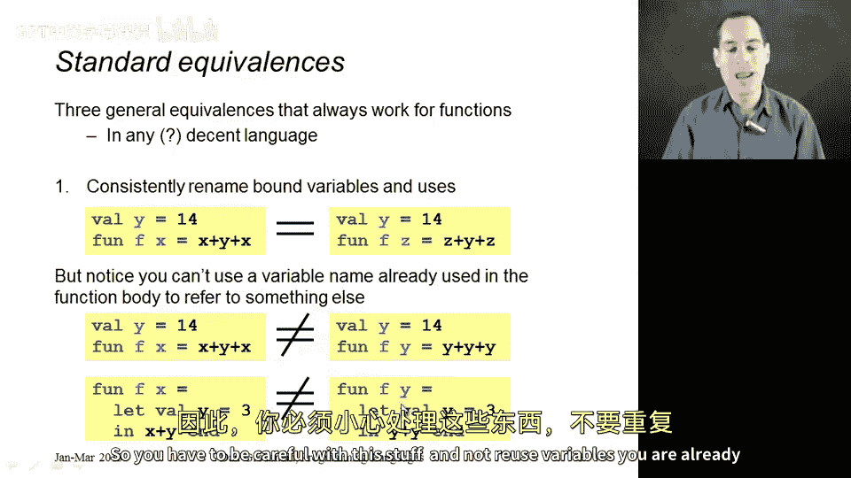
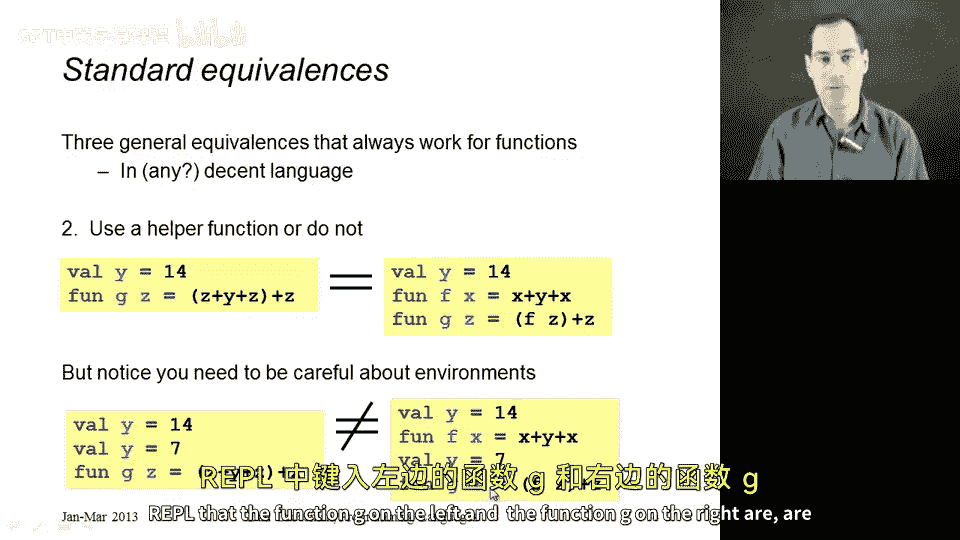
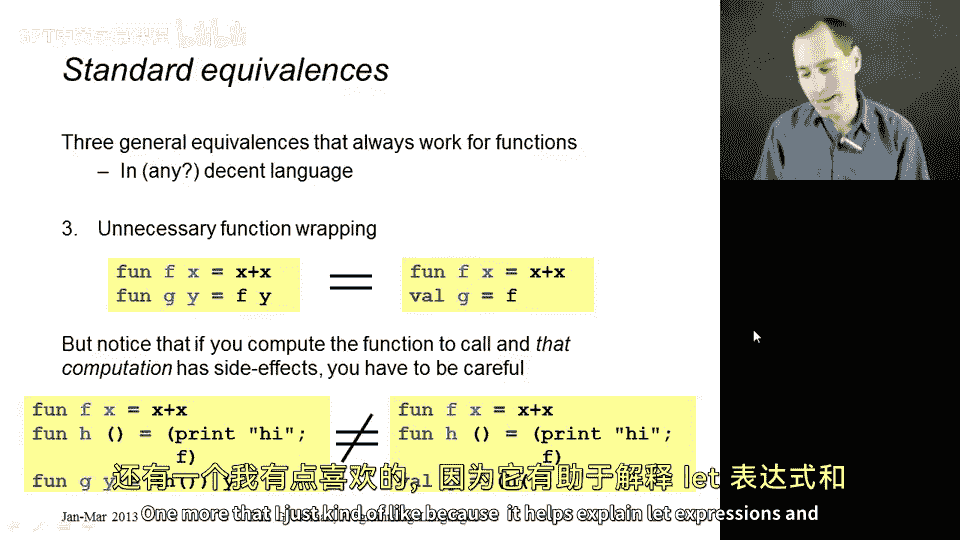
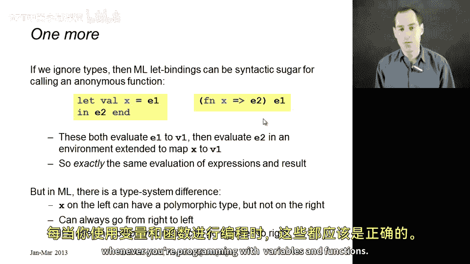

# 编程语言 A/B/C CSE341：第94章：标准等价性 🧩

在本节课中，我们将学习编程语言中一些广为人知的函数等价性。这些是编程语言设计者深入研究并充分理解的概念，涉及两个函数何时等价，以及在确保遵循所有假设时需要注意的事项。我们将通过几个例子来探讨这些等价性，并指出其中的微妙之处。

## 概述

本节将介绍几种常见的函数等价情况，包括语法糖的定义、变量重命名、辅助函数的使用、不必要的函数包装以及 `let` 表达式与函数的关系。我们将逐一分析这些情况，并指出在特定条件下可能出现的例外。

## 语法糖等价性 🍬



首先，我们来看语法糖的等价性。根据定义，如果某个结构是另一种结构的语法糖，那么它们总是等价的。例如，表达式 `E1 andalso E2` 是 `if E1 then E2 else false` 的语法糖。

以下是一个例子：左边的函数接受参数 `x` 并计算 `x andalso g x`（假设 `g` 已在环境中定义）。这个函数总是可以替换为右边的形式：`if x then g x else false`。

```ml
(* 左边：使用 andalso *)
fun f x = x andalso g x

(* 右边：使用 if-then-else *)
fun f x = if x then g x else false
```



虽然右边的写法风格不佳，但语言实现可能会这样做，以便只需实现 `if-then-else` 结构，而无需重复实现 `andalso` 的代码。反之亦然，如果你看到右边的形式，用左边的形式替换是更好的风格。

这里需要注意求值顺序。`andalso` 只有在先求值 `x`，且仅在 `x` 为 `false` 时才求值 `g x` 的情况下才是语法糖。因此，左边的代码与这里看到的右边版本并不等价，因为右边的版本总是调用 `g`，而左边的版本仅在 `x` 为 `false` 时才调用 `g`。这是我们的第一个例子，它实际上是基于定义的。

## 变量重命名 🔄

接下来，我们来看变量重命名的等价性。这是编程语言设计者深入理解并努力确保成立的三个等价性之一，通过正确处理变量等方式实现。其核心思想是，你应该能够重命名函数中的变量而不引起问题。

左边的代码接受参数 `x`，返回 `x + y + x`，即 `2*x + y`。右边的代码与左边完全相同，只是将函数参数名从 `x` 改为了 `z`，因此返回 `z + y + z`。我们确实希望这两者是等价的，因为语言不应该让调用者能够察觉到参数名的改变，比如你在清理别人的代码时决定换一个更好的变量名。

```ml
(* 左边：参数名为 x *)
fun f x = x + y + x

(* 右边：参数名重命名为 z *)
fun f z = z + y + z
```

然而，有时人们会粗心地认为可以将参数重命名为任何名称，并且总是有效。以下是两个微妙的错误情况，实际上不能这样做。

首先，假设我们取左边的代码（与上面相同），但将 `x` 替换为 `y`。如果天真地这样做，你会得到函数 `f` 接受参数 `y` 并返回 `y + y + y`。这不是同一个函数：右边的函数将其参数乘以3，而左边的函数返回其参数的两倍加上 `y`。

```ml
(* 错误示例：将参数重命名为已存在的变量名 *)
fun f x = x + y + x
(* 错误重命名为： *)
fun f y = y + y + y (* 这改变了函数含义！ *)
```

这里的错误在于，如果你将参数重命名为函数体中已用于引用外部变量的名称，就会引入之前不存在的变量遮蔽，导致函数不等价。

另一个相关的微妙之处是，也许 `y` 不是环境中已有的变量，而是一个局部定义的变量。例如，左边的函数定义了一个局部变量 `y` 为3，然后返回 `x + y`。我们知道这个函数只是返回其参数加3。右边的代码总是返回6，这显然不同。尽管我做的只是将每个 `x` 替换为 `y`，但这里的 `x + y` 中的 `x` 现在指向了被遮蔽的 `y`（即3），而不是参数。因此，你必须小心处理这类问题，不要重用已用于其他目的的变量名。

```ml
(* 左边：使用局部变量 y *)
fun g x =
    let val y = 3
    in x + y end



(* 错误重命名后： *)
fun g y =
    let val y = 3
    in y + y end (* 含义改变！ *)
```

## 辅助函数的使用 🛠️

现在，我们来看关于是否使用辅助函数的等价性。事实证明，你应该总是能够选择是否使用辅助函数，而调用者无法察觉。

左边的代码返回其参数的三倍加上14。右边的代码也总是返回其参数的三倍加上14，但它通过使用辅助函数 `f` 来实现。右边的代码调用 `f` 作为辅助函数，而左边的代码不使用 `f`。如果我将部分函数体移出并放入一个正确使用的辅助函数中，这应该无关紧要。

```ml
(* 左边：不使用辅助函数 *)
fun g x = 3*x + 14

(* 右边：使用辅助函数 *)
fun f z = z + z + z
fun g x = f x + 14
```

这一切都很好，但你必须小心，当你这样做时，所有变量仍然指向它们之前所指的内容。在这个稍有不同的例子中，左边的代码实际上返回其参数的三倍加上7，因为存在被遮蔽的 `y`。右边的代码使用了一个辅助函数 `f`，这个辅助函数 `f` 与上面的代码完全相同。但现在它的含义不同了，因为 `f` 中的 `y` 和 `g` 中的 `y` 不是同一个 `y`。因此，如果我将 `z + y + z` 替换为 `f z`，我最终会使用14，而本应使用7。你可以通过输入 REPL 来验证，左边的函数 `g` 和右边的函数 `g` 根本不相同。



```ml
(* 左边：y 被遮蔽为 7 *)
fun g x =
    let val y = 7
    in x + x + x + y end

(* 右边：尝试使用辅助函数，但 y 的引用出错 *)
fun f z = z + z + z
fun g x =
    let val y = 7
    in f x + y end (* 这里 f 中的 y 是外部环境的 y，不是 7 *)
```

## 不必要的函数包装 📦

最后，我们讨论不必要的函数包装。我们实际上已经多次提到过这一点，现在在讨论等价性时再次提及是很好的。

左边的函数 `g` 接受一个 `y` 并返回 `f y`。正如我已经强调过几次的，定义 `g` 的一个更简单的方法是直接说 `val g = f`。它们都是接受一个参数并返回 `f` 主体结果的函数，在这个例子中是使参数加倍。

```ml
(* 左边：不必要的包装 *)
fun g y = f y

(* 右边：直接绑定 *)
val g = f
```

这里的微妙之处在于需要小心。当被调用的函数只是一个变量时，这是没问题的。但如果相反，我们有一个需要求值才能得到函数的表达式，那么是否使用函数包装会影响我们执行某些操作的次数。如果你有副作用，比如打印或可变引用，这可能会产生影响。

让我展示两个不等价的例子。在左边，`f` 只是使其参数加倍。`h` 是一个零参数函数，接受 `unit`，当你调用它时，打印出“hi”，然后返回函数 `f`。所以这个函数 `g y`，每次你调用 `g`，它都会调用 `h`，打印“hi”，然后取结果并用 `y` 调用它。因此，函数 `g` 每次被调用时都会打印“hi”，然后使其参数加倍。

右边的代码以另一种方式定义 `g`，直接说 `val g = h ()`。这将做的是：我们会调用一次 `h`，打印“hi”，然后返回 `f`。因此，`val g` 绑定到 `f`，`g` 和 `f` 是同一个函数。所以右边的代码会在你调用 `g` 之前打印一次“hi”，并且再也不会打印。

让我再说一遍：右边的代码会打印一次“hi”，并且再也不会打印。它们都使参数加倍，左边的代码在你调用 `g` 之前根本不打印，但每次调用 `g` 时都会打印。因此，如果 `h` 可能有这样的副作用，它就会产生影响，它们不相同。

```ml
(* 左边：每次调用都打印 *)
fun f x = x * 2
fun h () = (print "hi"; f)
fun g y = (h ()) y



(* 右边：只打印一次 *)
fun f x = x * 2
fun h () = (print "hi"; f)
val g = h ()
```

## `let` 表达式与函数的关系 🔗

最后一个例子，我有点喜欢它，因为它有助于解释 `let` 表达式和函数。我们之前也提到过一次，但现在讨论等价性时重复一下是很好的。

我声称左边的代码和右边的代码总是会做同样的事情。原因如下：左边的代码按以下方式求值：将 `e1` 求值为一个值，扩展环境使 `x` 映射到该值，然后求值 `e2`，这就是你的答案。

右边的代码呢？嗯，这已经是一个值在左边，所以将 `e1` 求值为一个值。然后在 `x` 绑定到 `e1` 结果的环境中求值 `e2`，这就是我们整个的答案。左边和右边执行完全相同的步骤序列。它们都先求值 `e1`，然后在相同的扩展环境中求值 `e2`，然后返回 `e2` 的结果。所以它们不可能不等价。

你确实可以认为这些是相同的表达式，就好像其中一个是另一个的语法糖。在 ML 中，有一个类型系统差异，即左边的代码可以给出多态类型，右边的代码永远不会给出多态类型。因此，有些程序左边的版本类型检查通过，而右边的版本不通过。但这是 ML 类型系统的一个细节，对于任何确实都通过类型检查的表达式，它们是等价的，并且总是产生相同的结果。

```ml
(* 左边：let 表达式 *)
let val x = e1
in e2 end

(* 右边：立即执行的匿名函数 *)
(fn x => e2) e1
```

## 总结



在本节课中，我们一起学习了五种常见情况下函数等价性的例子，以及一些需要考虑变量遮蔽或副作用等微妙之处的场景。如果你理解了这些微妙的区别，那么你应该在非常基础的层面上理解了变量的作用和函数的含义。这些概念并非 ML 语言特有，而是在任何使用变量和函数进行编程时都应该成立的原理。掌握这些等价性有助于编写更清晰、更可靠的代码，并深入理解编程语言的设计。