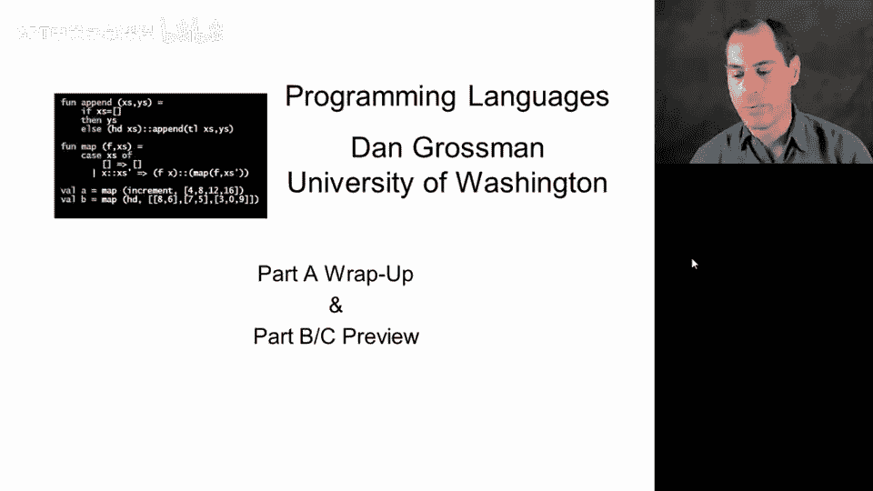
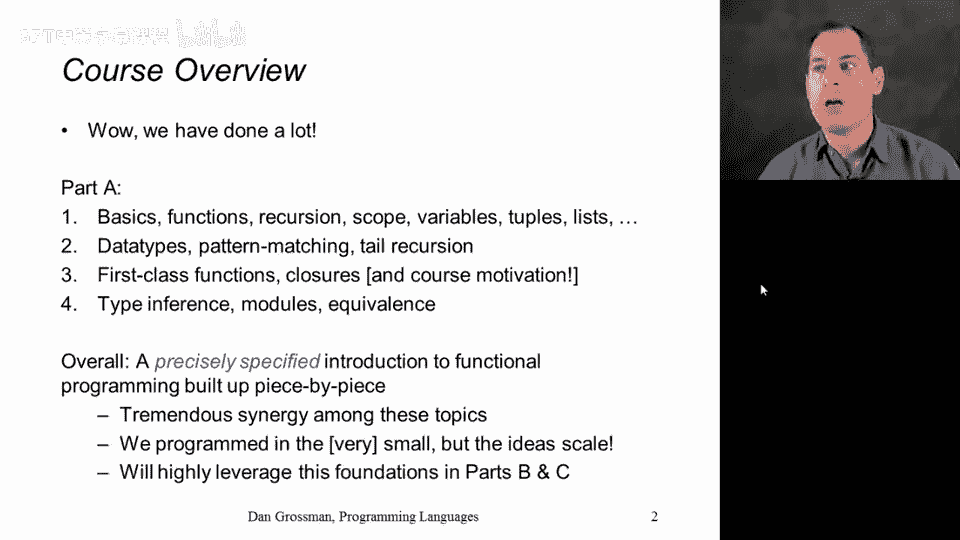
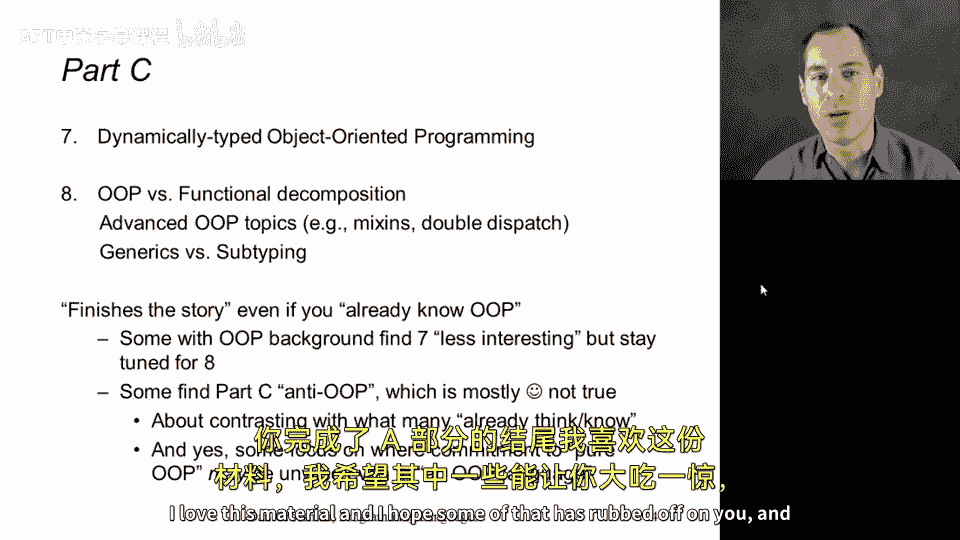

# 【编程语言 A⧸B⧸C CSE341 Coursera】华盛顿大学—中英字幕 p97 96_01_part-a-wrap-up-parts-b-c-preview -BV1bw4m1D7MM_p97-

All right， we've reached the end of Part A of the programming languagengus course。

 so I just wanted to congratulate you for reaching this point。

 briefly wrap up and review what we've done， and then explain how it fits together with the exciting content coming up in Part B and Part C。

So we absolutely have done a lot， and I'm sure you've worked very hard to get to this point。

 If you divide things down into the four sections that we had of real content that you can think of the first one as really setting the foundations of basics。

 functions， recursion， the idea of each language construct having a syntax。

 evaluation semantics and type checking rules。 The second section was primarily focused on data type definitions and pattern matching。

 we also saw the importance of tail recursion in that section。

 The third section was all about firstclass functions and closures。

 and that gave us the context we needed to take a step back and explain the course's motivation and why we're approaching this programming languages material the way that we are。

 and then finally we've just finished up a section that did type inference so that it didn't seem magical and so that we could separate out the idea of whether you write down types or not from whether your language has type checking rules。

And then we studied modules and more generally the notion of two implementations of an idea being equivalent as far as clients can tell。

And if you put all that together as we have， what you end up with is a precisely specified introduction to functional programming that is about taking a lot of individual pieces。

 whether it's a case expression or a signature or the idea of tail recursion and together gives you tremendous synergy。

 a lot of small individual features of programming languages that do one thing and do it well。

 that combine to let us quite do quite a bit of programming。Now in a course like this。

 we don't do any large projects we primarily program in the small。

 but I hope you'll take my word for it that these ideas。

 whether they're conceptual ideas like not mutating data or specific ideas like organizing your code in terms of different patterns that are part of a pattern match。

 really do scale and let us build robust， elegant software in a surprisingly enjoyable way。

I also think that as we move forward into parts B and C of the course。

 which I certainly hope you will join， that you'll be able to see us use all of the stuff we've learned here over and over again。

 and that we'll be leveraging it to not just repeat the same information in a couple other programming languages。

 but to build on it and complement it and use the ideas of high order functions of pattern matching。

 of data types in everything we still have left to study。

So in order to encourage you to go on to Part B， which I hope you do let me briefly review what it's going to do now that we've seen part A。

 it has two main sections so there's only two homework assignments， however。

 the second one is usually the assignment that people find most challenging and rewarding we're going to use racket in this portion of the course and the first thing we can do is see a lot of the ideas that we saw in ML redone in a dynamically typed language so the syntax will be very different。

 but syntax is just syntax。 the big difference is we won't have a type system。

 we won't have types guiding the functions that we're writing down。

 but we'll see a lot of the same things nonetheless and we're not just going to redo everything that wouldn't be particularly interesting we're also going to focus on idioms that delay evaluation basically learning the importance of using functions that take zero arguments and how that can be a really powerful programming idiom even though you're not passing any data to the colee。

Actually， material that we pretty much could have done in ML。

 but I want to switch to a dynamically typed language to give us more experience there。

And then in the second section of Part B， we're going to do two topics。

 the first is what the homework assignment is all about in that section。

 which is implementing your own small programming language。

 learning what it means to implement a language， how to write something called an interpreter and in fact how to implement a language that itself has higher order functions and closures。

 so itll really help reinforce the higher order programming that we did here in Part A by having you implement your own language inside of the rackqueet language to provide closures to users of your language。

We'll also study static versus dynamic typing， this is one of the main design criteria considered in programming languages。

 there's a lot of opinions， there's also some good foundational facts about the advantages and disadvantages of static typing that we can study after we have experience using both kinds of languages。

And then when we go on to part C， remember that's when we'll switch over to objectoriented programming and we'll do that also in a dynamically typed language。

 we will first see kind of the basics of Ruby and the basics of objectoriented programming。

 And even if you've done OOP before， I think doing so in a language like Ruby that's sort of purely objectoriented in its format is a great way to reinforce what you already know about OOP and in fact。

 to be able to contrast it and complement it with our study of functional program that we would have done up to that point。

 and then we'll do that even more explicitly in the last section of the course where we'll get into some more advanced OOP concepts and study generics versus subtyping and then in part C of the course。

 we'll have two more assignments again， the first one is kind of simpler and the second one is more challenging and then we'll have like we did at the end of part A an exam that's synthesizes and brings everything together。

 So I really hope you'll participate， you've already done a lot of the work you'll be able to。😊。

Gin a lot more you know you made a huge investment in Part A and I think there's a lot more coming in part B and C。

 so I really think of this as kind of the midpoint， kind of the halfway point of our study。

 maybe a little less， maybe a little more depending on how long and challenging you found Part A and I hope you'll continue with me by signing up for programming languages Part B so that we can learn more together。

Either way， congratulations on reaching the end of part A， I love this material。

 and I hope some of that is rubbed off on you， and that you've enjoyed the course to this point。😊。

