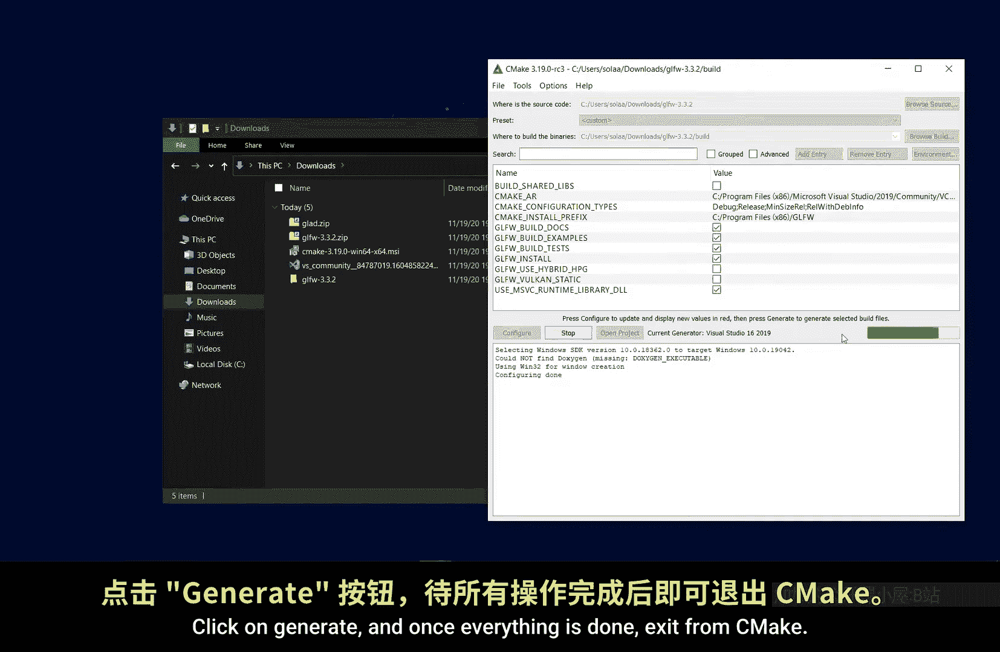

# 001：环境安装与配置 🛠️

在本节课中，我们将学习如何为OpenGL开发配置Visual Studio环境。这包括安装必要的工具、下载核心库以及正确设置项目结构。整个过程是后续所有OpenGL学习的基础。

本教程内容基于learnopengl.com，所有功劳归于Joey de Vries。

## 检查与安装必要软件

首先，你需要确保你的显卡驱动程序是最新版本，并且安装了最新版的Visual Studio。

接下来，请下载适用于Windows 64位系统的CMake安装程序，并完成安装。

## 下载核心库文件

现在，你需要下载GLFW的源代码包。

最后，你需要下载GLAD。请确保选择C/C++版本3.3核心（Core），忽略其他选项，然后点击生成（Generate）按钮。

点击生成的ZIP文件链接以下载它。

## 创建Visual Studio项目

完成CMake和Visual Studio的安装后，打开Visual Studio，点击“创建新项目”（Create a new project），为C++选择“空项目”（Empty Project）。

点击“下一步”（Next），为你的项目输入一个名称，确保复选框被勾选，并记住你将项目放置在哪个文件夹中。

打开你的项目文件夹，创建一个名为 `libraries` 的新文件夹。

## 组织项目库目录

现在，我们将在 `libraries` 文件夹内再创建两个文件夹，分别命名为 `lib` 和 `include`。

这里将是我们稍后导入所有库文件的位置。

## 使用CMake配置GLFW

我们需要解压GLFW的ZIP文件。打开CMake，在CMake中选择我们刚刚解压的文件夹作为源文件夹（source folder）。

然后在源文件夹内创建一个名为 `Build` 的新文件夹，并将其选为构建文件夹（build folder）。

点击“配置”（Configure），在确保你的设置与我相同后，点击“完成”（Finish）。

再次确认你的配置与我相同，然后再次点击“配置”（Configure）。接着点击“生成”（Generate），一切完成后，退出CMake。

## 构建GLFW库

现在我们需要构建GLFW。打开你解压的文件夹，进入 `build` 文件夹，然后用Visual Studio打开 `GLFW.sln` 文件。

在解决方案资源管理器中右键点击解决方案，选择“生成解决方案”（Build Solution）。如果出现任何错误，很可能意味着你在构建过程中出现了问题，因此我们必须使用CMake重新生成GLFW，并再次执行此步骤。

一旦构建成功完成，退出Visual Studio。

## 导入库文件到项目

现在是时候将我们的库导入项目了。打开解压后的GLFW文件夹，进入 `build` -> `src` -> `Debug`，将 `glfw3.lib` 文件剪切并粘贴到你项目的 `libraries/lib` 文件夹中。

回到解压的GLFW文件夹，进入 `include` 目录。将 `GLFW` 文件夹剪切并粘贴到你项目的 `libraries/include` 文件夹中。

假设你正确遵循了上述步骤，现在可以删除解压的GLFW文件夹了。

打开GLAD的ZIP文件。打开其中的 `include` 文件夹，将里面的两个文件夹解压到你项目的 `libraries/include` 文件夹中。

然后返回上一级目录，打开 `src` 文件夹，将 `glad.c` 文件解压到你项目的主文件夹中。

现在我们将进行配置。

---

本节课中，我们一起学习了OpenGL开发环境的完整搭建流程。我们安装了CMake和Visual Studio，下载并配置了GLFW和GLAD这两个核心库，并建立了清晰的项目目录结构。正确的环境配置是开始编写OpenGL代码的第一步。