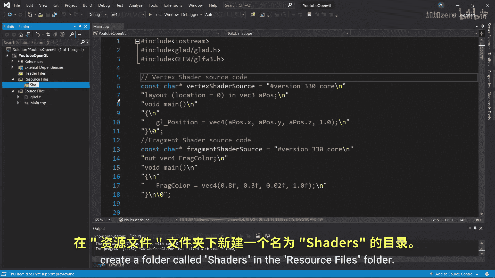
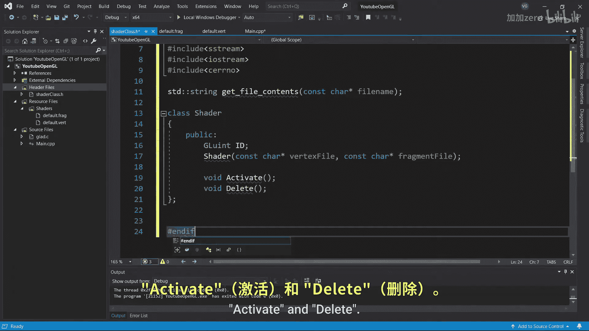
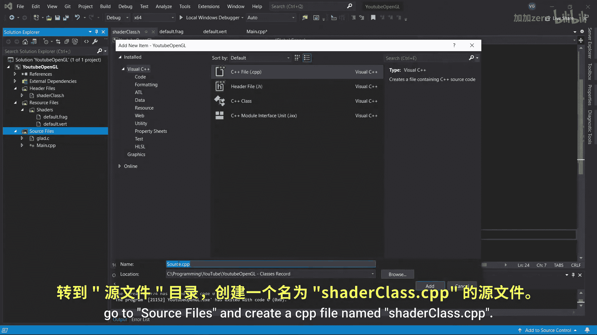
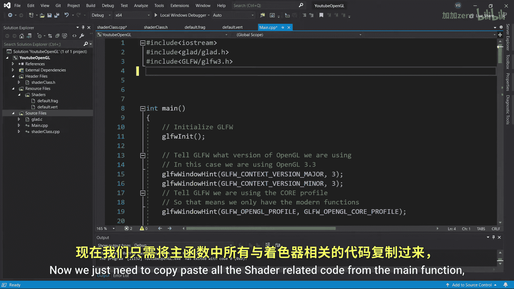
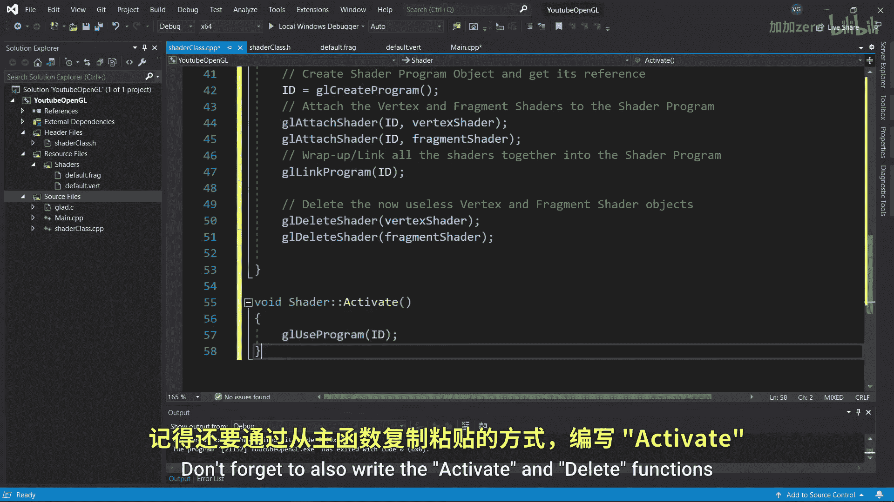
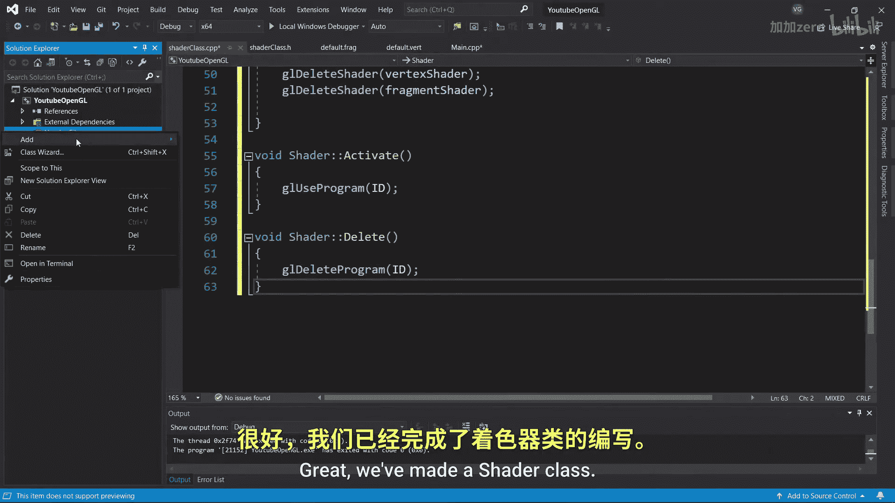
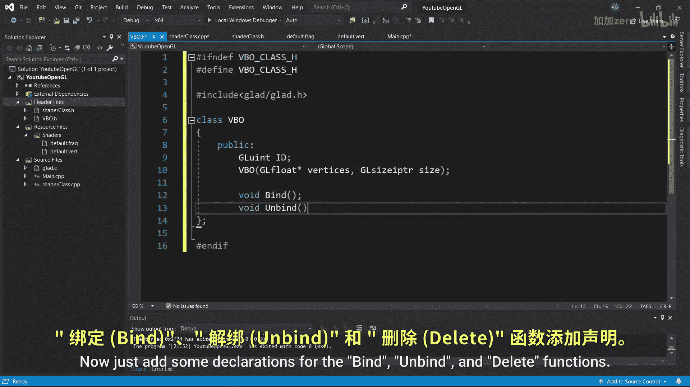

# 005：代码组织 🧹


## 概述
在本节课中，我们将学习如何组织OpenGL项目代码。我们将把着色器代码从主程序中分离到独立的文件中，并创建可重用的Shader类和VBO类，使代码结构更清晰、更易于维护。



---


## 从上一节到本节
上一节我们介绍了如何使用索引缓冲区。本节中，我们来看看如何整理项目中日益增多的代码。

目前，主函数中包含了许多内容。我们首先将着色器代码移动到独立的文本文件中。


以下是创建着色器文件的具体步骤：

1.  打开解决方案资源管理器，在“资源文件”文件夹中创建一个名为“Shaders”的新文件夹。
2.  添加一个新项，选择“实用工具” -> “文本文件”，并将其命名为 `default.vert`。
3.  打开 `default.vert` 文件，将顶点着色器的源代码复制粘贴进去。请确保删除所有引号和反斜杠。
4.  对片段着色器执行完全相同的操作，但将其命名为 `default.frag`。


---

## 创建Shader类
接下来，我们创建自己的Shader类来封装OpenGL的着色器程序。

首先，在头文件中添加新项，创建一个名为 `ShaderClass.h` 的头文件。在此文件中，我们将声明类及其相关函数。

为了防止头文件被重复包含导致变量冲突，我们使用预处理指令进行保护：
```cpp
#ifndef SHADERCLASS_H
#define SHADERCLASS_H
// ... 类声明 ...
#endif
```



我们需要声明一个读取着色器文本文件的函数。这个函数本身与OpenGL无关，它只是将文本文件的内容作为字符串输出。

现在，声明Shader类。这个类将是对OpenGL着色器程序的一个封装。
-   给它一个公共的ID成员变量。
-   声明一个构造函数，用于接收着色器源代码路径。
-   声明 `Activate` 和 `Delete` 函数。



完成头文件后，转到源文件并创建一个名为 `ShaderClass.cpp` 的CPP文件。
-   首先包含 `ShaderClass.h` 头文件。
-   将文件读取函数复制粘贴进去。
-   现在编写Shader类的构造函数：
    1.  将文本文件的内容读入字符串变量。
    2.  将字符串转换为字符数组。
    3.  复制主函数中所有与着色器相关的代码，稍作修改：将 `shaderProgram` 替换为 `ID`，将 `vertexShaderSource` 替换为 `vertexSource`，将 `fragmentShaderSource` 替换为 `fragmentSource`。
-   同样，通过从主函数复制代码来编写 `Activate` 和 `Delete` 函数。

很好，我们已经完成了Shader类的创建。



---



## 创建VBO类
接下来，让我们创建一个顶点缓冲区对象类。



创建一个头文件 `VBO.h`，并包含OpenGL函数所需的 `glad.h`。


现在创建一个VBO类：
-   给它一个公共的ID变量。
-   声明一个构造函数，该构造函数接收顶点数据及其大小（以字节为单位）。顶点数据的大小使用 `GLsizeiptr` 数据类型，因为这是OpenGL用于表示字节大小的类型。
-   添加 `Bind`、`Unbind` 和 `Delete` 函数的声明。

---



## 总结
本节课中，我们一起学习了如何组织OpenGL项目代码。我们将着色器代码分离到独立文件中，并创建了可重用的Shader类和VBO类。这样做使代码结构更模块化、更清晰，为后续添加更多功能打下了良好的基础。