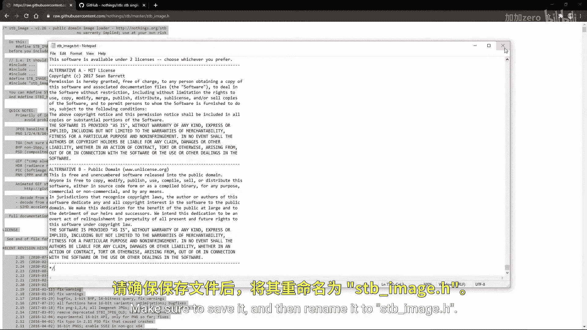
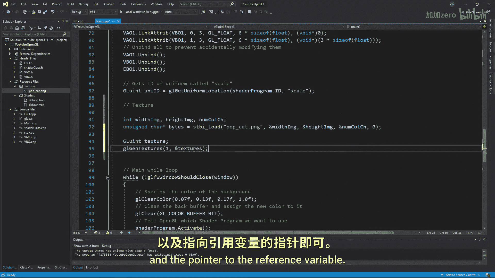

**OpenGL教程：P7：纹理**

在本节课中，我们将学习如何在OpenGL中使用纹理。上一节我们介绍了着色器的基础知识，本节中我们来看看如何将图像作为纹理应用到几何图形上，使渲染结果更加生动。

纹理可以是一维、二维或三维的，但本教程我们只关注最常见的二维纹理。

**导入图像**

首先，我们需要将一张图像导入到程序中，以便将其转换为纹理并显示。为此，我们将使用一个流行的开源库：**stb_image**。

以下是安装步骤：

1.  进入你的项目文件夹，然后进入 `libraries` 目录下的 `include` 目录。
2.  创建一个名为 `stb` 的文件夹。
3.  在 `stb` 文件夹内，创建一个名为 `stb_image.txt` 的文本文件。
4.  访问描述中提供的链接，按 `Ctrl+A` 全选所有内容，然后复制粘贴到刚创建的 `stb_image.txt` 文件中。
5.  保存文件，并将其重命名为 `stb_image.h`。
6.  在你的项目源文件中创建一个名为 `stb.cpp` 的CPP文件，并写入以下代码，以确保我们只使用该库中需要的部分：

```cpp
#define STB_IMAGE_IMPLEMENTATION
#include "stb_image.h"
```

7.  右键点击 `stb.cpp` 文件并选择“编译”。确保只编译这一个文件。

安装完成后，只需在想使用该库的文件中包含其头文件即可。我将在 `main.cpp` 文件中进行包含。

**准备几何图形**

在开始处理纹理之前，我们先确保有一个正方形的坐标，以便更好地观察纹理显示效果。同时，别忘了修改索引数组和 `glDrawElements` 函数的调用参数。

运行你的程序，确认确实得到了一个正方形。如果一切正常，我们就可以导入图像了。

请注意，尺寸为2的幂次方（例如1024x1024像素或2048x2048像素）的正方形纹理比具有随机像素数的纹理优化得更好。因此，请尽量使纹理符合此格式。


我将使用一张512x512像素的图片，并将其放入资源文件的 `textures` 文件夹中。别忘了也将图片复制到项目的主文件夹中。



**加载图像数据**

首先，创建三个整型变量来存储图像的宽度、高度（以像素为单位）和通道数。

```cpp
int width, height, nrChannels;
```

然后，使用 `stbi_load` 函数将图像本身加载到一个名为 `data` 的无符号字符数组中。需要提供图像的位置和名称，以及我们创建的变量的指针。

```cpp
unsigned char *data = stbi_load("textures/pop_cat.png", &width, &height, &nrChannels, 0);
```

图像导入就是这么简单。

**创建纹理对象**

现在，让我们创建纹理对象本身。就像任何OpenGL对象一样，我们首先创建一个 `GLuint` 类型的引用变量并命名为 `texture`。

```cpp
GLuint texture;
```

接着，使用 `glGenTextures` 函数生成纹理对象。需要提供想要生成的纹理数量（本例中为1）以及指向引用变量的指针。

```cpp
glGenTextures(1, &texture);
```

创建纹理后，我们也需要在 `main` 函数结束时删除它。

```cpp
glDeleteTextures(1, &texture);
```

**绑定纹理单元**

现在我们需要将纹理分配到一个纹理单元。你可以将纹理单元想象成一组捆绑在一起的纹理槽。通常一组包含大约16个纹理，允许片段着色器同时处理所有16个纹理。

要将我们的纹理插入纹理单元的槽中，我们只需激活想要使用的纹理单元。


```cpp
glActiveTexture(GL_TEXTURE0);
```


然后，将我们的纹理对象绑定到该活动纹理单元的目标上（对于2D纹理是 `GL_TEXTURE_2D`）。

```cpp
glBindTexture(GL_TEXTURE_2D, texture);
```

**设置纹理参数**

绑定纹理后，我们需要设置一些参数来控制纹理在几何图形上的采样方式。以下是需要设置的主要参数：

*   **纹理环绕方式**：定义当纹理坐标超出[0, 1]范围时如何处理。
    *   `GL_TEXTURE_WRAP_S`：水平方向（U轴）的环绕。
    *   `GL_TEXTURE_WRAP_T`：垂直方向（V轴）的环绕。
    *   常用选项：`GL_REPEAT`（重复）、`GL_MIRRORED_REPEAT`（镜像重复）、`GL_CLAMP_TO_EDGE`（拉伸边缘像素）、`GL_CLAMP_TO_BORDER`（使用指定边框颜色）。
*   **纹理过滤**：定义当纹理被拉伸或缩小时如何采样纹理像素（纹素）。
    *   `GL_TEXTURE_MIN_FILTER`：纹理缩小时的过滤方式。
    *   `GL_TEXTURE_MAG_FILTER`：纹理放大时的过滤方式。
    *   常用选项：`GL_NEAREST`（最近邻，像素化）、`GL_LINEAR`（线性，平滑）。

使用 `glTexParameteri` 函数来设置这些参数。例如，设置水平和垂直方向都重复，并使用线性过滤：

```cpp
glTexParameteri(GL_TEXTURE_2D, GL_TEXTURE_WRAP_S, GL_REPEAT);
glTexParameteri(GL_TEXTURE_2D, GL_TEXTURE_WRAP_T, GL_REPEAT);
glTexParameteri(GL_TEXTURE_2D, GL_TEXTURE_MIN_FILTER, GL_LINEAR);
glTexParameteri(GL_TEXTURE_2D, GL_TEXTURE_MAG_FILTER, GL_LINEAR);
```

**生成纹理**

最后，使用 `glTexImage2D` 函数将我们加载的图像数据上传到GPU，从而生成最终的纹理。

```cpp
glTexImage2D(GL_TEXTURE_2D, 0, GL_RGB, width, height, 0, GL_RGB, GL_UNSIGNED_BYTE, data);
```

参数说明：
1.  目标（`GL_TEXTURE_2D`）。
2.  多级渐远纹理级别（0表示基本级别）。
3.  纹理在OpenGL内部的存储格式（`GL_RGB` 表示红绿蓝三通道）。
4.  纹理的宽度。
5.  纹理的高度。
6.  历史遗留参数，必须为0。
7.  源图像的格式（`GL_RGB`）。
8.  源图像的数据类型（`GL_UNSIGNED_BYTE` 表示无符号字节）。
9.  指向图像数据的指针。

生成纹理后，可以释放图像数据，因为数据已经上传到GPU。

```cpp
stbi_image_free(data);
```

**在着色器中使用纹理**

要在着色器中使用纹理，我们需要：
1.  在顶点着色器中，将纹理坐标作为顶点属性传入。
2.  在片段着色器中，声明一个 `uniform sampler2D` 变量来代表纹理，并使用 `texture` 函数根据纹理坐标进行采样。
3.  在主程序中，通过 `glUniform1i` 将纹理单元（例如 `GL_TEXTURE0` 对应数字0）赋值给着色器中的采样器。



**总结**


本节课中我们一起学习了OpenGL纹理的基础知识。我们介绍了如何安装和使用 `stb_image` 库加载图像，创建和配置纹理对象，绑定纹理单元，设置纹理参数，以及将图像数据上传到GPU生成纹理。最后，我们还简要提及了在着色器中采样纹理的方法。掌握这些步骤后，你就能为你的3D模型贴上丰富多彩的纹理了。