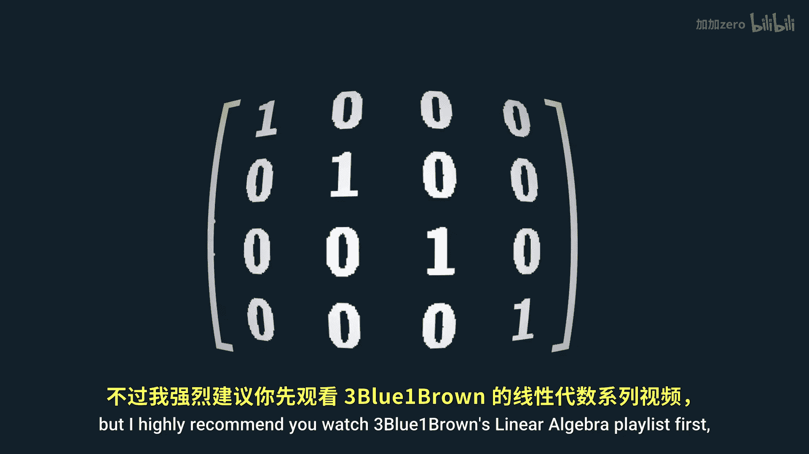
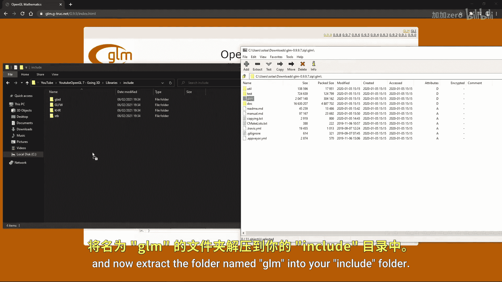

# 008：进入三维世界 🚀

## 概述
在本节课中，我们将告别二维平面，正式进入三维图形世界。我们将学习如何使用矩阵变换将三维物体坐标转换为最终在屏幕上显示的二维图像。核心内容包括理解不同的坐标空间、学习三种关键矩阵（模型、视图、投影矩阵）的作用，以及使用GLM库来简化矩阵运算。

---

## 修正先前代码
上一节我们介绍了如何为场景添加纹理。现在，在进入三维世界之前，需要对之前关于顶点数组对象和纹理类的代码进行一个小修正。

我忘记将顶点缓冲对象和着色器输入设置为引用类型。只需像下面这样添加一个“&”符号即可。

```cpp
// 示例：将VBO和着色器输入设置为引用
void someFunction(VertexBufferObject& vbo, Shader& shader) {
    // ... 函数体
}
```

---

## 引入GLM库
上一节我们介绍了纹理，本节中我们来看看如何为三维坐标变换做准备。OpenGL将我们的坐标限制在标准化坐标范围内。为了绕过此限制并为三维坐标提供更广泛的范围，我们可以使用矩阵来缩放不同的坐标。

如果你对矩阵了解不多，仍然可以大致跟上课程，但我强烈建议你先观看3Blue1Brown的线性代数系列视频，这对后续学习会有帮助。

我们将使用一个名为GLM的优秀库来处理矩阵。请按照以下步骤操作：

1.  访问描述中提供的网站并点击下载。
2.  进入你的库文件夹，然后进入“include”目录。
3.  打开下载的ZIP文件，进入“GLM”文件夹。
4.  将名为“GLM”的文件夹解压到你的“include”文件夹中。

完成以上步骤后，在你的项目中包含该库的以下部分：

```cpp
#include <glm/glm.hpp>
#include <glm/gtc/matrix_transform.hpp>
#include <glm/gtc/type_ptr.hpp>
```

现在，我们就可以轻松地使用矩阵了。




---



## 坐标系统理论 🧠
为了获得具有透视效果的漂亮三维图像，我们需要将不同的矩阵应用于不同的坐标。让我们来看看这些坐标类型。

以下是几种关键的坐标空间：

1.  **局部坐标**
    *   这些坐标的原点与物体自身的原点相同。
    *   它们通常位于物体的中心，但并非总是如此。

2.  **世界坐标**
    *   这些坐标的原点位于世界的中心。
    *   这些坐标通常包含其他物体的位置信息。

3.  **观察坐标**
    *   这些坐标的原点与相机或视点的位置相同。
    *   请注意，这些坐标尚未考虑透视效果。

4.  **裁剪坐标**
    *   这些坐标本质上与观察坐标相同，但它们会进行“裁剪”，即删除标准化范围之外的任何顶点，并且可以处理透视效果。

5.  **屏幕坐标**
    *   这是最终的坐标空间，所有内容都被展平，以便在屏幕上显示。

为了从一个坐标系统转换到下一个系统，我们需要使用矩阵。😊

---

## 核心变换矩阵
上一节我们介绍了不同的坐标空间，本节中我们来看看连接这些空间的核心工具——变换矩阵。

我们将主要使用三种矩阵：

1.  **模型矩阵**
    *   作用：将**局部坐标**转换为**世界坐标**。
    *   公式：`World Coordinates = Model Matrix * Local Coordinates`

2.  **视图矩阵**
    *   作用：将**世界坐标**转换为**观察坐标**。
    *   公式：`View Coordinates = View Matrix * World Coordinates`

3.  **投影矩阵**
    *   作用：将**观察坐标**转换为**裁剪坐标**。
    *   公式：`Clip Coordinates = Projection Matrix * View Coordinates`

从裁剪坐标到屏幕坐标的最终转换由OpenGL自动完成。我们应用的所有这些矩阵都是4维的，但我们不必自己编写它们，因为GLM库可以处理这些工作。

---

## 创建模型矩阵
让我们开始创建模型矩阵。我们首先创建一个名为`model`、类型为`mat4`的变量，并将其初始化为单位矩阵。

```cpp
glm::mat4 model = glm::mat4(1.0f);
```

这被称为初始化，必须执行此操作，否则矩阵可能包含未定义的值。

---


## 总结
本节课中我们一起学习了从二维迈向三维的关键步骤。我们理解了从局部坐标到屏幕坐标的完整变换管线，认识了模型、视图和投影矩阵各自的作用，并成功引入了GLM库来辅助矩阵运算。下一节，我们将利用这些知识，实际创建一个具有三维透视效果的场景。