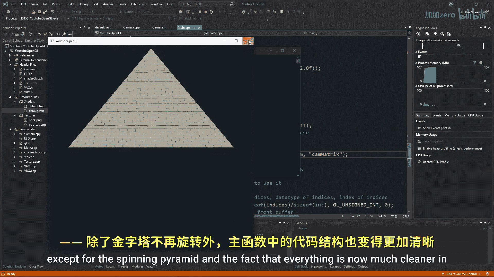
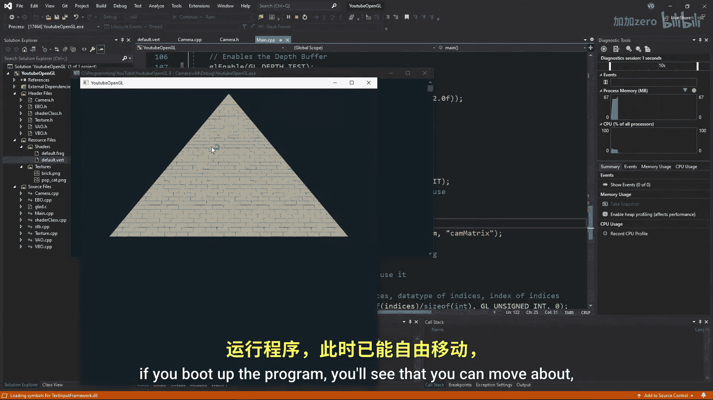

# 009：摄像机类 🎥

在本节课中，我们将学习如何创建一个摄像机类，以简化OpenGL中的3D场景观察。我们将封装视图和投影矩阵的生成，并实现键盘和鼠标控制，使摄像机能够在场景中自由移动和观察。

---

## 概述

上一节我们成功地将场景从2D转换到了3D。本节中，我们将创建一个摄像机类来管理视图和投影矩阵，并实现基本的移动和视角控制功能，使代码结构更清晰，操作更直观。

## 创建摄像机类头文件

首先，创建一个名为 `camera.h` 的头文件。为了防止C++重复包含，我们使用预处理器指令。摄像机类将包含位置、朝向、上方向等核心向量，以及屏幕尺寸、移动速度和视角灵敏度等参数。


以下是 `camera.h` 文件的核心内容：

```cpp
#ifndef CAMERA_H
#define CAMERA_H

#include <glad/glad.h>
#include <GLFW/glfw3.h>
#include <glm/glm.hpp>
#include <glm/gtc/matrix_transform.hpp>
#include <glm/gtc/type_ptr.hpp>
#include <glm/gtx/rotate_vector.hpp>
#include <glm/gtx/vector_angle.hpp>

class Camera {
public:
    // 摄像机位置
    glm::vec3 Position;
    // 摄像机朝向（方向）
    glm::vec3 Orientation = glm::vec3(0.0f, 0.0f, -1.0f);
    // 上方向向量
    glm::vec3 Up = glm::vec3(0.0f, 1.0f, 1.0f);
    // 屏幕宽度和高度
    int width;
    int height;
    // 移动速度
    float speed = 0.1f;
    // 鼠标灵敏度
    float sensitivity = 100.0f;

    // 构造函数
    Camera(int width, int height, glm::vec3 position);
    // 生成并传递矩阵到着色器
    void Matrix(float FOVdeg, float nearPlane, float farPlane, GLuint shaderID, const char* uniform);
    // 处理输入（键盘和鼠标）
    void Inputs(GLFWwindow* window);
};

#endif
```

## 实现摄像机类

接下来，创建 `camera.cpp` 文件来实现摄像机类的功能。构造函数用于初始化基本参数，`Matrix` 函数负责生成视图和投影矩阵，并将其传递给着色器。

以下是 `camera.cpp` 中构造函数和矩阵函数的核心实现：

```cpp
#include "camera.h"

// 构造函数
Camera::Camera(int width, int height, glm::vec3 position) {
    this->width = width;
    this->height = height;
    this->Position = position;
}

// 矩阵函数
void Camera::Matrix(float FOVdeg, float nearPlane, float farPlane, GLuint shaderID, const char* uniform) {
    // 初始化矩阵
    glm::mat4 view = glm::mat4(1.0f);
    glm::mat4 projection = glm::mat4(1.0f);

    // 创建视图矩阵
    // glm::lookAt(摄像机位置, 目标位置, 上方向向量)
    view = glm::lookAt(Position, Position + Orientation, Up);
    // 创建投影矩阵
    projection = glm::perspective(glm::radians(FOVdeg), (float)(width / height), nearPlane, farPlane);

    // 将矩阵导出到着色器
    glUniformMatrix4fv(glGetUniformLocation(shaderID, uniform), 1, GL_FALSE, glm::value_ptr(projection * view));
}
```

## 集成摄像机到主程序

现在，我们需要在主程序中使用新创建的摄像机类。首先，在 `main.cpp` 中包含摄像机头文件，并创建一个摄像机对象。然后，在渲染循环中调用摄像机的 `Matrix` 函数来更新视图。

以下是集成步骤：

1.  包含头文件并创建摄像机对象。
2.  在渲染循环中删除旧的矩阵生成代码，改用摄像机的 `Matrix` 函数。
3.  在顶点着色器中，将旧的矩阵统一变量替换为新的摄像机矩阵。

完成这些步骤后，运行程序，你将看到与上一节相同的3D场景，但代码结构更加清晰。

## 实现键盘输入控制




为了允许用户通过键盘控制摄像机移动，我们需要在 `Camera` 类中添加一个 `Inputs` 函数。该函数将处理WASD键（前后左右移动）、空格键（上升）、Ctrl键（下降）以及Shift键（加速）的输入。

以下是 `Inputs` 函数中处理键盘控制的核心逻辑：

```cpp
void Camera::Inputs(GLFWwindow* window) {
    // 处理WASD移动
    if (glfwGetKey(window, GLFW_KEY_W) == GLFW_PRESS) {
        Position += speed * Orientation;
    }
    if (glfwGetKey(window, GLFW_KEY_A) == GLFW_PRESS) {
        Position += speed * -glm::normalize(glm::cross(Orientation, Up));
    }
    if (glfwGetKey(window, GLFW_KEY_S) == GLFW_PRESS) {
        Position += speed * -Orientation;
    }
    if (glfwGetKey(window, GLFW_KEY_D) == GLFW_PRESS) {
        Position += speed * glm::normalize(glm::cross(Orientation, Up));
    }
    // 处理上升和下降
    if (glfwGetKey(window, GLFW_KEY_SPACE) == GLFW_PRESS) {
        Position += speed * Up;
    }
    if (glfwGetKey(window, GLFW_KEY_LEFT_CONTROL) == GLFW_PRESS) {
        Position += speed * -Up;
    }
    // 处理加速
    if (glfwGetKey(window, GLFW_KEY_LEFT_SHIFT) == GLFW_PRESS) {
        speed = 0.4f;
    } else {
        speed = 0.1f;
    }
}
```

在主程序的渲染循环中调用 `camera.Inputs(window)` 后，你就可以使用键盘在场景中自由移动了。

## 实现鼠标输入控制

目前摄像机还无法通过鼠标观察四周。为了实现鼠标控制，我们需要在 `Inputs` 函数中添加处理鼠标移动的代码。其核心思想是：隐藏鼠标光标，根据鼠标移动的偏移量来调整摄像机的朝向（`Orientation`）向量。

以下是处理鼠标控制的核心步骤：

1.  隐藏鼠标光标并将其锁定在窗口中心。
2.  计算当前帧与上一帧之间鼠标位置的偏移量。
3.  根据偏移量和灵敏度，调整摄像机在水平和垂直方向上的旋转角度。
4.  使用旋转后的角度更新摄像机的朝向向量。

将这部分代码添加到 `Inputs` 函数中，并在主循环中调用后，你就可以通过移动鼠标来环顾3D场景了。

## 总结




本节课中，我们一起学习了如何创建一个功能完整的OpenGL摄像机类。我们定义了摄像机的位置、朝向和上方向等属性，并实现了生成视图和投影矩阵的 `Matrix` 函数。通过集成键盘的WASD控制和鼠标的视角控制，我们使得摄像机能够在3D场景中自由移动和观察。这个摄像机类极大地简化了主程序的代码，并为后续更复杂的交互功能打下了基础。