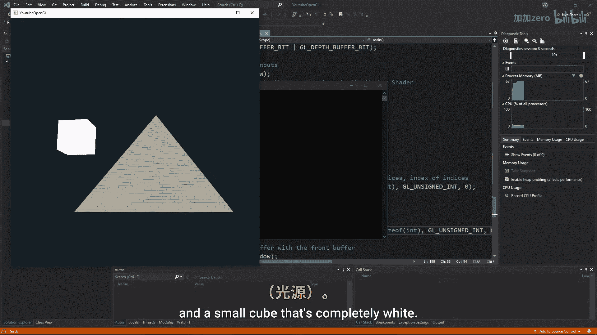

# 010：光照

在本节课中，我们将学习如何为OpenGL场景添加基础光照效果。我们将从修改相机类开始，然后引入一个光源立方体，并最终通过计算光线颜色和强度来模拟真实的光照效果。

## 修改相机类

上一节我们介绍了如何创建相机。本节中，我们首先对相机类进行微调，以便能高效地在多个物体上使用视图矩阵，并确保新的相机功能在主函数中正常工作。

## 添加光源立方体



接下来，我们将添加一个立方体作为场景中的光源。如果你不清楚如何操作，特别是对光源位置向量和光源模型矩阵的作用有疑问，建议回顾我之前关于坐标系的教程。

以下是创建光源立方体的核心步骤：
1.  定义光源立方体的顶点数据。
2.  为其创建独立的VAO、VBO和着色器程序。
3.  在主渲染循环中，使用光源的模型矩阵（通常只包含平移变换）和视图矩阵绘制它。

启动程序后，你应该能看到你的主物体和一个完全白色的小立方体。

## 模拟光线颜色


正如你在现实生活中可能注意到的，光线可以拥有多种颜色。通常光线是白色的，因此能显示出物体的真实颜色。但如果光源是红色的，那么所有物体看起来都会偏红。

我们可以通过将物体的颜色与光源的颜色相乘来模拟这一现象。两者都是RGB值。例如，如果光源的RGB值为 `(1.0, 0.0, 0.0)`（红色），当它与一个橙色物体（例如 `(1.0, 0.5, 0.0)`）的颜色相乘时，绿色和蓝色分量将变为0，而红色分量保持不变。

```glsl
// 在物体片段着色器中
vec3 objectColor = vec3(1.0, 0.5, 0.0); // 橙色
vec3 lightColor = vec3(1.0, 0.0, 0.0); // 红色光源
vec3 result = objectColor * lightColor; // 结果为 (1.0, 0.0, 0.0)，即红色
```

这模拟了现实世界中只有红色光被反射回来的情况，即使物体本身是橙色的。

现在，让我们创建一个名为 `lightColor` 的 `vec4` 变量，并将其设为纯白色。我们需要将这个变量传递给两个着色器：光源的片段着色器和我们主物体的片段着色器。在光源的着色器中，我们直接将其用作立方体的颜色。在主物体的着色器中，我们将用它乘以当前片段的颜色 `fColor`。

## 计算光照强度

接下来，我们需要模拟光照的强度。你可能已经注意到，表面与光源之间的夹角越大，该表面的颜色强度就越低。这在一个球体上可以清晰地看到强度沿曲面产生的渐变效果。

为了获取这个夹角并计算强度，我们需要光源的位置（我们已经有了）以及了解表面斜率的方法。传统的做法是用**法向量**来表示表面的斜率。

## 理解与添加法向量

到目前为止，我们的顶点数据中包含了坐标、颜色和纹理坐标。现在，我们还需要添加法向量。

法向量是**单位向量**（即长度为1的向量），它帮助我们计算光线应如何作用于特定物体。法向量可以垂直于单个三角形的表面（称为**面法线**），也可以以其他方式排列，例如垂直于所有相邻顶点构成的平面（称为**顶点法线**）。

以下是两种法线类型的区别：
*   **面法线**：选择这种方式会得到所谓的**平面着色**，所有三角形清晰可见。
*   **顶点法线**：选择这种方式，物体看起来会平滑得多，效果更佳。

选择哪一种取决于你的网格模型和艺术风格。由于我们有一个金字塔模型，我们将采用平面着色，因为在立方体或金字塔等棱角分明的几何形状上，平滑着色看起来会很奇怪。

因为金字塔每个面的法线都不同，我们需要为每个面指定正确的法线数据。

## 总结


本节课中，我们一起学习了OpenGL基础光照的核心步骤。我们首先优化了相机以便复用，然后创建了一个可视化的光源。接着，我们通过将物体颜色与光源颜色相乘来模拟有色光的效果。最后，我们引入了法向量的概念，它是计算光照强度（如漫反射）的基础。下一节，我们将利用这些法向量来计算具体的漫反射光照模型。