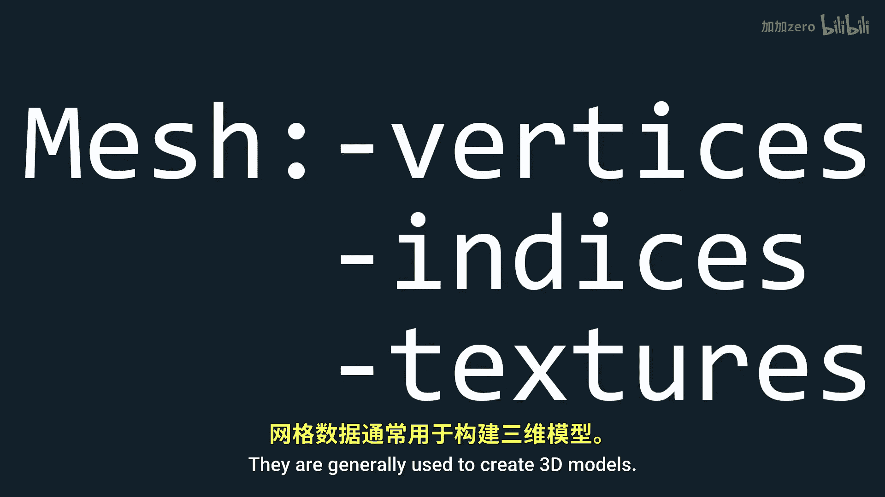
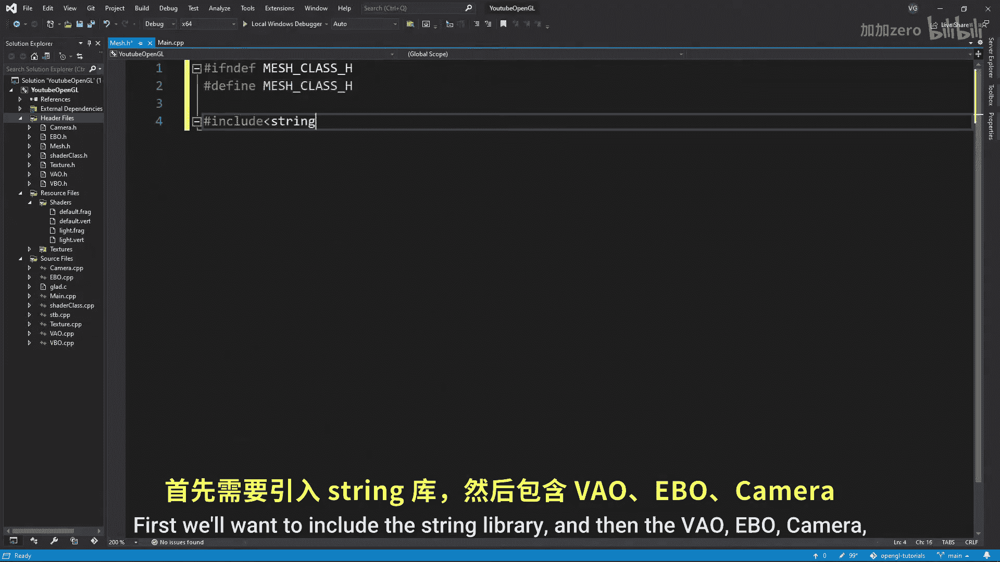
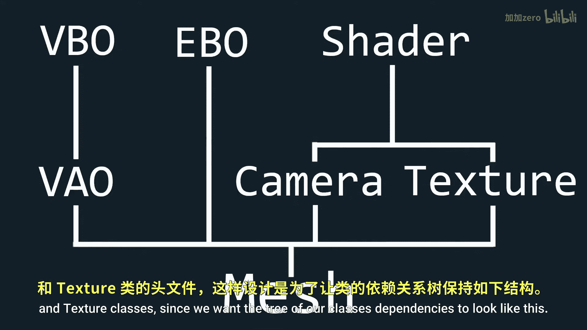
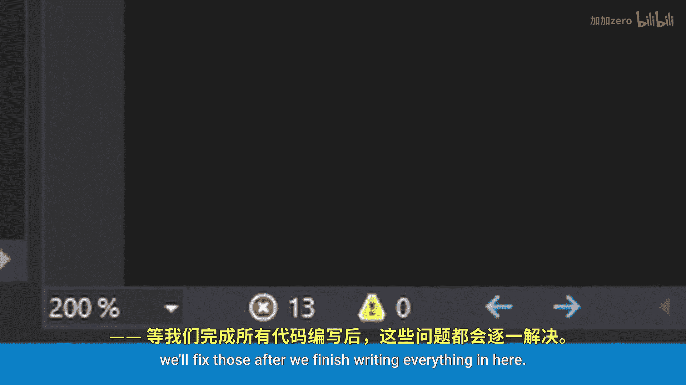
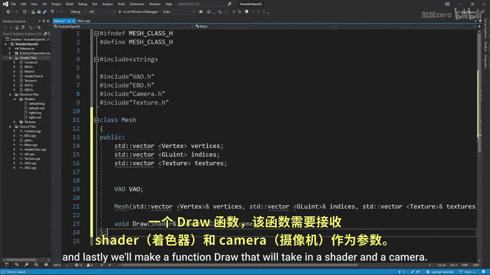
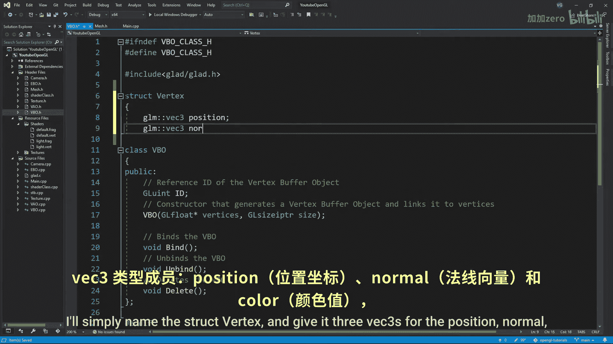
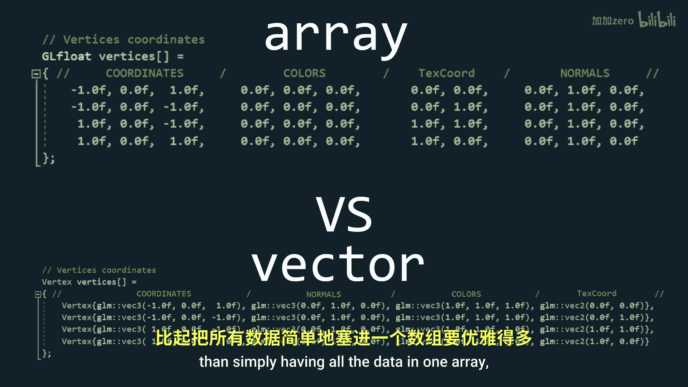

# 013：网格类 🧱

在本节课中，我们将整合之前创建的所有类以及大部分核心功能，构建一个**网格类**。这个类将作为未来教程中导入3D模型的基础。

## 概述

网格是3D图形中的基本单元。它通常包含顶点数据、索引数据，有时还包含纹理数据。本节课我们将学习如何创建一个封装这些数据的`Mesh`类，并实现其绘制功能。

## 网格类的定义

首先，我们为网格类创建一个头文件。网格类需要管理三类数据：顶点、索引和纹理。由于我们无法预先知道这些数据的大小，因此使用C++的`std::vector`容器来存储它们，以保证灵活性。

以下是网格类的基本结构：

```cpp
#include <string>
#include <vector>
#include "VBO.h"
#include "EBO.h"
#include "Camera.h"
#include "Texture.h"

class Mesh {
public:
    std::vector<Vertex> vertices;
    std::vector<GLuint> indices;
    std::vector<Texture> textures;
    VAO VAO;

    Mesh(std::vector<Vertex>& vertices, std::vector<GLuint>& indices, std::vector<Texture>& textures);
    void Draw(Shader& shader, Camera& camera);
};
```

注意，这里的`vertices`向量存储的是`Vertex`结构体，而不是原始的浮点数数组。这使数据组织更清晰。





## 顶点结构体




上一节我们定义了网格类的框架，但其中用到了一个尚未定义的`Vertex`结构体。本节我们来创建它。


一个顶点通常包含以下信息：
*   位置
*   法线
*   颜色
*   纹理坐标

将这些数据打包到一个结构体中，比使用一个扁平的浮点数数组更易于管理。结构体定义如下：

```cpp
#include <glm/glm.hpp>

struct Vertex {
    glm::vec3 position;
    glm::vec3 normal;
    glm::vec3 color;
    glm::vec2 texUV;
};
```

## 修改VBO和EBO类

定义了顶点结构体后，我们需要更新VBO（顶点缓冲对象）和EBO（元素缓冲对象）类，使其能够接受`std::vector<Vertex>`作为输入，而不是原始的`GLfloat`数组。

这样修改的好处是，我们不再需要手动计算数据大小，`std::vector`可以帮我们管理。

以下是VBO构造函数修改后的核心代码：

```cpp
VBO::VBO(std::vector<Vertex>& vertices) {
    glGenBuffers(1, &ID);
    glBindBuffer(GL_ARRAY_BUFFER, ID);
    glBufferData(GL_ARRAY_BUFFER, vertices.size() * sizeof(Vertex), vertices.data(), GL_STATIC_DRAW);
}
```

对EBO类进行类似的修改，使其接受`std::vector<GLuint>`作为索引数据。

## 实现网格类构造函数




现在，让我们在`.cpp`文件中实现网格类的具体功能。首先从构造函数开始。



构造函数接收顶点、索引和纹理向量，并将它们存储到类的成员变量中。接着，它需要初始化VAO（顶点数组对象），并设置顶点属性指针。




以下是构造函数的核心步骤：



1.  将传入的数据赋值给成员变量。
2.  生成并绑定VAO、VBO和EBO。
3.  将顶点数据复制到VBO中。
4.  将索引数据复制到EBO中。
5.  设置顶点属性指针，告诉OpenGL如何解析顶点数据。

我们按照`位置 -> 法线 -> 颜色 -> 纹理坐标`的顺序来布局顶点属性。虽然顺序不是强制的，但保持一致性会让代码更清晰。

```cpp
Mesh::Mesh(std::vector<Vertex>& vertices, std::vector<GLuint>& indices, std::vector<Texture>& textures) {
    this->vertices = vertices;
    this->indices = indices;
    this->textures = textures;

    VAO.Bind();
    VBO VBO(vertices);
    EBO EBO(indices);

    // 位置属性 (第0个属性，vec3)
    VAO.LinkAttrib(VBO, 0, 3, GL_FLOAT, sizeof(Vertex), (void*)0);
    // 法线属性 (第1个属性，vec3)
    VAO.LinkAttrib(VBO, 1, 3, GL_FLOAT, sizeof(Vertex), (void*)(3 * sizeof(float)));
    // 颜色属性 (第2个属性，vec3)
    VAO.LinkAttrib(VBO, 2, 3, GL_FLOAT, sizeof(Vertex), (void*)(6 * sizeof(float)));
    // 纹理坐标属性 (第3个属性，vec2)
    VAO.LinkAttrib(VBO, 3, 2, GL_FLOAT, sizeof(Vertex), (void*)(9 * sizeof(float)));

    VAO.Unbind();
    VBO.Unbind();
    EBO.Unbind();
}
```

## 实现绘制函数

最后，我们实现网格类的`Draw`函数。这个函数负责在每一帧中渲染网格。

它的主要任务是：
1.  激活并绑定着色器程序。
2.  将相机矩阵（视图和投影矩阵）传递给着色器。
3.  绑定网格的VAO。
4.  如果网格有纹理，则激活并绑定它们。
5.  调用`glDrawElements`进行绘制。

```cpp
void Mesh::Draw(Shader& shader, Camera& camera) {
    shader.Activate();
    VAO.Bind();

    // 传递相机矩阵
    glUniformMatrix4fv(glGetUniformLocation(shader.ID, "view"), 1, GL_FALSE, glm::value_ptr(camera.viewMatrix));
    glUniformMatrix4fv(glGetUniformLocation(shader.ID, "projection"), 1, GL_FALSE, glm::value_ptr(camera.projectionMatrix));

    // 绑定纹理（如果有的话）
    for (unsigned int i = 0; i < textures.size(); i++) {
        textures[i].Bind();
        // 可以将纹理单元位置传递给着色器，例如：
        // glUniform1i(glGetUniformLocation(shader.ID, "tex0"), i);
    }

    // 绘制网格
    glDrawElements(GL_TRIANGLES, indices.size(), GL_UNSIGNED_INT, 0);

    VAO.Unbind();
}
```

## 更新着色器

由于我们改变了顶点属性的布局顺序，需要相应地更新顶点着色器和片段着色器，以正确接收这些属性。

在顶点着色器中，按照`位置、法线、颜色、纹理坐标`的顺序声明输入变量：

```glsl
#version 330 core
layout (location = 0) in vec3 aPos;
layout (location = 1) in vec3 aNormal;
layout (location = 2) in vec3 aColor;
layout (location = 3) in vec2 aTex;

// ... 其余代码
```

在片段着色器中，可以相应地使用这些传递过来的变量。

## 总结

本节课中，我们一起学习了如何创建一个功能完整的**网格类**。我们定义了`Vertex`结构体来整洁地组织顶点数据，修改了VBO和EBO类以支持向量输入，并实现了网格的初始化和绘制逻辑。


这个`Mesh`类成功地将顶点缓冲、索引缓冲、纹理和绘制命令封装在一起，为后续加载复杂的3D模型打下了坚实的基础。现在，你可以使用这个类来轻松创建和渲染任何由三角形构成的3D物体了。