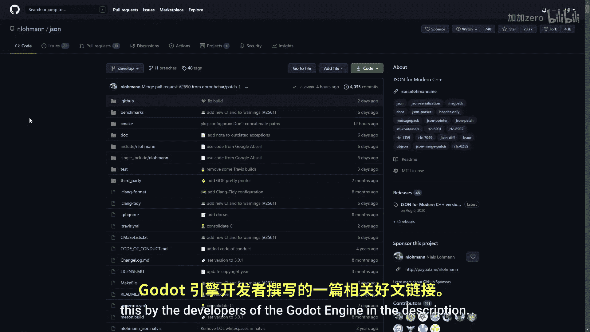
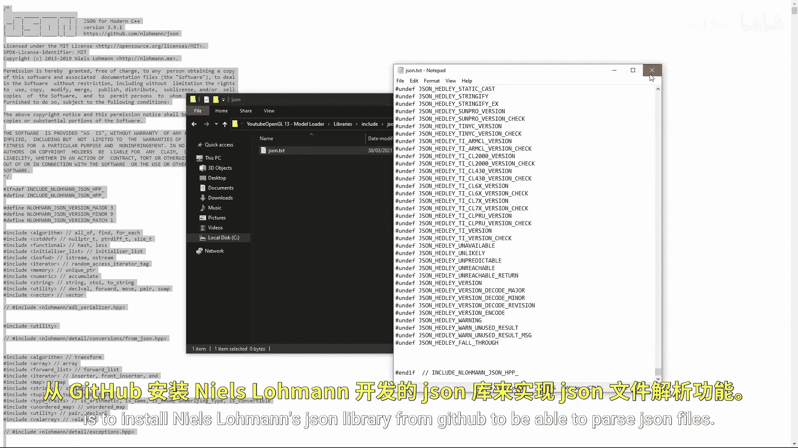

# 014：模型加载 🎮

在本教程中，我们将学习如何通过构建一个基础的导入器，将3D模型导入到你的OpenGL应用程序中。本教程会比往常更长，并且只有在最后才能看到可见的结果，因此请保持耐心并注意我的操作步骤，否则你可能会在最后遇到一连串的错误。

首先需要说明一点。你可能知道，在存储图像方面，行业标准是使用PNG和JPEG等格式。但对于3D模型，存在数十种甚至更多的文件格式，其中许多是专有的。这种文件格式的多样性使得在不同程序之间导出和导入模型变得更加困难。本着标准化的精神，本教程将使用GLTF文件格式，因为它是由创建OpenGL的Khronos集团开发的，并且看起来是一个有前途、未来可能成为标准的格式。我在描述中留下了一个由Godot引擎开发者撰写的关于此格式的优秀文章链接。

现在进入实际教程。GLTF使用JSON文件结构，因此我们需要做的第一件事是从GitHub安装Neil Slaughterman的JSON库，以便能够解析JSON文件。库的准备工作就绪后，我们就可以为模型类创建一个头文件，模型即一组网格。然后，我们将创建一个构造函数，它接收一个文件名；以及一个绘制函数，它接收一个着色器和一个相机。在私有部分，我们将存储文件名、一个包含模型所有数据的顶点向量，以及一个稍后会详细解释的JSON对象。

现在，在模型的CPP文件中，让我们在构造函数中使用与读取着色器相同的函数来读取GLTF文件。然后我们解析文本并将其存储在JSON变量中。JSON文件的工作原理类似于字典中的字典。字典有键和与这些键关联的值。如果你给字典一个键，它会指向某个值。这个JSON对象将GLTF文件抽象成这样的结构。所以，我们只需存储文件，然后将我们的数据变量赋值给一个名为`getData`的函数。

我们希望这个函数从一个外部的二进制数据文件中获取一个顶点向量。因此，我们创建一个字符串变量`rawText`来保存原始文本。为了获取文件的位置，我们可以查看`buffer`键，它将指向一个数组，我们想查看第一个元素，这又是一个字典。所以我们再次使用一个键，这次是`uri`键。这个`uri`给我们一个包含二进制数据的`.bin`文件的名称。然后我们获取文本，将其放入向量中并返回。




现在你已经初步了解了文件结构，让我们更仔细地看一下。该文件包含字典，这些字典又包含其他字典，使其成为一种树状结构，但这棵树并不规整。因为许多分支会包含索引，这些索引将指向其他分支，所以事情会变得相当复杂。

为了避免在这种情况下的混淆，我喜欢从叶子节点开始，然后逐步向下处理到树的根部。请记住，我将在GLTF文件中采取一些捷径，否则这个导入器会变得过于复杂。抛开这些，下图是树的一个主要分支的简化视图，也是我们最关心的部分。在顶部，我们有存储在缓冲区中的数据，但要知道应该读取哪些部分，我们需要查看访问器和缓冲区视图。


上一节我们介绍了GLTF文件的基本结构和数据获取方法。本节中，我们来看看如何通过访问器和缓冲区视图来解析模型的具体几何数据。

访问器定义了如何解释缓冲区视图中的数据。它包含诸如数据类型、偏移量、步长和计数等信息。缓冲区视图则指向缓冲区中的特定数据块，并指定其长度和偏移量。

以下是解析网格数据的关键步骤：

1.  **遍历网格**：GLTF文件中的`meshes`数组包含了所有网格。我们需要遍历这个数组。
2.  **获取图元**：每个网格包含一个或多个图元。图元定义了网格的几何形状（如三角形）和所使用的属性（如位置、法线、纹理坐标）。
3.  **解析属性**：对于每个图元，我们需要解析其属性。这涉及到查找对应的访问器，然后通过访问器找到缓冲区视图，最终从二进制数据中提取出顶点数据。
4.  **处理索引**：如果图元使用了索引绘制，我们还需要解析索引数据。索引数据也通过一个访问器来定义。



为了简化，我们的基础导入器将专注于加载顶点位置、法线和纹理坐标。我们将创建一个`Mesh`类来存储这些数据，并在`Model`类中管理多个`Mesh`实例。

现在，让我们看看如何从JSON结构中提取一个网格的顶点位置数据。假设我们已经有了一个指向网格图元的JSON对象`primitive`：

```cpp
// 伪代码，展示思路
int positionAccessorIndex = primitive["attributes"]["POSITION"];
json positionAccessor = accessors[positionAccessorIndex];

int bufferViewIndex = positionAccessor["bufferView"];
json bufferView = bufferViews[bufferViewIndex];

int bufferIndex = bufferView["buffer"];
int byteOffset = bufferView["byteOffset"]; // 在缓冲区中的偏移
int byteLength = bufferView["byteLength"]; // 数据长度
int target = bufferView["target"]; // 目标（如 ARRAY_BUFFER）

// 根据访问器中的类型（如"VEC3"）和组件类型（如5126代表GL_FLOAT）
// 从之前获取的二进制数据向量中，从 byteOffset 处开始，读取 byteLength 长度的数据，
// 并将其解释为一系列浮点数，填充到顶点向量中。
```

通过类似的方式，我们可以提取法线、纹理坐标和索引数据。将所有必要的数据提取并组织到`Mesh`对象的顶点数组和索引数组中后，我们就可以像之前渲染自定义几何体一样，为每个网格设置VAO、VBO和EBO。

最后，在`Model`的`Draw`函数中，我们遍历所有存储的`Mesh`对象，并调用它们各自的绘制函数，同时传入着色器和相机所需的变换矩阵（如模型矩阵）。


本节课中我们一起学习了如何加载GLTF格式的3D模型。我们从安装JSON库开始，解析了GLTF的JSON结构，理解了缓冲区、缓冲区视图和访问器之间的关系，并逐步提取了顶点位置、法线、纹理坐标和索引数据来构建网格。虽然这是一个基础导入器，但它揭示了模型加载的核心原理。通过扩展此导入器，你可以支持更多属性、动画和材质，从而在OpenGL应用中渲染复杂的3D场景。