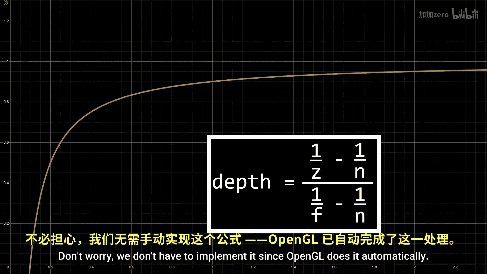
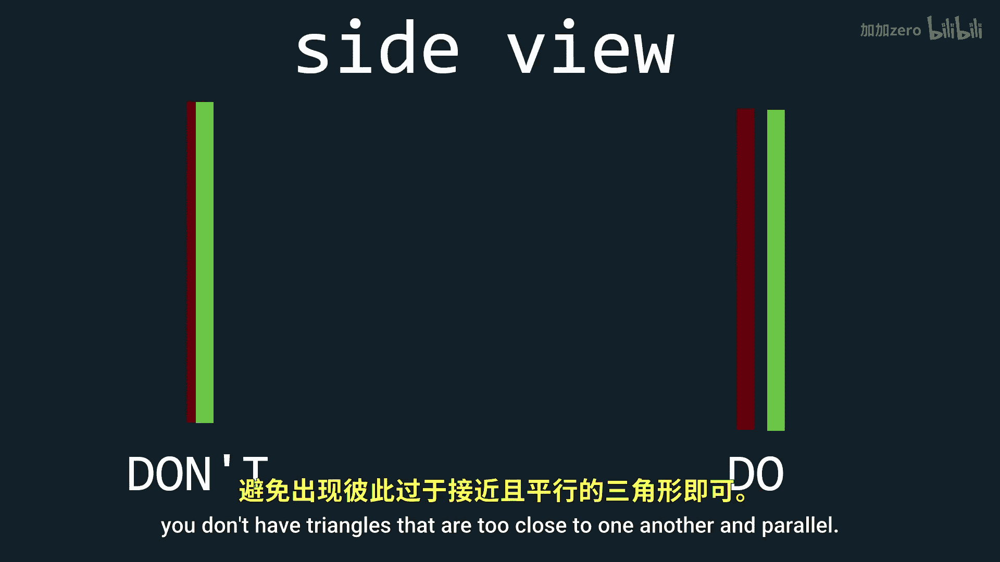
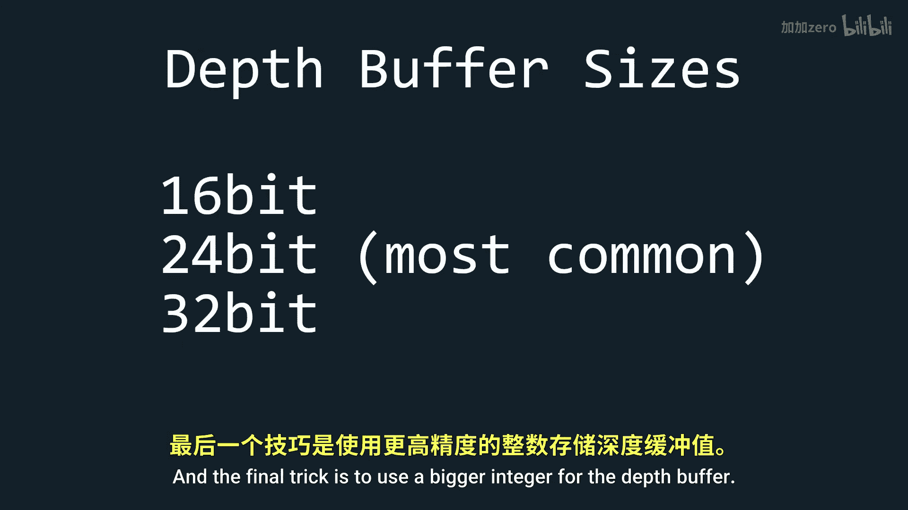

# 015：深度缓冲区 🧊

在本节课中，我们将学习OpenGL中的深度缓冲区，并了解如何利用它实现一个简单的图形效果。深度缓冲区是处理3D场景中物体前后遮挡关系的关键组件。

## 概述

你可能还记得，在之前的“进入3D世界”教程中，我们已经使用深度缓冲区解决了一个奇怪的渲染问题。深度缓冲区默认是关闭的，因此我们需要确保启用它，并像清空颜色缓冲区一样，在每一帧清空深度缓冲区。

## 深度缓冲区原理

深度缓冲区的基本作用是存储深度值。这些深度值表示特定片段距离投影矩阵近裁剪平面的远近程度。深度值0表示片段正好在近裁剪平面上，而深度值1表示片段在远裁剪平面上。

利用这些深度信息，我们可以判断哪个物体应该显示在另一个物体的前面。

## 深度测试函数

我们可以通过使用`glDepthFunc`函数并传入以下参数之一来实现深度测试。默认情况下，OpenGL选择`GL_LESS`。这意味着如果一个物体的深度值小于当前深度缓冲区中的值，那么前者的片段将替换后者的片段。

在大多数情况下，你应该使用`GL_LESS`。但如果你想让你的游戏或应用产生迷幻效果，也可以选择其他函数。

以下是可用的深度测试函数：
*   `GL_ALWAYS`：总是通过测试。
*   `GL_NEVER`：永远不通过测试。
*   `GL_LESS`：片段深度值小于缓冲区值时通过（默认）。
*   `GL_EQUAL`：片段深度值等于缓冲区值时通过。
*   `GL_LEQUAL`：片段深度值小于或等于缓冲区值时通过。
*   `GL_GREATER`：片段深度值大于缓冲区值时通过。
*   `GL_NOTEQUAL`：片段深度值不等于缓冲区值时通过。
*   `GL_GEQUAL`：片段深度值大于或等于缓冲区值时通过。

## 可视化深度缓冲区

现在来看一个有趣的部分：可视化深度缓冲区。我们可以轻松地在片段着色器中，将`gl_FragCoord.z`作为颜色值输出来实现。

```glsl
void main()
{
    FragColor = vec4(vec3(gl_FragCoord.z), 1.0);
}
```

但问题是，一旦运行程序，你会发现屏幕几乎是纯白色的。只有非常靠近物体时，才能看到一点暗色。

## 非线性深度

这是因为OpenGL中的深度是非线性的。如果深度是线性的，那么我们在近距离和远距离将拥有相同的深度精度。

由于我们几乎总是关注靠近我们的物体，因此我们希望近处的精度非常高，而远处的精度较低。这是通过以下公式实现的：

**公式：**
`depth = (1/z - 1/near) / (1/far - 1/near)`


不用担心，我们不需要手动实现它，因为OpenGL会自动处理。

## 线性化深度值

不过，有时你可能想使用另一个公式。为此，我们必须首先通过线性化深度函数来获取Z值。这可以使用以下函数完成：

```glsl
float LinearizeDepth(float depth, float near, float far)
{
    float z = depth * 2.0 - 1.0; // 从[0,1]映射回NDC[-1,1]
    return (2.0 * near * far) / (far + near - z * (far - near));
}
```

使用这个函数，我们得到了Z值。请记住，这个值没有归一化，它只是到近裁剪平面的距离。

现在，让我们清除之前设置的近平面和远平面常量，并将线性深度除以远平面距离来快速归一化它，看看结果如何。

```glsl
float linearDepth = LinearizeDepth(gl_FragCoord.z, near_plane, far_plane);
linearDepth /= far_plane; // 为了演示进行归一化
FragColor = vec4(vec3(linearDepth), 1.0);
```



## Z冲突问题

接下来，让我们看一个使用深度缓冲区时可能遇到的常见问题，然后我将展示一个利用深度缓冲区实现的酷炫效果。

深度缓冲区引发的主要问题称为**Z冲突**。当两个或多个三角形具有非常接近甚至相同的深度值时，深度测试函数无法决定哪一个更近，从而导致它们在渲染时不断闪烁切换。

一个简单的修复方法通常是确保没有三角形彼此过于接近且平行。如果Z冲突出现在远距离，那么你也可以考虑调整深度缓冲区的函数，以在该距离上获得更高的精度。最后一个技巧是使用更大位数的整数作为深度缓冲区，默认通常使用24位。

## 利用深度缓冲区的效果

现在，展示一个利用深度缓冲区实现的酷炫效果。我们可以将线性化的深度值用于后处理效果，例如创建雾效或边缘检测。

一个简单的雾效实现如下：

```glsl
void main()
{
    // ... 计算颜色和深度 ...
    float fogAmount = smoothstep(fogNear, fogFar, linearDepth);
    FragColor = mix(objectColor, fogColor, fogAmount);
}
```



## 总结




本节课中，我们一起学习了OpenGL深度缓冲区的核心概念。我们了解了它的工作原理、如何通过`glDepthFunc`控制深度测试、深度值的非线性特性及其线性化方法。我们还探讨了Z冲突问题及其解决方案。最后，我们看到了深度值如何被用于实现诸如雾效等后处理图形效果。掌握深度缓冲区是渲染正确3D场景的基础。