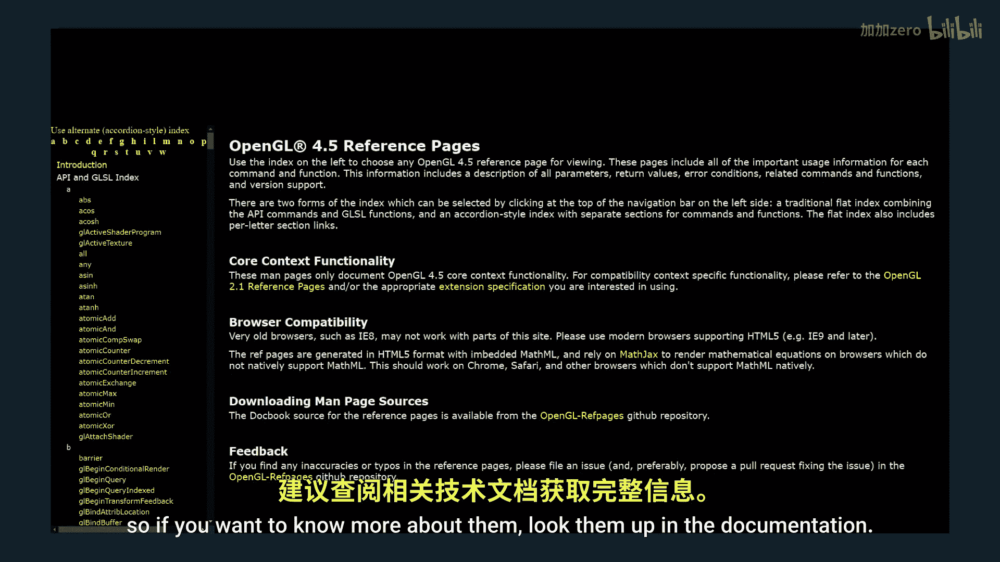
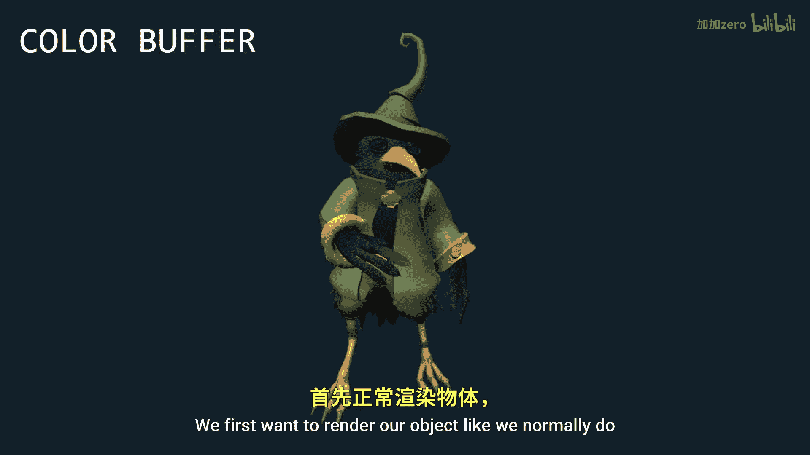
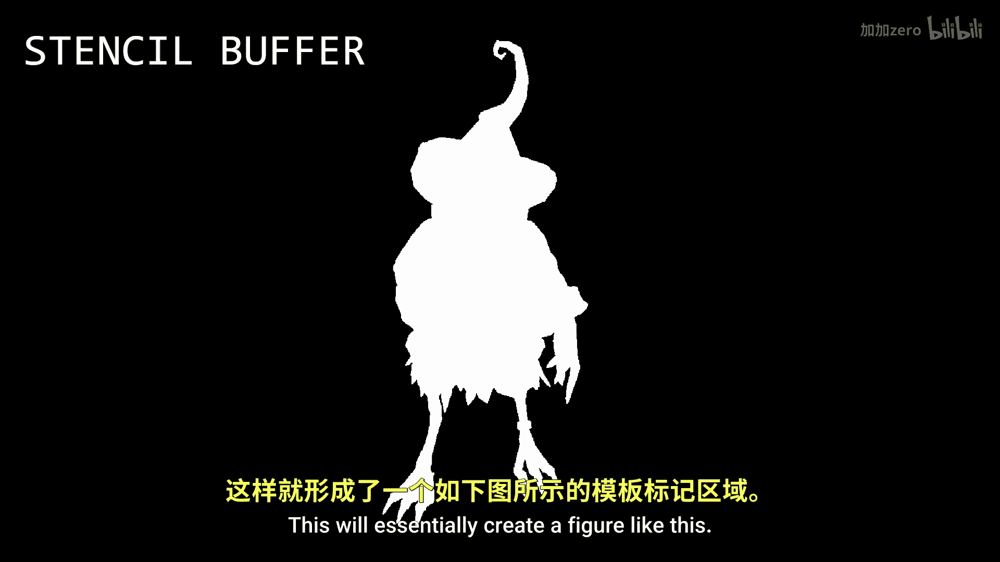

OpenGL教程：P16：模板缓冲与模型描边

在本节课中，我们将学习模板缓冲的基本概念，并探讨如何利用它来实现一个实用的视觉效果：为模型添加轮廓描边。

模板缓冲与深度缓冲类似，它为屏幕上的每个像素存储一个值，通常用于图像遮罩。与深度缓冲每个像素存储2到4字节数据不同，模板缓冲的每个像素只存储1字节数据。这意味着其取值范围是0到255，但在实际应用中，主要只使用0和1这两个值。

上一节我们介绍了模板缓冲的基本概念，本节中我们来看看如何操作这个缓冲。

首先，我们使用函数 `glStencilMask` 来选择允许修改模板缓冲的哪些部分。该函数对遮罩像素和模板缓冲中对应的像素进行按位与（bitwise AND）比较。每个像素有1字节（8位）数据。按位与操作会比较两个数的每一位，只有当对应位都为1时，结果的该位才为1。

以下是 `glStencilMask` 的两种典型用法：
*   如果传入 `0x00`（即8位全为0），所有比较都会失败，模板缓冲将完全不会被修改。
*   如果传入 `0xFF`（即8位全为1），则可以修改模板缓冲的任何部分。

接下来，我们介绍另外两个关键函数：`glStencilFunc` 和 `glStencilOp`。

`glStencilFunc` 函数用于控制模板测试如何通过或失败。它接受三个参数：一个比较函数、一个参考值和一个遮罩。默认的比较函数是 `GL_ALWAYS`，表示测试总是通过。参考值是我们用于比较的基准值。在比较模板值与参考值之前，会先使用遮罩对两者进行按位与操作。因此，若想进行准确的数值比较，通常应将遮罩设置为 `0xFF`。

`glStencilOp` 函数则用于指定在三种情况下对模板缓冲执行什么操作。它同样接受三个参数，分别对应：
1.  模板测试失败时（`sfail`）
2.  模板测试通过但深度测试失败时（`dpfail`）
3.  模板测试和深度测试都通过时（`dppass`）

对于这些情况，你可以从多个选项中选择操作，默认值都是 `GL_KEEP`，即保持模板缓冲值不变。

关于这些函数的更多细节，建议查阅官方文档以获取最全面的信息。

模板缓冲可以用于实现多种效果，例如传送门、镜子等。一个相对容易实现的功能是为模型添加轮廓。下面我们来看看具体步骤。

首先，像往常一样渲染你的模型对象，并同时更新模板缓冲：在模型片段覆盖的每个像素位置，将模板值设为1；在其他位置，将模板值设为0。这本质上会创建一个模型的“剪影”。

接着，我们需要禁用对深度缓冲和颜色缓冲的写入，并稍微放大模型进行第二次渲染。这次，我们设置模板测试，使其仅在模板值不等于1的地方通过（即只渲染原始模型轮廓之外的区域）。这样，一个放大的、单色的模型轮廓就会绘制在原始模型周围，从而实现描边效果。

本节课中我们一起学习了模板缓冲的工作原理，掌握了 `glStencilMask`、`glStencilFunc` 和 `glStencilOp` 等核心函数的使用方法，并最终实现了一个为3D模型添加轮廓描边的实用效果。