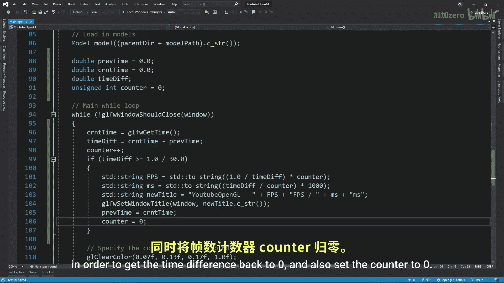

OpenGL教程：P17：面剔除与FPS计数器

在本节课中，我们将学习OpenGL中的面剔除技术，了解它如何提升渲染性能。同时，我们将通过制作一个FPS计数器来量化这一性能变化。

面剔除是图形渲染管线中的一个步骤，它决定一个三角形是否继续传递到片段着色器，即是否被绘制。OpenGL通过判断三角形的哪一面朝向摄像机来做出决定。在大多数3D图形程序中，三角形的前面会被发送到片段着色器，而背面则被丢弃。

OpenGL通过索引顺序约定来判断哪一面是前面。这个约定可以是顺时针或逆时针。在逆时针约定下，如果一个三角形的索引顺序在面向我们时是逆时针的，那么我们看到的这一面就是前面。反之，如果索引顺序是顺时针的，我们看到的就是背面。对于顺时针约定，情况则完全相反。大多数图形程序使用逆时针标准，但并非所有程序都如此。

上一节我们介绍了面剔除的基本概念，本节中我们来看看如何将其转化为代码。

以下是启用面剔除的步骤：
1.  使用 `glEnable(GL_CULL_FACE)` 启用面剔除功能。
2.  使用 `glCullFace` 指定要保留的面。在99%的情况下，这会是 `GL_FRONT`（前面）。
3.  使用 `glFrontFace` 指定使用的标准。建议使用 `GL_CCW`（逆时针），因为它更为常见。

运行程序后，你会注意到当进入一个物体内部时，将无法看到其内部结构。这是因为构成物体内部的三角形背面已被剔除，我们只能看到背景。

为了衡量面剔除带来的性能差异，我们需要一个FPS计数器，并将其显示在窗口标题栏。让我们从创建几个变量开始。

以下是创建FPS计数器所需的变量：
*   `previousTime`：记录上一帧的时间。
*   `currentTime`：记录当前帧的时间。
*   `timeDifference`：记录两帧之间的时间差。
*   `frameCounter`：一个无符号整数，用于统计特定时间段内的帧数。

FPS即每秒帧数。要计算FPS，我们可以统计在一秒内获得的帧数（一帧即主循环的一次迭代）。但这意味着FPS每秒才更新一次。我们可以改为每1/30秒更新一次。

以下是计算FPS和每帧耗时的逻辑：
1.  使用 `glfwGetTime()` 获取当前时间（秒）。
2.  计算与上一帧的时间差，并递增帧计数器。
3.  如果时间差大于或等于1/30秒，则进行测量：
    *   **FPS计算公式**：`FPS = frameCounter / timeDifference`
    *   **每帧耗时（毫秒）计算公式**：`frameTime = (timeDifference / frameCounter) * 1000`
4.  将新的标题（包含FPS和帧耗时）通过 `glfwSetWindowTitle` 设置给窗口。
5.  将 `previousTime` 更新为 `currentTime`，并将 `frameCounter` 重置为0，为下一个测量周期做准备。

启动程序后，你就能在窗口标题栏看到实时的帧率信息。

本节课中我们一起学习了面剔除的原理与实现，它通过丢弃不可见的三角形背面来提升渲染效率。同时，我们构建了一个FPS计数器来监测性能变化，掌握了计算帧率和每帧耗时的方法。