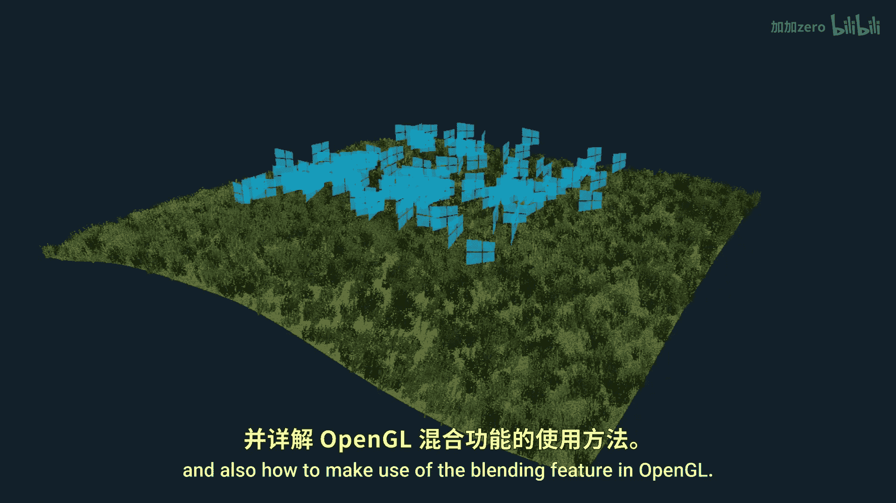
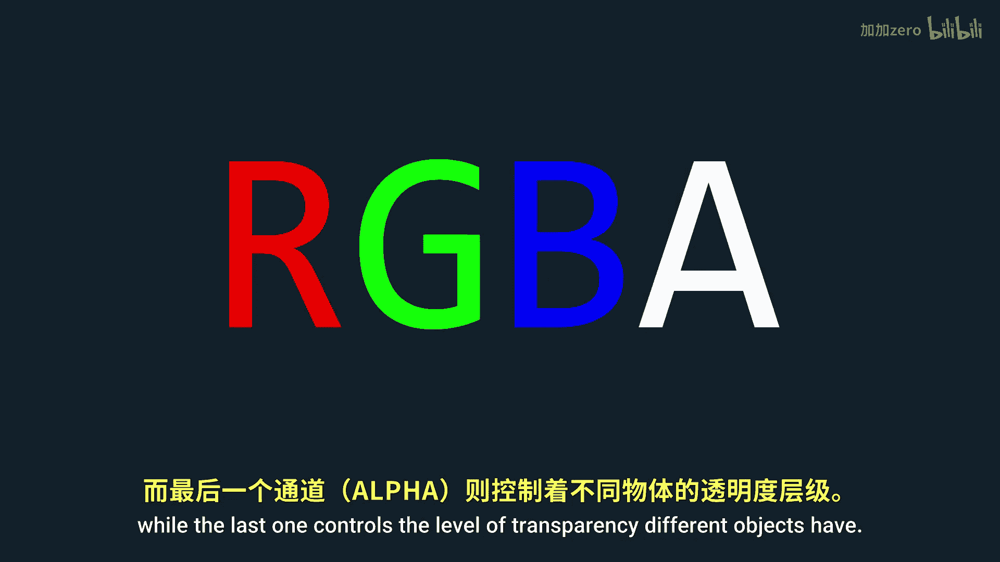
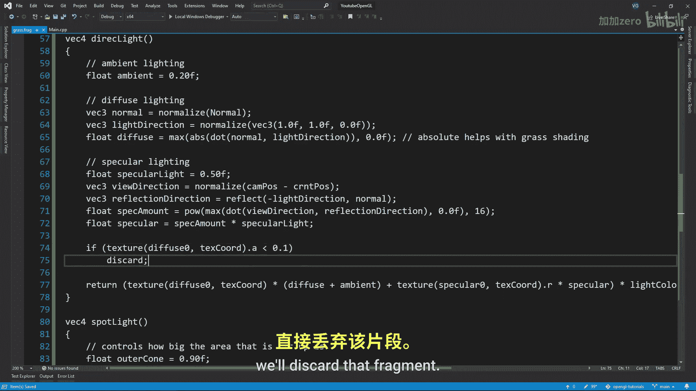
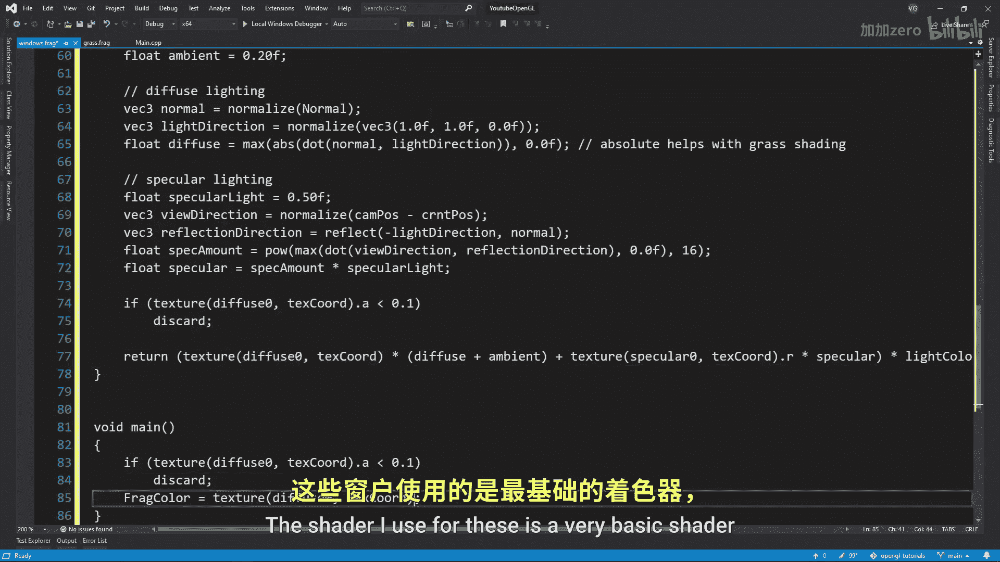
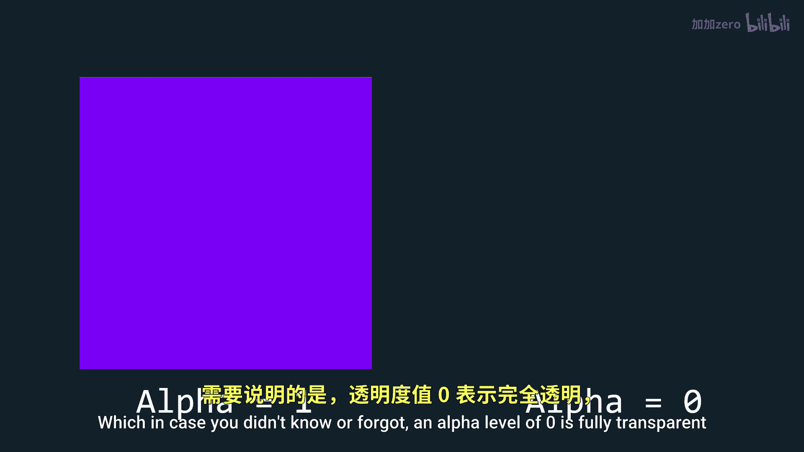
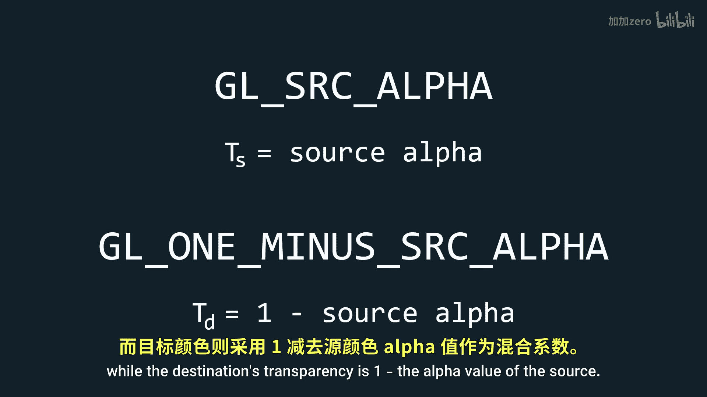
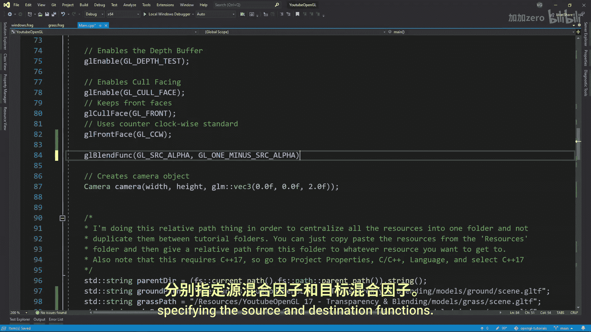
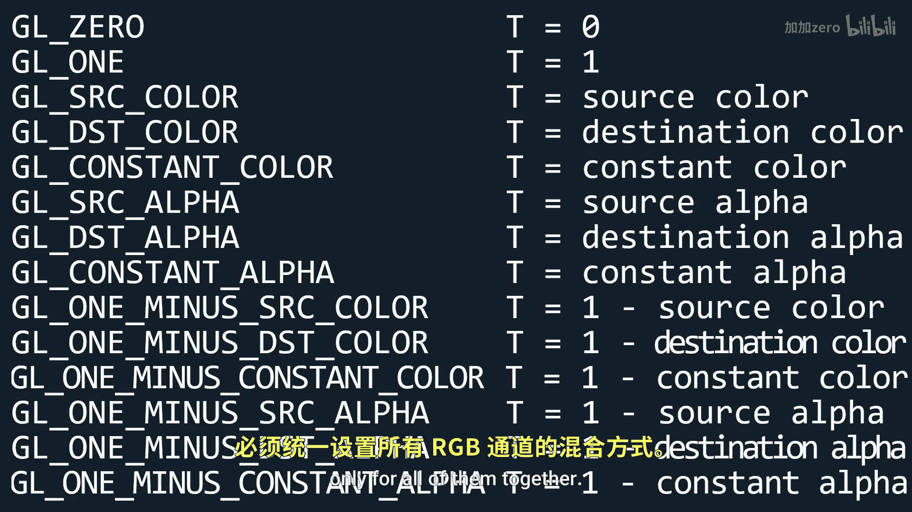
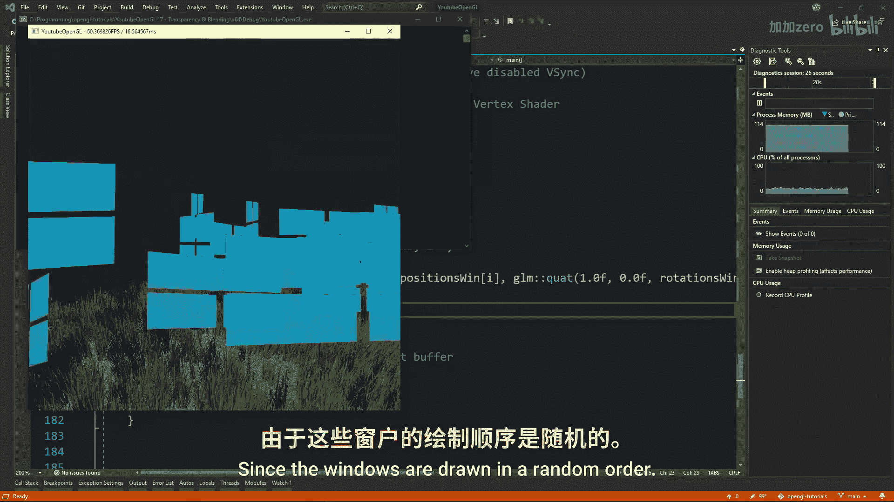

OpenGL教程：P18：透明度与混合

在本节课中，我们将学习如何在OpenGL中快速启用透明度效果，并利用混合功能实现半透明物体的渲染。

---

### 概述

到目前为止，我们使用的所有图片都包含四个分量：红、绿、蓝和Alpha。前三个分量决定了场景的颜色，而最后一个分量Alpha则控制着物体的透明度。本节课将首先介绍如何通过片段着色器实现基础的透明度效果，然后深入讲解OpenGL的混合机制，并解决渲染顺序带来的问题。

---

### 启用基础透明度

上一节我们介绍了纹理的基础知识。本节中，我们来看看如何让一个物体变得透明。以导入的草地模型为例，默认情况下它是不透明的。

为了启用透明度，我们需要创建一个新的片段着色器。这个着色器与我们常规的片段着色器几乎相同，但会添加一个关键步骤：检查Alpha值。如果Alpha值低于某个阈值，我们就丢弃该片段。

以下是实现此逻辑的着色器代码示例：
```glsl
#version 330 core
out vec4 FragColor;
in vec2 TexCoords;





uniform sampler2D texture1;




void main()
{
    vec4 texColor = texture(texture1, TexCoords);
    if(texColor.a < 0.1) // 如果Alpha值小于0.1，则丢弃该片段
        discard;
    FragColor = texColor;
}
```
不要忘记为这个新的片段着色器创建一个新的着色器程序。运行程序后，草地应该会按预期显示为透明。


接着，我添加了一组随机放置的透明窗户。用于渲染窗户的着色器非常简单，仅显示纹理，不包含任何光照计算。

现在，虽然窗户已经显示出来，但即使纹理本身是透明的，窗户看起来仍然不透明。为了实现“透视”效果，我们需要使用混合功能。

---

### 理解混合理论

混合是将源颜色（当前片段着色器输出的颜色）与目标颜色（当前颜色缓冲区中已有的颜色）结合的过程。OpenGL使用以下公式进行混合：

**最终颜色 = (源颜色因子 × 源颜色) + (目标颜色因子 × 目标颜色)**

其中：
*   **源颜色**：当前片段着色器输出的颜色。
*   **目标颜色**：颜色缓冲区中已存在的颜色。
*   **Alpha值**：0表示完全透明，1表示完全不透明。

最常见的配置是让**源颜色因子**等于源颜色的Alpha值，而**目标颜色因子**等于 `1 - 源颜色的Alpha值`。这样，最终颜色就是源颜色和目标颜色的加权混合。

---




### 配置OpenGL混合




现在，让我们告诉OpenGL使用上述混合配置。

首先，使用 `glBlendFunc` 函数指定源因子和目标因子：
```cpp
glBlendFunc(GL_SRC_ALPHA, GL_ONE_MINUS_SRC_ALPHA);
```
以下是其他一些可能用到的混合因子选项：

*   `GL_ZERO`：因子为0
*   `GL_ONE`：因子为1
*   `GL_SRC_COLOR`：因子等于源颜色向量
*   `GL_ONE_MINUS_SRC_COLOR`：因子等于1 - 源颜色向量
*   `GL_DST_COLOR`：因子等于目标颜色向量
*   `GL_ONE_MINUS_DST_COLOR`：因子等于1 - 目标颜色向量
*   `GL_SRC_ALPHA`：因子等于源颜色的Alpha值
*   `GL_ONE_MINUS_SRC_ALPHA`：因子等于1 - 源颜色的Alpha值

其次，你还可以使用 `glBlendEquation` 来指定颜色组合方式，默认是 `GL_FUNC_ADD`（将源和目标相加）：
```cpp
glBlendEquation(GL_FUNC_ADD);
```
其他选项包括 `GL_FUNC_SUBTRACT`（相减）和 `GL_FUNC_REVERSE_SUBTRACT`（反向相减）。

此外，`glBlendFuncSeparate` 函数允许为RGB通道和Alpha通道分别设置混合因子，提供了更精细的控制。

最后，在渲染透明物体（如窗户）之前，启用混合；渲染完成后，立即禁用它，以免影响其他不透明物体的渲染。
```cpp
glEnable(GL_BLEND);
// ... 渲染所有透明物体 ...
glDisable(GL_BLEND);
```
对于透明物体，应始终遵循此模式。

---

### 解决深度测试问题

编译并运行程序后，窗户现在应该是透明的了，但你可能发现混合效果看起来不正确，显得混乱。



这个问题源于我们的老朋友——深度缓冲区。由于窗户是随机绘制的，后绘制的窗户可能会覆盖先绘制的窗户，即使它在现实中应该位于其后。深度测试仅根据深度值决定是否写入片段，而不考虑透明度，这导致了错误的遮挡关系。




解决方案是：**先绘制所有不透明物体，然后禁用深度写入（但保持深度测试启用），最后按照从远到近的顺序绘制所有透明物体**。



具体步骤如下：
1.  绘制所有不透明物体。
2.  使用 `glDepthMask(GL_FALSE)` 禁用深度缓冲区的写入操作。
3.  对透明物体进行排序，按照从后（距离摄像机远）到前（距离摄像机近）的顺序进行绘制。
4.  绘制所有排序后的透明物体。
5.  使用 `glDepthMask(GL_TRUE)` 重新启用深度写入。

这样，远处的透明片段会先与颜色缓冲区混合，然后近处的片段再覆盖上去，从而得到正确的视觉效果。

---

### 总结

本节课中我们一起学习了OpenGL中的透明度与混合。
1.  我们首先通过片段着色器丢弃低Alpha片段来实现基础的透明效果。
2.  接着，深入理解了OpenGL的混合公式，并学会了如何使用 `glBlendFunc` 和 `glBlendEquation` 来配置混合。
3.  最后，我们识别并解决了由深度测试引起的透明物体渲染顺序问题，关键步骤是**先绘制不透明物体，然后按从远到近的顺序绘制透明物体**，并在绘制透明物体时禁用深度写入。




掌握这些技术后，你就能在场景中正确地渲染窗户、玻璃、水等半透明物体了。