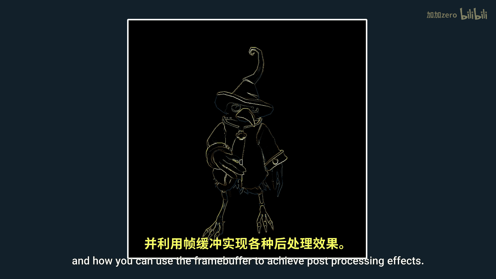
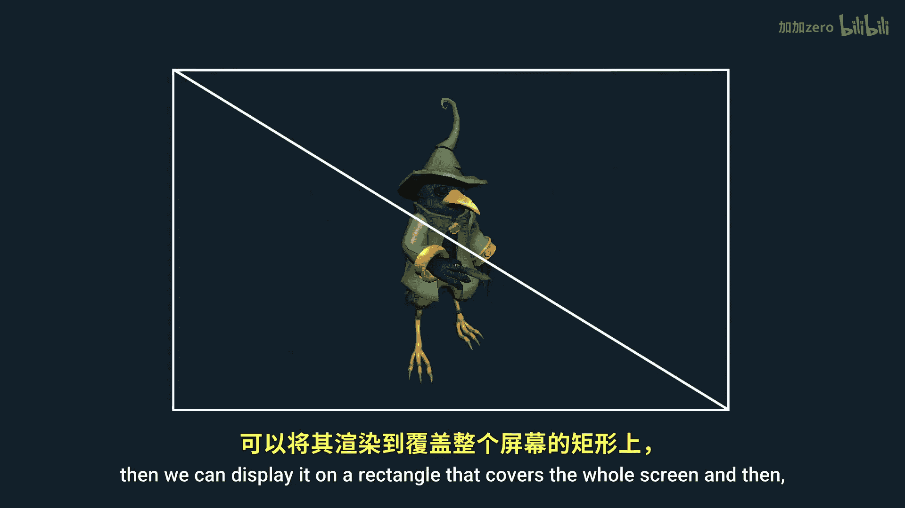
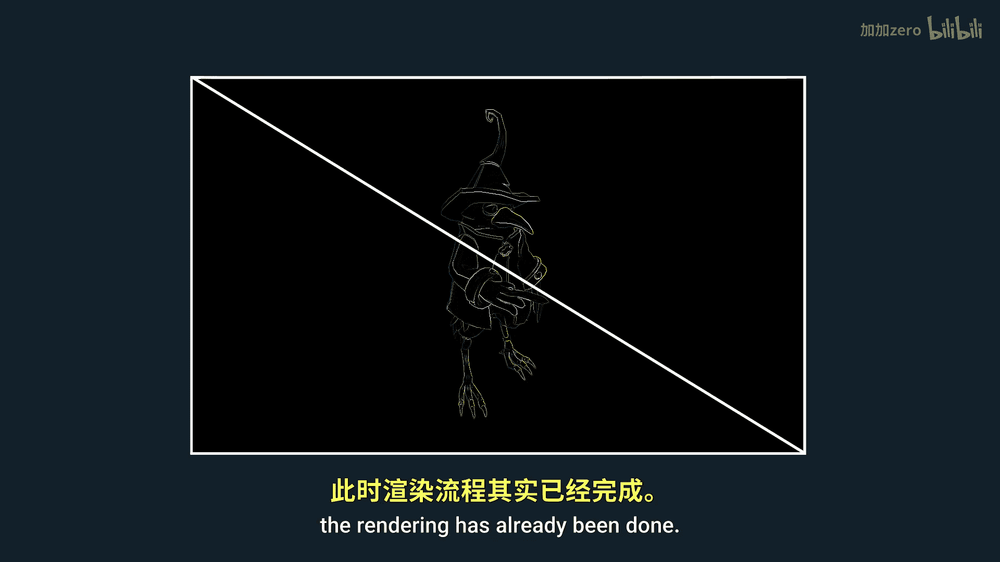
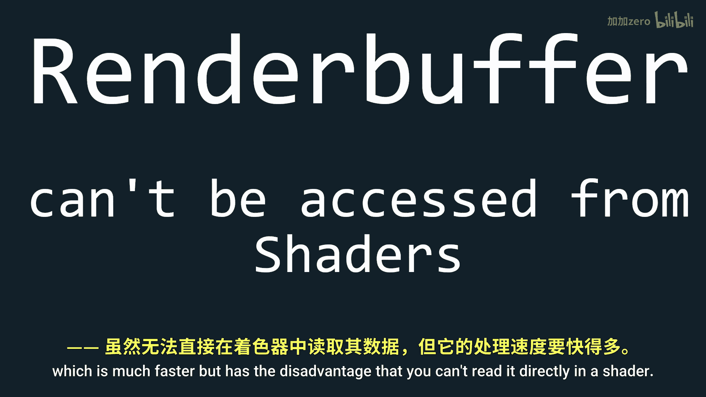
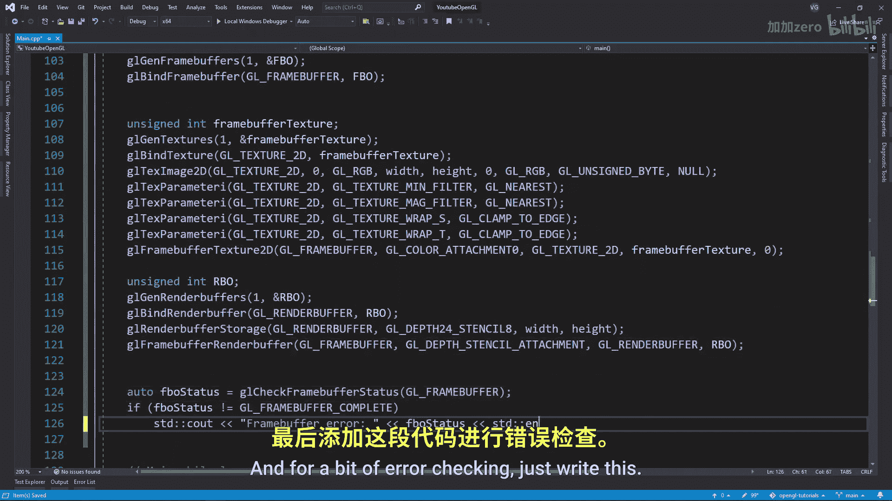

# 019：帧缓冲与后期处理 🖼️

在本节课中，我们将学习如何在OpenGL应用程序中实现自定义帧缓冲，并利用帧缓冲实现后期处理效果。

## 概述

帧缓冲是多个缓冲区的集合，它最终生成你在屏幕上看到的图像。它包含颜色缓冲、深度缓冲和模板缓冲。通过创建自定义帧缓冲，我们可以将渲染结果绘制到一个覆盖整个屏幕的矩形上，然后使用着色器修改矩形上的像素，从而实现各种效果。这种方法被称为“后期处理”，因为所有渲染完成后才处理像素。

## 帧缓冲的实现

上一节我们介绍了帧缓冲的基本概念，本节中我们来看看如何具体实现一个帧缓冲。

与任何OpenGL对象类似，我们首先创建一个无符号整数来标识帧缓冲对象，然后生成并绑定它。

```cpp
unsigned int framebuffer;
glGenFramebuffers(1, &framebuffer);
glBindFramebuffer(GL_FRAMEBUFFER, framebuffer);
```

至此，帧缓冲对象创建完成。但要使它有用，我们还需要为其附加颜色附件。

## 颜色附件

以下是创建并附加颜色纹理附件的步骤。

我们创建一个纹理，就像在纹理教程中一样。需要确保将纹理的环绕方式设置为“夹取到边缘”，否则某些效果会因纹理默认的重复行为而从屏幕一侧“溢出”到另一侧。

```cpp
unsigned int texture;
glGenTextures(1, &texture);
glBindTexture(GL_TEXTURE_2D, texture);
glTexImage2D(GL_TEXTURE_2D, 0, GL_RGB, width, height, 0, GL_RGB, GL_UNSIGNED_BYTE, NULL);
glTexParameteri(GL_TEXTURE_2D, GL_TEXTURE_MIN_FILTER, GL_LINEAR);
glTexParameteri(GL_TEXTURE_2D, GL_TEXTURE_MAG_FILTER, GL_LINEAR);
glTexParameteri(GL_TEXTURE_2D, GL_TEXTURE_WRAP_S, GL_CLAMP_TO_EDGE);
glTexParameteri(GL_TEXTURE_2D, GL_TEXTURE_WRAP_T, GL_CLAMP_TO_EDGE);
```



然后，我们使用`glFramebufferTexture2D`将纹理附加到帧缓冲上。我们将颜色存储在纹理中，这样我们就可以在着色器中访问它，这对于后期处理是必需的。





```cpp
glFramebufferTexture2D(GL_FRAMEBUFFER, GL_COLOR_ATTACHMENT0, GL_TEXTURE_2D, texture, 0);
```

## 深度与模板附件

对于深度缓冲，在本教程中我们并不需要在着色器中读取它。因此，我们可以使用渲染缓冲对象，它比纹理附件更快，但缺点是无法直接在着色器中读取。

以下是创建并附加渲染缓冲对象的步骤。

我们使用`glGenRenderbuffers`创建渲染缓冲对象，然后使用`glRenderbufferStorage`配置其存储。这里我们使用`GL_DEPTH24_STENCIL8`内部格式，以便同时存储深度和模板数据。

```cpp
unsigned int rbo;
glGenRenderbuffers(1, &rbo);
glBindRenderbuffer(GL_RENDERBUFFER, rbo);
glRenderbufferStorage(GL_RENDERBUFFER, GL_DEPTH24_STENCIL8, width, height);
```

然后，我们将其附加到帧缓冲的深度和模板附件点上。

```cpp
glFramebufferRenderbuffer(GL_FRAMEBUFFER, GL_DEPTH_STENCIL_ATTACHMENT, GL_RENDERBUFFER, rbo);
```

**非常重要的一点是，帧缓冲的所有附件（颜色纹理和渲染缓冲）必须具有相同的宽度和高度，否则可能会出错。**

为了进行错误检查，可以添加以下代码。遗憾的是，OpenGL的错误信息通常不具体，只提供一个错误码。

```cpp
if(glCheckFramebufferStatus(GL_FRAMEBUFFER) != GL_FRAMEBUFFER_COMPLETE)
    std::cout << "ERROR::FRAMEBUFFER:: Framebuffer is not complete!" << std::endl;
```

以下是可能遇到的错误码及其含义：
*   `GL_FRAMEBUFFER_UNDEFINED`：指定的帧缓冲是默认帧缓冲，但它不存在。
*   `GL_FRAMEBUFFER_INCOMPLETE_ATTACHMENT`：至少一个附件点不完整。
*   `GL_FRAMEBUFFER_INCOMPLETE_MISSING_ATTACHMENT`：帧缓冲没有附加任何图像。
*   `GL_FRAMEBUFFER_INCOMPLETE_DRAW_BUFFER`：`glDrawBuffers`调用中指定的颜色附件点没有图像附着。
*   `GL_FRAMEBUFFER_INCOMPLETE_READ_BUFFER`：`GL_READ_BUFFER`指定的附件点没有图像附着。
*   `GL_FRAMEBUFFER_UNSUPPORTED`：附着的图像内部格式组合不受支持。
*   `GL_FRAMEBUFFER_INCOMPLETE_MULTISAMPLE`：所有图像的采样数不同。
*   `GL_FRAMEBUFFER_INCOMPLETE_LAYER_TARGETS`：某些图像不是分层纹理，或者附加到了多个层。


## 屏幕矩形与着色器



现在我们已经有了帧缓冲对象，接下来需要创建一个覆盖整个屏幕的矩形。这个矩形不需要任何变换（如模型、视图、投影矩阵），因为它直接对应屏幕空间。

然后，我们编写两个非常基础的着色器来从帧缓冲纹理中读取颜色，并将它们链接成一个着色器程序。在着色器中，我们只需要采样我们附加的颜色纹理。

顶点着色器示例：
```glsl
#version 330 core
layout (location = 0) in vec2 aPos;
layout (location = 1) in vec2 aTexCoords;

out vec2 TexCoords;

void main()
{
    gl_Position = vec4(aPos.x, aPos.y, 0.0, 1.0);
    TexCoords = aTexCoords;
}
```

片段着色器示例：
```glsl
#version 330 core
out vec4 FragColor;

in vec2 TexCoords;

uniform sampler2D screenTexture;

void main()
{
    FragColor = texture(screenTexture, TexCoords);
}
```

在程序中，我们需要将纹理单元0（`GL_TEXTURE0`）传递给着色器，因为这是此着色器中唯一的纹理。

```cpp
shader.use();
shader.setInt("screenTexture", 0);
glActiveTexture(GL_TEXTURE0);
glBindTexture(GL_TEXTURE_2D, texture); // 绑定我们之前创建的帧缓冲纹理
```

## 渲染流程



现在让我们来处理绘制部分。以下是使用自定义帧缓冲进行渲染的步骤。


首先，在绘制任何物体（包括背景）之前，确保绑定我们自定义的帧缓冲。同时，确保清空缓冲并启用深度测试。

```cpp
// 1. 绑定到自定义帧缓冲并绘制场景
glBindFramebuffer(GL_FRAMEBUFFER, framebuffer);
glEnable(GL_DEPTH_TEST); // 启用深度测试
glClearColor(0.1f, 0.1f, 0.1f, 1.0f);
glClear(GL_COLOR_BUFFER_BIT | GL_DEPTH_BUFFER_BIT);
// ... 绘制你的3D场景 ...
```

在场景中的所有物体绘制完毕后，我们切换回默认的帧缓冲（通过绑定ID为0的帧缓冲），然后绘制那个覆盖全屏的矩形，它将显示我们刚刚解绑的自定义帧缓冲中的内容。**记得在绘制矩形前禁用深度测试**，否则矩形可能因为深度测试而被遮挡。

```cpp
// 2. 绑定回默认帧缓冲并绘制屏幕四边形
glBindFramebuffer(GL_FRAMEBUFFER, 0);
glDisable(GL_DEPTH_TEST); // 禁用深度测试
glClearColor(1.0f, 1.0f, 1.0f, 1.0f);
glClear(GL_COLOR_BUFFER_BIT);

screenShader.use();
glBindVertexArray(quadVAO);
glBindTexture(GL_TEXTURE_2D, texture); // 绑定帧缓冲的颜色纹理
glDrawArrays(GL_TRIANGLES, 0, 6);
```

现在如果你运行程序，应该看到和之前完全一样的画面。如果你的屏幕显示为纯色，请首先检查控制台是否有任何OpenGL错误（例如不完整的帧缓冲）。如果控制台窗口没有错误信息，请确保你的视口（`glViewport`）设置正确，覆盖了整个窗口。

## 总结


本节课中我们一起学习了OpenGL帧缓冲的核心机制。我们了解了帧缓冲是颜色、深度和模板附件的集合。我们实现了创建自定义帧缓冲、附加纹理作为颜色附件、附加渲染缓冲作为深度和模板附件的完整流程。最后，我们掌握了使用双通道渲染（先渲染到自定义帧缓冲，再渲染到默认帧缓冲的屏幕矩形）来实现后期处理的基础框架。有了这个框架，你就可以在屏幕矩形的片段着色器中添加各种图像处理算法（如反相、灰度、模糊、核效果等），轻松实现丰富的后期处理效果。