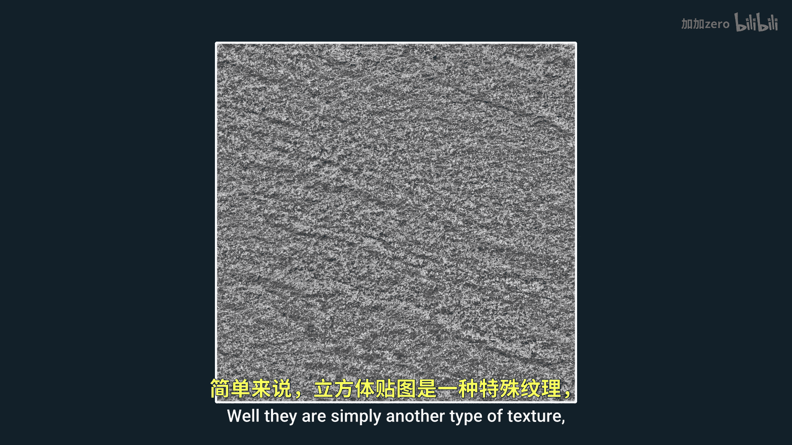
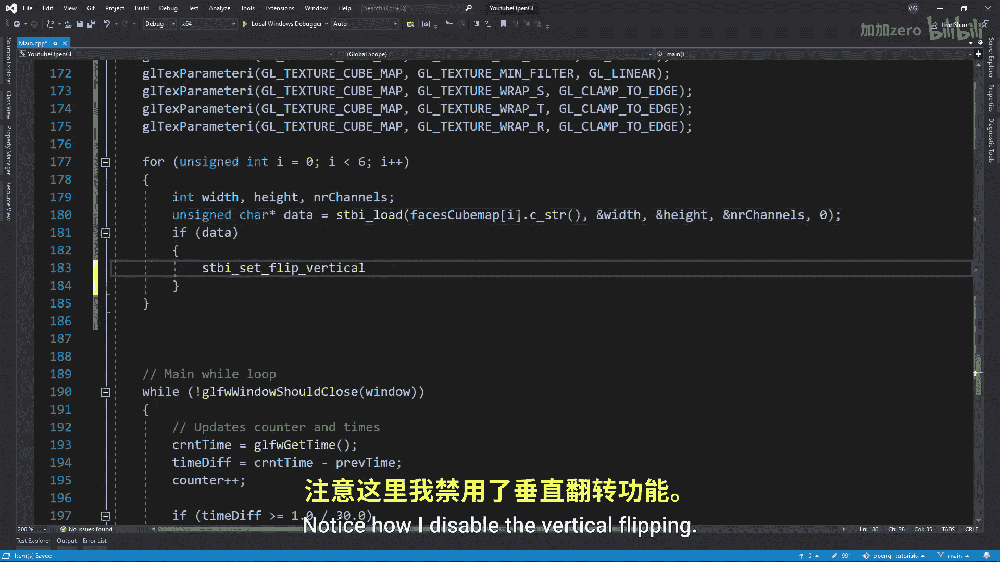
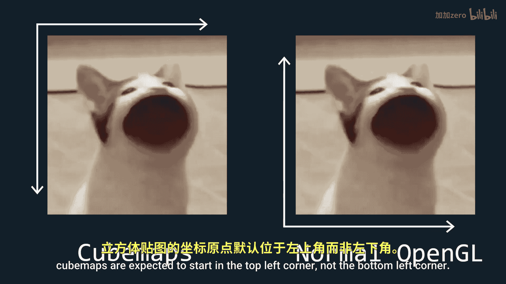
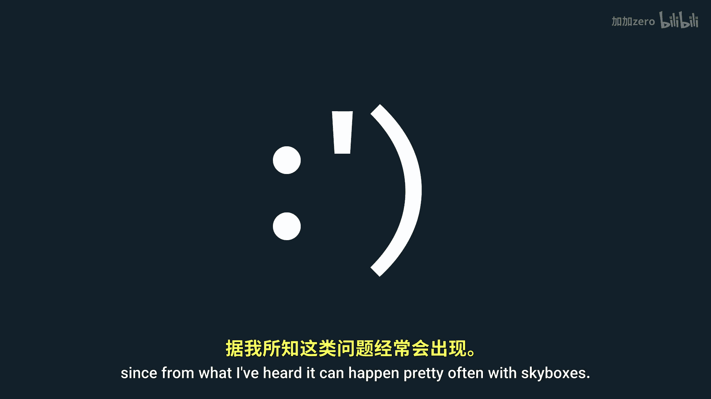

# 020：Cubemaps与Skyboxes 🎨

在本教程中，我们将学习OpenGL中的Cubemaps（立方体贴图）是什么，以及如何使用它们来创建Skyboxes（天空盒）。

## 概述

立方体贴图是一种特殊的纹理类型，它包含六个2D纹理，分别对应一个立方体的六个面。采样立方体贴图时，我们使用一个3D向量而非2D纹理坐标。这使得我们能够轻松地在立方体的所有六个面之间进行采样。由于立方体的坐标与采样向量相对应，因此不需要UV坐标。立方体贴图最常见的用途是环境贴图和天空盒。

## 创建立方体贴图

上一节我们介绍了立方体贴图的基本概念，本节中我们来看看如何创建它。

首先，我们需要定义立方体的顶点和索引数据。

以下是立方体的顶点坐标和索引数据：

```cpp
float skyboxVertices[] = {
    // 位置坐标
    -1.0f,  1.0f, -1.0f,
    -1.0f, -1.0f, -1.0f,
     1.0f, -1.0f, -1.0f,
     1.0f,  1.0f, -1.0f,
    // ... 其他顶点
};

unsigned int skyboxIndices[] = {
    0, 1, 2,
    2, 3, 0,
    // ... 其他索引
};
```

然后，我们需要创建VAO、VBO和EBO，就像在最初的教程中一样。

```cpp
unsigned int skyboxVAO, skyboxVBO, skyboxEBO;
glGenVertexArrays(1, &skyboxVAO);
glGenBuffers(1, &skyboxVBO);
glGenBuffers(1, &skyboxEBO);
// ... 绑定和配置缓冲区
```

## 加载天空盒纹理




接下来，我们需要加载天空盒的六个面纹理。

首先，创建一个包含六个图像路径的字符串数组。

```cpp
std::vector<std::string> faces = {
    "right.jpg",
    "left.jpg",
    "top.jpg",
    "bottom.jpg",
    "front.jpg",
    "back.jpg"
};
```

然后，创建立方体贴图纹理本身。这与创建其他纹理类似，但有一个关键区别：我们使用`GL_TEXTURE_CUBE_MAP`而不是`GL_TEXTURE_2D`。

```cpp
unsigned int cubemapTexture;
glGenTextures(1, &cubemapTexture);
glBindTexture(GL_TEXTURE_CUBE_MAP, cubemapTexture);
```

确保在所有三个方向上对纹理进行钳制。由于纹理是一个立方体（因此是3D的），这种钳制可以防止任何接缝出现。

```cpp
glTexParameteri(GL_TEXTURE_CUBE_MAP, GL_TEXTURE_WRAP_S, GL_CLAMP_TO_EDGE);
glTexParameteri(GL_TEXTURE_CUBE_MAP, GL_TEXTURE_WRAP_T, GL_CLAMP_TO_EDGE);
glTexParameteri(GL_TEXTURE_CUBE_MAP, GL_TEXTURE_WRAP_R, GL_CLAMP_TO_EDGE);
```

现在，我们将遍历所有六个纹理，使用STB库读取它们，并将它们放入立方体贴图中。

```cpp
int width, height, nrChannels;
for (unsigned int i = 0; i < faces.size(); i++) {
    unsigned char *data = stbi_load(faces[i].c_str(), &width, &height, &nrChannels, 0);
    if (data) {
        glTexImage2D(GL_TEXTURE_CUBE_MAP_POSITIVE_X + i, 0, GL_RGB, width, height, 0, GL_RGB, GL_UNSIGNED_BYTE, data);
        stbi_image_free(data);
    }
}
```

请注意，我禁用了垂直翻转。这是因为与OpenGL中的大多数纹理不同，立方体贴图期望从左上角开始，而不是左下角。

另外，请注意我如何将`i`添加到`GL_TEXTURE_CUBE_MAP_POSITIVE_X`。这代表了我当前正在分配纹理的立方体面，我通过添加`i`来循环遍历所有面。

以下是OpenGL文档中面的顺序：





```
GL_TEXTURE_CUBE_MAP_POSITIVE_X
GL_TEXTURE_CUBE_MAP_NEGATIVE_X
GL_TEXTURE_CUBE_MAP_POSITIVE_Y
GL_TEXTURE_CUBE_MAP_NEGATIVE_Y
GL_TEXTURE_CUBE_MAP_POSITIVE_Z
GL_TEXTURE_CUBE_MAP_NEGATIVE_Z
```


这是我们写入路径的顺序。注意到有什么奇怪的地方吗？通常，在OpenGL中，前方是负Z方向，但对于立方体贴图，前方是正Z方向。这意味着立方体贴图在左手坐标系中工作，而OpenGL的大部分内容在右手坐标系中工作。这可能会非常令人困惑，老实说，我不知道他们为什么选择这样做。但请记住，如果不小心，你可能会因此遇到一些小错误。在我的情况下，我的右侧纹理由于某种原因一直倒置显示。为了解决这个问题，我只需在图像编辑器中翻转纹理。所以请准备好处理这类问题，因为据我所知，这在天空盒中经常发生。

## 创建天空盒着色器

现在我们需要为天空盒创建两个着色器。

顶点着色器将接收坐标、输出纹理坐标，并接收用于矩阵变换的uniform变量。

```glsl
#version 330 core
layout (location = 0) in vec3 aPos;

out vec3 TexCoords;

uniform mat4 projection;
uniform mat4 view;

void main() {
    TexCoords = aPos;
    vec4 pos = projection * view * vec4(aPos, 1.0);
    gl_Position = pos.xyww;
}
```

在main函数中，创建一个`pos`变量，用于保存最终变换后的坐标。由于这些坐标现在在屏幕空间中，我们将做一些有点奇怪的事情：我们不给`gl_Position`分配坐标，而是分配`pos`的`x`、`y`、`w`和`w`分量。这将导致在透视除法之后，Z分量始终为1。由于深度缓冲区将Z分量作为深度值，天空盒将始终具有深度值1。

片段着色器将接收纹理坐标，并使用立方体贴图纹理进行采样。

```glsl
#version 330 core
out vec4 FragColor;



in vec3 TexCoords;

uniform samplerCube skybox;

void main() {
    FragColor = texture(skybox, TexCoords);
}
```

## 渲染天空盒

最后，我们需要在渲染循环中绘制天空盒。确保在绘制其他物体之后绘制天空盒，并禁用深度写入，以便天空盒始终在背景中。

```cpp
glDepthMask(GL_FALSE);
glBindVertexArray(skyboxVAO);
glBindTexture(GL_TEXTURE_CUBE_MAP, cubemapTexture);
glDrawElements(GL_TRIANGLES, 36, GL_UNSIGNED_INT, 0);
glDepthMask(GL_TRUE);
```


## 总结


在本节课中，我们一起学习了OpenGL中的立方体贴图（Cubemaps）以及如何使用它们创建天空盒（Skybox）。我们首先了解了立方体贴图的基本概念，然后逐步实现了顶点和索引数据的定义、纹理的加载、着色器的编写以及最终的渲染过程。通过本教程，你应该能够理解并实现一个基本的天空盒效果，为你的3D场景增添背景环境。