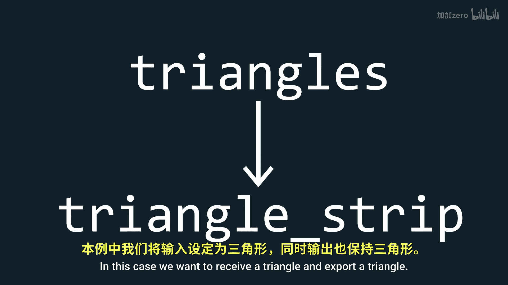
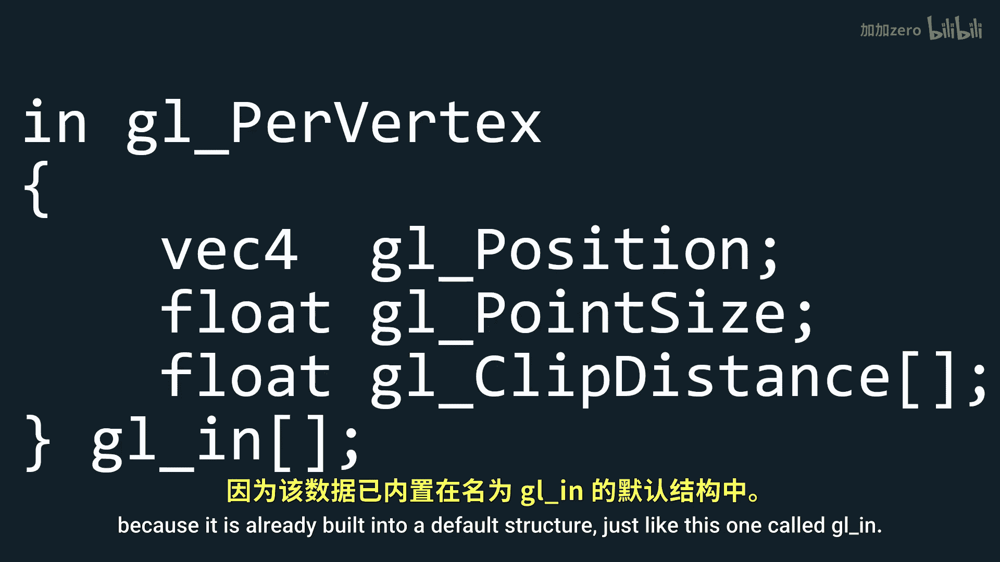

# 021：几何着色器 🧩

在本教程中，我们将学习什么是几何着色器，以及如何使用它来创建诸如可见法线等效果。

## 概述

到目前为止，我们只使用了顶点着色器和片段着色器。在大多数情况下，这两个着色器已经足够。但有时，在顶点着色器和片段着色器之间，你可能需要一个额外的步骤来修改网格的几何形状。虽然看起来可以在顶点着色器中完成，但你只能对单个顶点进行操作。如果你想修改整个三角形（即一组顶点），那么就需要使用几何着色器。几何着色器的第二个优点是它可以在不同类型的图元之间切换，从而创建或删除顶点。

## 将几何着色器添加到着色器类

首先，我们需要将几何着色器添加到我们的着色器类中。请注意，我执行的操作与其他两个着色器完全相同，只是我使用了 `GL_GEOMETRY_SHADER`。

```cpp
// 创建几何着色器
unsigned int geometryShader = glCreateShader(GL_GEOMETRY_SHADER);
glShaderSource(geometryShader, 1, &geometryShaderSource, NULL);
glCompileShader(geometryShader);
// ... 检查编译错误并链接到着色器程序
```

## 创建一个基础的几何着色器

现在我们已经支持自定义几何着色器，让我们创建一个什么都不做的几何着色器。与任何其他着色器一样，我们首先声明版本。


```glsl
#version 330 core
```


然后，我们需要两个布局声明，写法如下。第一个布局表示我们接收的图元类型，可以是以下之一：
*   `points`
*   `lines`
*   `lines_adjacency`
*   `triangles`
*   `triangles_adjacency`


第二个布局表示我们输出的图元类型，可以是以下之一：
*   `points`
*   `line_strip`
*   `triangle_strip`

在本例中，我们希望接收一个三角形并输出一个三角形。

```glsl
layout (triangles) in;
layout (triangle_strip, max_vertices = 3) out;
```


接着，我们定义输出到片段着色器的变量。请记住，数据应该从顶点着色器传递到几何着色器，然后再传递到片段着色器。


```glsl
out vec3 Normal;
out vec3 Color;
out vec2 TexCoord;
```

## 将数据导入几何着色器

现在，为了将数据导入几何着色器，我们需要做一些稍微不同的事情。我们不是简单地使用一个 `in` 变量，而是定义一个类似C语言的结构体，写法如下：

```glsl
in VS_OUT {
    vec3 Normal;
    vec3 Color;
    vec2 TexCoord;
} gs_in[];
```

请注意，我们不需要在这个结构体中包含位置信息，因为它已经内置在一个名为 `gl_in[]` 的默认结构中。

## 修改顶点着色器

我们需要回到顶点着色器，将所有输出数据替换为完全相同的结构体，只是最后一部分用 `out` 代替 `in`。确保结构体中的所有其他内容都与几何着色器中的对应部分相同。

```glsl
out VS_OUT {
    vec3 Normal;
    vec3 Color;
    vec2 TexCoord;
} vs_out;
```

另外，我们只包含了模型视图矩阵，而没有包含投影矩阵。这是因为我们希望在修改几何形状之后才应用投影矩阵。



现在，要为这些输出值分配数据，我们只需写下我们给它们起的名字，加上一个点，再加上我们想要分配数据的变量名，这非常类似于C或C++的结构体。




```glsl
vs_out.Normal = mat3(transpose(inverse(modelView))) * aNormal;
vs_out.Color = aColor;
vs_out.TexCoord = aTexCoord;
gl_Position = modelView * vec4(aPos, 1.0);
```

## 在几何着色器中组装数据

在几何着色器中，我们已经拥有了所有需要的数据，剩下的就是将这些数据组装起来。为此，我们只需为位置、法线、颜色和纹理坐标分配数据。

请注意，在这里，除了要访问的结构体部分的名称外，我还有一个索引。这是因为我们在几何着色器中，本质上拥有一个这样的结构体数组，每个数组元素对应一个特定顶点的不同值。

```glsl
gl_Position = gl_in[0].gl_Position;
Normal = gs_in[0].Normal;
Color = gs_in[0].Color;
TexCoord = gs_in[0].TexCoord;
EmitVertex();
```

一旦我们完成了一个顶点的值分配，我们必须使用 `EmitVertex()` 来声明我们已经完成了这个顶点。

我们可以对其他两个顶点做同样的事情：

```glsl
gl_Position = gl_in[1].gl_Position;
Normal = gs_in[1].Normal;
Color = gs_in[1].Color;
TexCoord = gs_in[1].TexCoord;
EmitVertex();

gl_Position = gl_in[2].gl_Position;
Normal = gs_in[2].Normal;
Color = gs_in[2].Color;
TexCoord = gs_in[2].TexCoord;
EmitVertex();
```

一旦我们完成了三角形所需的所有三个顶点，我们就需要使用 `EndPrimitive()` 来声明我们的图元已经完成。


```glsl
EndPrimitive();
```


## 总结

在本节课中，我们一起学习了几何着色器的基础知识。我们了解了它的作用——在顶点和片段着色器之间处理图元（如三角形），并能够创建或修改顶点。我们逐步实现了将几何着色器集成到现有着色器程序中，包括：
1.  在着色器类中添加对几何着色器的支持。
2.  编写一个基础的几何着色器，定义了输入和输出的图元类型。
3.  使用自定义结构体在顶点着色器和几何着色器之间传递数据。
4.  在几何着色器中，通过索引访问每个顶点的数据，并使用 `EmitVertex()` 和 `EndPrimitive()` 函数来组装并输出最终的图元。


这个基础的几何着色器目前没有改变几何形状，但它为后续实现更复杂的功能（如生成可见法线）搭建了必要的框架。