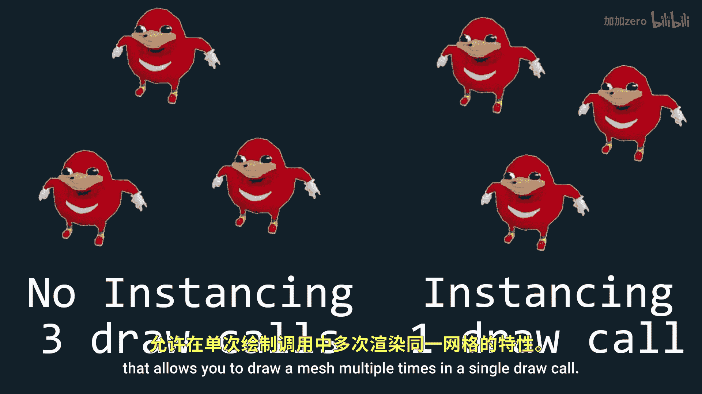
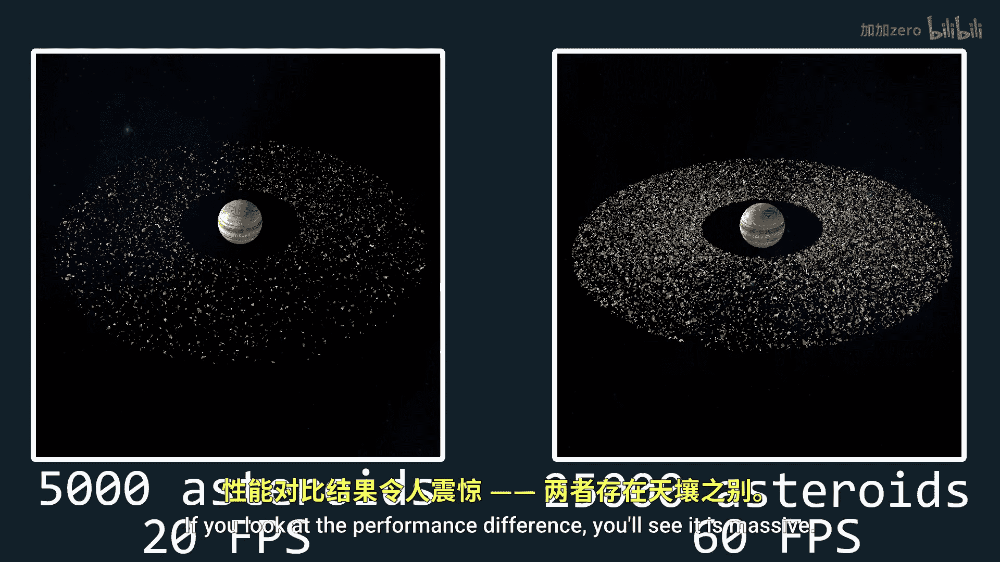

# 022：实例化 🚀

在本教程中，我们将学习什么是实例化，以及如何利用它来大幅提升OpenGL项目的性能和视觉效果。

实例化是一项功能，它允许你在一次绘制调用中多次绘制同一个网格。为什么需要这个功能呢？考虑以下场景：左边场景中有一堆小行星，它们都源自同一个小行星网格，并通过顶点着色器进行变形以产生多样性。我使用一个循环来逐个绘制每个小行星，这意味着每个小行星都需要一次单独的绘制调用。

而在右边的场景中，我一次性绘制所有小行星，这意味着只需要一次绘制调用。观察性能差异，你会发现提升是巨大的。现在，让我们开始实现它。

我将从为第一个场景（即逐个绘制）已经写好的代码开始，因为这对本系列教程来说并不新鲜。

## 启用实例化

为了启用实例化，我们需要做的只是将 `glDrawElements` 替换为 `glDrawElementsInstanced`，并在其末尾添加我们想要绘制的网格实例数量。

```cpp
glDrawElementsInstanced(GL_TRIANGLES, indices.size(), GL_UNSIGNED_INT, 0, instanceCount);
```






唯一的问题是，这会将所有网格绘制在完全相同的位置上，因此目前是无效的。


## 为每个实例设置不同位置

有多种方法可以将每个网格移动到唯一的位置。例如，你可以在顶点着色器中编写代码来实现这一点。

使用 `gl_InstanceID`，你可以获取当前正在绘制的实例的索引，从而可以将其用于可控的随机数生成。

```glsl
int instanceIndex = gl_InstanceID;
```

或者，你可以使用一个包含所有变换矩阵的uniform变量，并通过 `gl_InstanceID` 来检索特定实例的正确变换矩阵。

```glsl
uniform mat4 instanceTransforms[100];
mat4 transform = instanceTransforms[gl_InstanceID];
```

但这种方法的问题是，uniform变量无法存储大量数据。

因此，要在拥有大量变换矩阵的同时，又不将生成逻辑完全放在顶点着色器内，最佳方法是将变换矩阵存储在附加到网格VAO的顶点缓冲区中。


## 实现实例化变换

让我们从创建一个接受 `glm::mat4` 向量（即变换矩阵列表）的VBO构造函数开始。

在网格类中，我们需要添加一个公共的无符号整数变量，来表示我们期望的实例数量。当然，我们也需要将其添加到构造函数中以便轻松修改。

同样在构造函数中，我们应该添加用于实例的变换矩阵向量，以便我们可以将其传入顶点缓冲区。

在网格类的实现文件（.cpp）中，我们想要为实例创建一个VBO，然后将其属性链接到VAO。**注意：** 仅当我们绘制多个实例时才需要这样做。

确保将矩阵链接为四个不同的 `vec4` 属性，否则程序将无法工作。最后，使用 `glVertexAttribDivisor` 函数，为每个 `vec4` 属性的布局位置传入参数 `1`。

```cpp
glVertexAttribDivisor(layoutLocation, 1);
```

这里的 `1` 意味着这个 `vec4` 属性将用于整个实例。如果它是 `0`，则该 `vec4` 将用于每个顶点，然后下一个 `vec4` 用于下一个顶点，这显然不是我们想要的。为了更清晰，如果它是 `2`，则意味着每两个实例才会切换到下一个 `vec4` 值。

现在，我们也需要限制 `glDrawElementsInstanced` 仅在有多个实例时才被使用。

对于模型类，我们需要做与网格类完全相同的事情：在构造函数中添加实例变换矩阵作为变量，并添加实例化数量作为变量。

## 总结


本节课中，我们一起学习了OpenGL中的实例化技术。我们了解了实例化的概念及其在提升性能方面的巨大优势。通过将 `glDrawElements` 替换为 `glDrawElementsInstanced`，并配合使用 `gl_InstanceID` 和存储在VBO中的变换矩阵，我们实现了在单次绘制调用中渲染大量相似但位置不同的对象。关键在于正确设置顶点属性指针和使用 `glVertexAttribDivisor` 来指定属性数据更新的频率。掌握实例化对于渲染粒子系统、植被、大量重复建筑等场景至关重要。