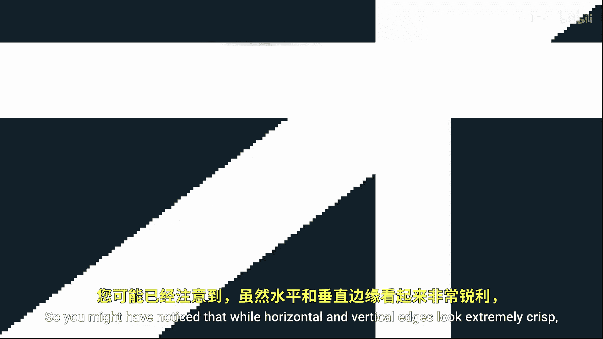
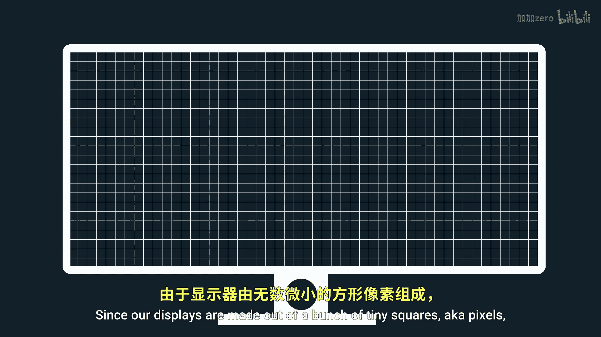
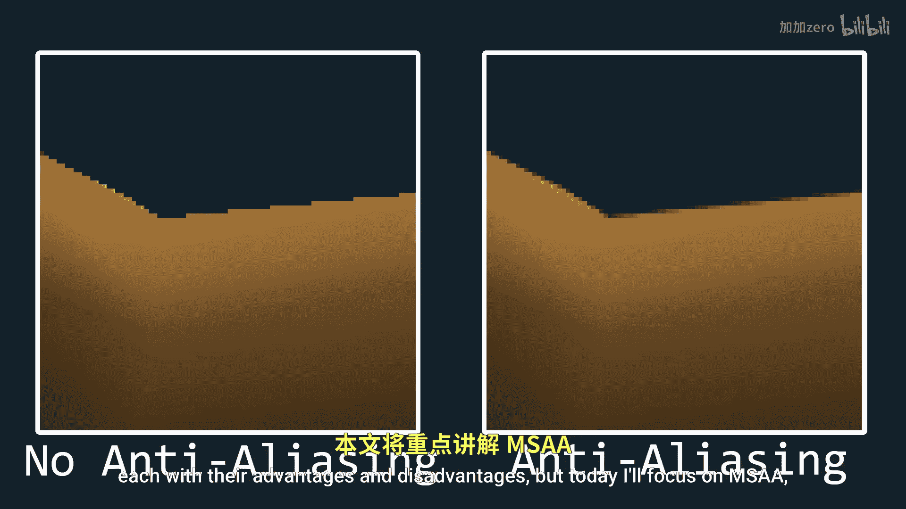
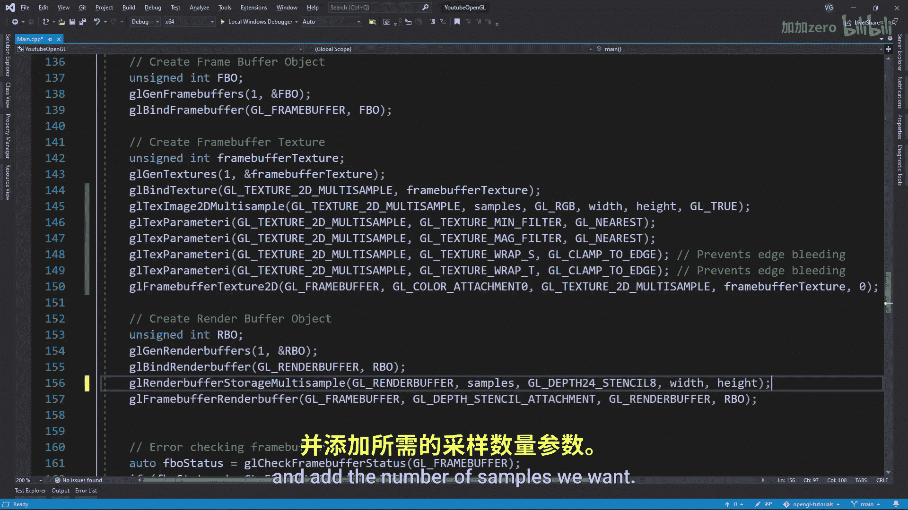
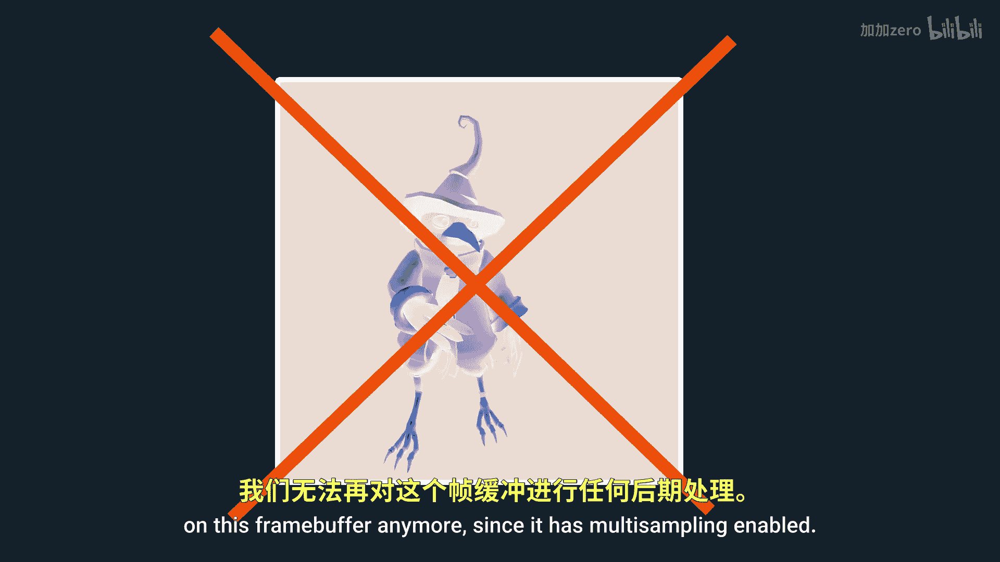

# 023：抗锯齿（MSAA）

在本教程中，我们将学习什么是抗锯齿，以及如何在你的OpenGL项目中实现它。具体来说，我们将重点介绍**多重采样抗锯齿（MSAA）** 的原理和实现步骤。

## 概述：什么是锯齿与抗锯齿？

你可能已经注意到，在渲染图形时，水平和垂直的边缘看起来非常清晰，而对角线边缘却常常呈现出类似楼梯的锯齿状。这种现象被称为**锯齿（Aliasing）**。

其根本原因在于我们的显示器是由无数微小的正方形（即像素）组成的。在绘制对角线时，无法完美地呈现一条平滑的线条。抗锯齿技术通过将边缘的颜色“渗透”到相邻的像素中来模拟平滑效果，从而改善视觉体验。

有多种抗锯齿技术，各有优劣。本教程将专注于**多重采样抗锯齿（MSAA）**。

## 核心原理：MSAA如何工作？

上一节我们介绍了锯齿产生的原因，本节中我们来看看MSAA的核心工作原理。

在图形渲染管线的**光栅化（Rasterization）**阶段，系统需要决定哪些像素应该被着色。传统方法是检查每个像素中心的**采样点（Sample Point）**是否位于图元（如三角形）内部。如果采样点在三角形外，该像素就不会被着色，即使从视觉上看它应该被部分着色。




MSAA通过在每个像素内设置**多个采样点**来解决这个问题。系统会检查所有采样点与图元的重叠情况，并根据重叠比例来计算该像素的最终颜色。




例如，如果一个像素有4个采样点，其中2个位于三角形内部，那么该像素的颜色将是背景色和三角形颜色的混合。这有效地平滑了边缘。


**核心公式/概念**：
*   **传统采样**：`if (center_sample_inside_primitive) { color_pixel(); }`
*   **MSAA采样**：`final_color = (num_samples_inside / total_samples) * primitive_color + (num_samples_outside / total_samples) * background_color`



## 实现步骤：在OpenGL中启用MSAA

理解了原理后，现在让我们进入实践环节，看看如何在代码中实现MSAA。实现方式取决于你是否使用了自定义的帧缓冲。

### 情况一：不使用自定义帧缓冲

如果你的项目直接渲染到默认的窗口帧缓冲，启用MSAA非常简单。

以下是需要执行的步骤：
1.  在创建窗口前，使用GLFW提示指定所需的多重采样级别。
2.  启用OpenGL的多重采样功能。

对应的核心代码如下：
```cpp
// 1. 指定采样数（例如4倍抗锯齿）
glfwWindowHint(GLFW_SAMPLES, 4);

// ... 创建窗口和OpenGL上下文 ...

// 2. 启用多重采样
glEnable(GL_MULTISAMPLE);
```
在这种情况下，启用上述设置后，你的渲染就会自动应用MSAA。

### 情况二：使用自定义帧缓冲（FBO）

如果你的项目使用了离屏渲染的自定义帧缓冲，步骤会稍复杂一些。我们需要创建一个支持多重采样的帧缓冲。


以下是创建多重采样帧缓冲的步骤：
1.  创建纹理附件时，使用 `GL_TEXTURE_2D_MULTISAMPLE` 类型代替普通的 `GL_TEXTURE_2D`。
2.  使用 `glTexImage2DMultisample` 函数来分配存储空间，并指定采样数量。
3.  创建渲染缓冲对象（RBO）附件时，使用 `glRenderbufferStorageMultisample` 函数。

核心代码对比如下：
```cpp
// 普通帧缓冲纹理附件
glGenTextures(1, &texture);
glBindTexture(GL_TEXTURE_2D, texture);
glTexImage2D(GL_TEXTURE_2D, 0, GL_RGB, width, height, 0, GL_RGB, GL_UNSIGNED_BYTE, NULL);

// 多重采样帧缓冲纹理附件
glGenTextures(1, &texture);
glBindTexture(GL_TEXTURE_2D_MULTISAMPLE, texture);
glTexImage2DMultisample(GL_TEXTURE_2D_MULTISAMPLE, 4, GL_RGB, width, height, GL_TRUE); // 4个样本
```
```cpp
// 普通渲染缓冲对象
glRenderbufferStorage(GL_RENDERBUFFER, GL_DEPTH24_STENCIL8, width, height);

// 多重采样渲染缓冲对象
glRenderbufferStorageMultisample(GL_RENDERBUFFER, 4, GL_DEPTH24_STENCIL8, width, height); // 4个样本
```

## 高级处理：结合后期效果

直接使用多重采样帧缓冲会带来一个问题：我们无法再对其内容进行**后期处理（Post-Processing）**，因为多采样纹理与普通的着色器采样器不兼容。

为了解决这个问题，我们需要一个额外的**渲染管线**。思路是：
1.  将所有场景渲染到一个**多重采样帧缓冲（MSAA FBO）** 中。
2.  将这个多重采样帧缓冲的内容**解析（Resolve）** 到一个普通的**中间帧缓冲（Intermediate FBO）** 中。
3.  对中间帧缓冲中的图像进行后期处理。
4.  将处理后的结果绘制到屏幕。

以下是渲染循环中的核心步骤：
```cpp
// 1. 绑定多重采样FBO，渲染场景
glBindFramebuffer(GL_FRAMEBUFFER, msaaFBO);
glClearColor(...);
glClear(GL_COLOR_BUFFER_BIT | GL_DEPTH_BUFFER_BIT);
glEnable(GL_DEPTH_TEST);
// ... 绘制所有场景对象 ...

// 2. 绑定中间FBO，将多重采样FBO的内容解析（复制）过来
glBindFramebuffer(GL_READ_FRAMEBUFFER, msaaFBO);
glBindFramebuffer(GL_DRAW_FRAMEBUFFER, intermediateFBO);
glBlitFramebuffer(0, 0, width, height, 0, 0, width, height, GL_COLOR_BUFFER_BIT, GL_NEAREST);




// 3. 绑定中间FBO，进行后期处理（例如应用灰度、模糊等着色器）
glBindFramebuffer(GL_FRAMEBUFFER, intermediateFBO);
// ... 应用后期处理着色器，绘制一个覆盖屏幕的四边形 ...

// 4. 绑定回默认帧缓冲（屏幕），将后期处理结果绘制出来
glBindFramebuffer(GL_FRAMEBUFFER, 0);
// ... 将中间FBO的纹理绘制到全屏四边形上 ...
```

## 总结

本节课中我们一起学习了抗锯齿技术，特别是**多重采样抗锯齿（MSAA）**。

我们首先了解了**锯齿（Aliasing）** 现象的产生原因。接着，深入探讨了MSAA的核心原理：通过为每个像素设置多个采样点，并根据采样点被图元覆盖的比例来混合颜色，从而平滑边缘。

在实现部分，我们分两种情况讨论：
*   对于**不使用自定义帧缓冲**的简单场景，只需设置GLFW提示并启用 `GL_MULTISAMPLE` 即可。
*   对于**使用自定义帧缓冲**的复杂场景，需要创建特殊的多重采样纹理和渲染缓冲，并通常需要结合一个中间帧缓冲来实现后期处理流程。




通过本教程，你应该已经掌握了在OpenGL项目中应用MSAA来提升图形渲染质量的基本方法。