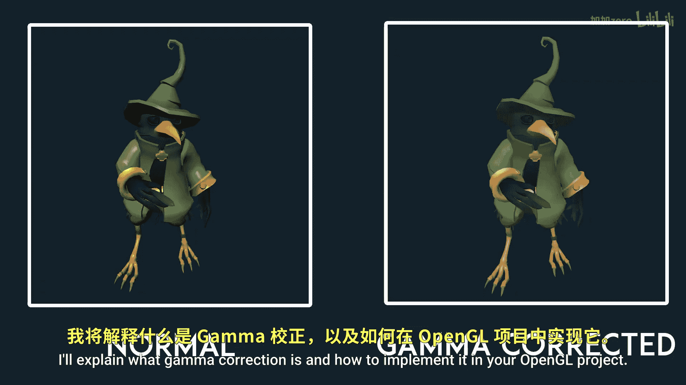
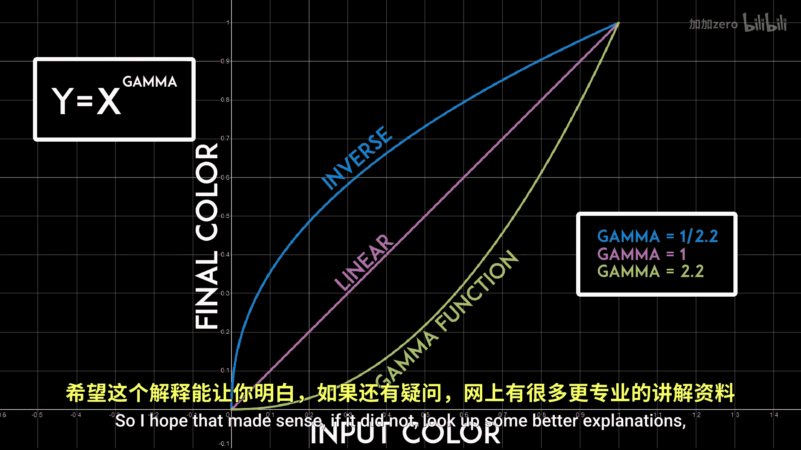

# 025：Gamma校正 🎨

在本节课中，我们将要学习Gamma校正的概念，理解为什么显示器显示的颜色与我们代码中定义的颜色存在差异，并学习如何在OpenGL项目中实现Gamma校正，以获得更真实、更线性的光照效果。

## 概述

在计算机图形学中，Gamma校正是一个至关重要的概念。它描述了显示器对输入颜色信号的响应曲线。由于历史原因，显示器并非线性地显示颜色，这导致我们在代码中设定的颜色（例如，完美的灰色）在屏幕上会显得更暗。为了模拟现实中线性的光照，我们需要在渲染管线中应用Gamma校正。

上一节我们介绍了帧缓冲和后处理的基础知识，本节中我们来看看如何通过Gamma校正来改善最终图像的色彩表现。

## 什么是Gamma？

Gamma本质上是显示器对不同颜色深浅的敏感度。

请看下图，其中X轴代表我们在代码中输入的色彩值，Y轴代表最终在屏幕上显示的色彩值。如果曲线是一条直线，那么输入将等于输出，这是理想情况，因为我们知道代码中写入的颜色就是显示器上实际看到的颜色。




然而，现实中至少对于显示器而言并非如此。由于历史原因，显示器自动带有一条如下图所示的Gamma曲线。这意味着，如果我们输入一个0.5的颜色值（即介于黑色和白色之间的完美灰色），我们在屏幕上实际得到的颜色值将是0.218，这是一个暗得多的灰色。


## 为什么需要Gamma校正？

我们希望以线性的方式表现光线，因为现实中的光是线性的。为了实现这一点，我们需要将所有颜色转换为Gamma函数的反函数。这样，当Gamma函数被应用时，它们会相互抵消，从而得到一个线性函数。这个反函数就叫做Gamma校正函数。

如果上述解释不够清晰，建议查阅网络上更详细的资料。

## 如何在OpenGL中实现Gamma校正？

现在进入实际的编码部分。启用Gamma校正的一个非常简单的方法是调用：
```cpp
glEnable(GL_FRAMEBUFFER_SRGB);
```
这种方法的问题在于，它不允许我们控制Gamma的幂值。一般来说，Gamma幂值为2.2（默认值）最适合大多数显示器，但我们可能希望有能力控制它。

为了实现自定义控制，我们可以简单地将Gamma校正函数应用到后处理帧缓冲的片段着色器中。以下是核心公式：
```
fragmentColor.rgb = pow(fragmentColor.rgb, vec3(1.0 / gamma));
```
其中 `gamma` 通常取值2.2。



运行程序后，你会发现一切都变得更亮了，但背景色和模型网格会显得过亮且颜色失真。

## 遇到的问题与解决方案

为什么会出现这种情况？Gamma校正不是应该让颜色看起来更好、更真实吗？难道生活只是一团糟吗？并非如此。

当你选择背景颜色时，你很可能是在看着显示器的情况下进行的。这意味着，你选择的颜色已经通过显示器的Gamma校正被“调整”过了。现在我们在着色器中再次应用校正，等于校正了两次。模型纹理也存在同样的问题，因为它们也是由人类艺术家在看着显示器的情况下制作的。

以下是解决此问题的步骤：

**1. 修正背景色**
对于背景色，我们可以简单地将颜色的每个分量提升到我们的Gamma幂值。
```cpp
backgroundColor = pow(backgroundColor, vec3(gamma));
```

**2. 修正纹理**
在加载纹理时，如果它们是`GL_RGB`格式，我们可以加载为`GL_SRGB`；如果它们是`GL_RGBA`格式，我们可以加载为`GL_SRGB_ALPHA`。这样，OpenGL会自动对所有纹理应用默认的Gamma值（2.2）。
```cpp
// 例如，加载为SRGB格式
glTexImage2D(..., GL_SRGB, ...);
```
如果你想应用自定义的Gamma值，则必须在每个使用纹理的片段着色器中进行手动校正。

## 精度问题与最终效果

现在运行应用程序，你会发现颜色看起来好多了，也更真实。但如果你仔细观察图像的某些部分，可能仍会注意到一些阶梯状的渐变。

这是由于我们在不同Gamma级别之间反复转换颜色时产生的精度错误，因为浮点数并非无限精确。幸运的是，这通常不是一个严重问题，并且可以通过使用更高精度的帧缓冲（例如16位或32位浮点纹理）来缓解。

最终，应用Gamma校正后的图像对比度更自然，暗部细节更丰富，更接近人眼在真实世界中看到的效果。


## 总结


本节课中我们一起学习了Gamma校正。我们了解到显示器显示颜色的非线性特性，并学会了通过应用Gamma校正函数来抵消这种影响，从而在渲染中获得线性的光照计算。我们探讨了两种实现方法：使用OpenGL内置的`sRGB`帧缓冲，以及在着色器中手动进行幂运算校正。同时，我们也解决了对背景色和纹理进行重复校正的问题。正确应用Gamma校正是实现逼真渲染的重要一步。