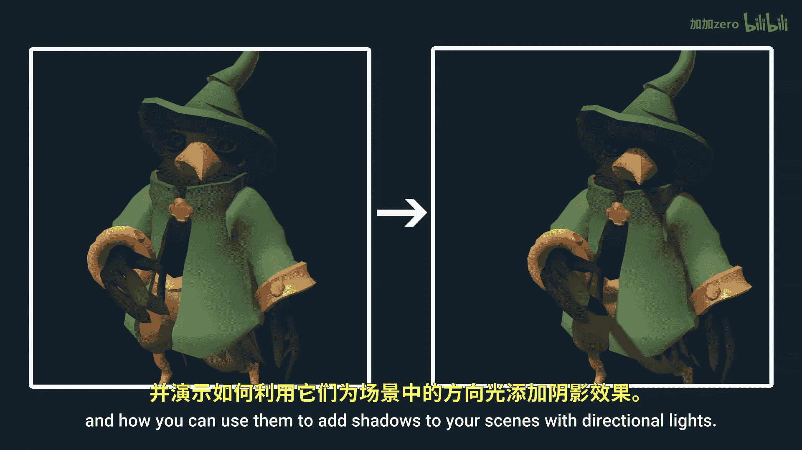
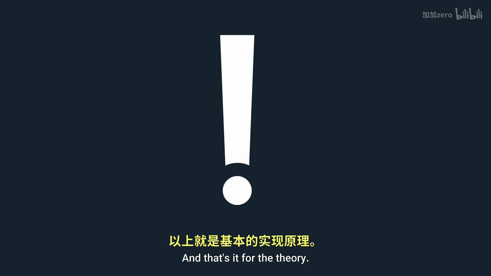
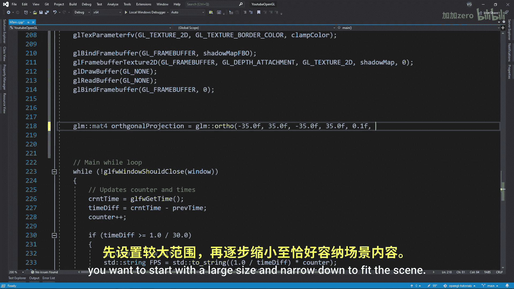

# 026：阴影贴图（定向光）🕶️

在本教程中，我们将学习如何使用阴影贴图技术，为场景中的定向光添加阴影效果。

## 概述

阴影本质上是光线被遮挡的区域。目前我们实现的光照模型，光线不会从一个表面“弯曲”到另一个表面，它只会照射到其直接路径上的表面。这意味着，从光源的视角观察，我们看到的图像包含了所有被光线直接照射的表面。因此，在片段着色器中，我们可以切换到光源的视角，检查当前处理的片段是否处于光照之中。

## 核心原理

实现阴影贴图的核心思想是：从光源的视角渲染场景，生成一张深度图（即阴影贴图）。这张图记录了从光源视角看，每个像素点距离光源最近的深度值。



随后，在正常的渲染流程中，对于每个片段，我们将其转换到光源的裁剪空间，得到其深度值。我们将这个深度值与阴影贴图中对应位置的深度值进行比较。

*   **如果片段深度 > 阴影贴图深度**：意味着当前片段位于某个被光源直接照射的物体**之后**，因此它处于阴影中。
*   **否则**：意味着当前片段是距离光源最近的表面，因此它被照亮。

用伪代码表示这个判断逻辑：
```glsl
float shadow = currentFragmentDepth > depthFromShadowMap ? 1.0 : 0.0;
```
其中，`shadow`为1.0表示处于阴影，0.0表示被照亮。

## 实现步骤

上一节我们介绍了阴影贴图的基本原理，本节中我们来看看具体的实现步骤。整个过程可以分为两个主要阶段：生成阴影贴图和利用阴影贴图渲染。

### 第一阶段：生成阴影贴图

首先，我们需要创建一个帧缓冲对象（Framebuffer Object, FBO）来专门用于渲染阴影贴图。



1.  **创建帧缓冲和深度纹理**：
    *   创建一个帧缓冲对象（`glGenFramebuffers`）。
    *   创建一张纹理来存储深度信息（`glGenTextures`）。注意，纹理的内部格式应设置为`GL_DEPTH_COMPONENT`，因为我们只需要深度值，而非颜色。
    *   将这张深度纹理附加到帧缓冲的深度附件上（`glFramebufferTexture2D`）。
    *   由于我们不需要向这个帧缓冲写入颜色，需要显式告知OpenGL：
        ```cpp
        glDrawBuffer(GL_NONE);
        glReadBuffer(GL_NONE);
        ```

2.  **配置纹理参数**：
    *   将纹理的环绕模式设置为`GL_CLAMP_TO_BORDER`，并将边界颜色设置为白色（即深度值1.0）。这是因为阴影贴图只能覆盖有限区域，区域外的部分我们希望其深度值为最大（1.0），这样在深度比较时，区域外的所有片段都会被视为“被照亮”，从而避免产生错误的阴影。
        ```cpp
        glTexParameteri(GL_TEXTURE_2D, GL_TEXTURE_WRAP_S, GL_CLAMP_TO_BORDER);
        glTexParameteri(GL_TEXTURE_2D, GL_TEXTURE_WRAP_T, GL_CLAMP_TO_BORDER);
        float borderColor[] = { 1.0f, 1.0f, 1.0f, 1.0f };
        glTexParameterfv(GL_TEXTURE_2D, GL_TEXTURE_BORDER_COLOR, borderColor);
        ```

3.  **计算光源变换矩阵**：
    *   对于**定向光**，其光线是平行的，因此我们使用**正交投影矩阵**（`glm::ortho`）而非透视投影矩阵。透视投影会使平行线交汇，不符合定向光的特性。
    *   正交投影的范围（`left`, `right`, `bottom`, `top`, `near`, `far`）需要根据场景调整。一个经验法则是：从一个较大的范围开始，逐步缩小以紧密包裹你的场景。范围过大虽然仍能产生阴影，但会因纹理分辨率有限而导致阴影质量下降（称为“透视锯齿”）。范围与场景匹配得越好，阴影质量越高。
    *   由于定向光被认为在无限远处，我们需要为其在光线方向上选取一个合适的位置来构建观察矩阵（`glm::lookAt`）。这个位置应能确保整个需要阴影的场景都位于其视锥体内。通常可以沿着光的方向，取一个远离场景原点的点。
    *   最终的光源变换矩阵是：**正交投影矩阵 × 光源观察矩阵**。
        ```cpp
        glm::mat4 lightProjection = glm::ortho(-10.0f, 10.0f, -10.0f, 10.0f, 1.0f, 7.5f);
        glm::mat4 lightView = glm::lookAt(lightPos, glm::vec3(0.0f), glm::vec3(0.0, 1.0, 0.0));
        glm::mat4 lightSpaceMatrix = lightProjection * lightView;
        ```

4.  **创建渲染阴影贴图的着色器**：
    *   **顶点着色器**：非常简单，只需将顶点位置通过模型矩阵和上一步计算出的`lightSpaceMatrix`变换到光源的裁剪空间。
        ```glsl
        #version 330 core
        layout (location = 0) in vec3 aPos;
        uniform mat4 lightSpaceMatrix;
        uniform mat4 model;
        void main() {
            gl_Position = lightSpaceMatrix * model * vec4(aPos, 1.0);
        }
        ```
    *   **片段着色器**：留空即可。因为我们绑定了深度纹理到帧缓冲，且禁用了颜色绘制，OpenGL会自动将深度值写入深度附件（即我们的阴影贴图纹理）。
        ```glsl
        #version 330 core
        void main() {
            // gl_FragDepth is automatically written
        }
        ```

5.  **渲染到阴影贴图**：
    *   绑定为阴影贴图准备的帧缓冲。
    *   使用上面创建的简单着色器程序。
    *   将视口大小设置为阴影贴图纹理的分辨率（例如1024x1024）。
    *   清除深度缓冲。
    *   渲染场景中的所有物体（通常只渲染会投射阴影的物体）。此时，深度信息会被记录到阴影贴图纹理中。

### 第二阶段：使用阴影贴图进行渲染




现在我们已经有了阴影贴图，接下来在正常渲染场景时使用它。

1.  **修改主着色器**：
    *   在顶点着色器中，除了常规变换，还需要额外输出一个变量，表示当前顶点在光源裁剪空间中的坐标（即`lightSpaceMatrix * model * vec4(aPos, 1.0)`的结果），并传递给片段着色器。
    *   在片段着色器中：
        a. 接收从顶点着色器传来的光源空间位置。
        b. 将其执行**透视除法**（`xyz /= w`），将坐标从裁剪空间转换到标准设备坐标（NDC，范围[-1,1]）。
        c. 再将NDC坐标转换到[0,1]范围，以便作为纹理坐标采样阴影贴图。
        d. 使用转换后的xy坐标采样阴影贴图，得到最近表面的深度值。
        e. 将当前片段在光源空间中的深度值（z分量）与采样得到的深度值进行比较。
        f. 根据比较结果计算阴影因子，并将其应用到最终的光照计算中。

    核心片段着色器代码示例：
    ```glsl
    uniform sampler2D shadowMap;
    in vec4 FragPosLightSpace; // 从顶点着色器传来

    float ShadowCalculation(vec4 fragPosLightSpace) {
        // 执行透视除法，得到NDC坐标
        vec3 projCoords = fragPosLightSpace.xyz / fragPosLightSpace.w;
        // 转换到[0,1]范围
        projCoords = projCoords * 0.5 + 0.5;
        // 获取当前片段在光源视角下的深度
        float currentDepth = projCoords.z;
        // 从阴影贴图中获取最近深度
        float closestDepth = texture(shadowMap, projCoords.xy).r;
        // 检查当前片段是否在阴影中
        float shadow = currentDepth > closestDepth ? 1.0 : 0.0;
        return shadow;
    }

    void main() {
        // ... 其他光照计算 ...
        float shadow = ShadowCalculation(FragPosLightSpace);
        vec3 lighting = (ambient + (1.0 - shadow) * (diffuse + specular)) * objectColor;
        FragColor = vec4(lighting, 1.0);
    }
    ```

## 总结


本节课中我们一起学习了OpenGL中阴影贴图的基本原理与实现方法。关键点在于：**从光源视角渲染场景生成深度图（阴影贴图），然后在正常渲染时，将片段转换到同一空间进行深度比较，以决定其是否处于阴影中**。对于定向光，需使用正交投影。实现时需注意阴影贴图纹理的配置、光源变换矩阵的计算以及着色器间的坐标传递与转换。这是实时渲染中生成动态阴影的基础且高效的技术。