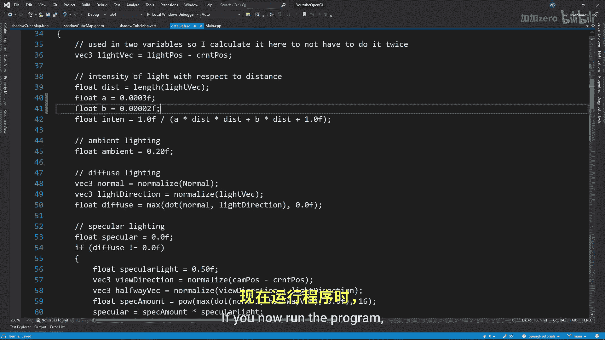

# 027：聚光灯与点光源的阴影映射 🔦

在本教程中，我们将学习如何在OpenGL中为聚光灯和点光源实现阴影映射技术。我们将从相对简单的聚光灯阴影开始，然后深入探讨更复杂的点光源阴影实现，后者会利用立方体贴图和几何着色器。

如果你还不了解如何为定向光源实现阴影映射，强烈建议你先观看我之前的教程，否则本教程的内容可能难以理解。

## 聚光灯阴影映射

上一节我们介绍了定向光源的阴影映射。本节中，我们来看看如何为聚光灯实现阴影映射。聚光灯的阴影实现与定向光源非常相似，主要区别在于投影矩阵。

以下是实现聚光灯阴影映射的核心步骤：

1.  **替换投影矩阵**：将定向光源使用的正交投影矩阵替换为透视投影矩阵。
2.  **应用阴影映射代码**：将阴影映射的渲染和采样逻辑应用到聚光灯光源上。
3.  **调整深度偏移**：由于聚光灯有明确的位置，通常可以获得更高质量的阴影贴图。因此，你可能需要调整深度偏移的精度以获得正确的阴影效果，这与定向光源中可能需要调整以适应大范围场景不同。

## 点光源阴影映射

现在，我们来看看更复杂的点光源阴影映射。点光源向所有方向发射光线，因此其阴影计算需要覆盖整个球面。

理论上，你可以为立方体的六个面分别使用六个聚光灯来计算阴影，但这需要六次渲染过程。


为了避免这种低效的做法，我们可以使用立方体贴图配合几何着色器，在单次渲染过程中绘制出所有六个面的深度信息。

### 创建立方体贴图帧缓冲

首先，我们需要创建一个帧缓冲对象和一个立方体贴图纹理。

```cpp
// 创建立方体贴图
glGenTextures(1, &depthCubemap);
glBindTexture(GL_TEXTURE_CUBE_MAP, depthCubemap);
for (unsigned int i = 0; i < 6; ++i)
    glTexImage2D(GL_TEXTURE_CUBE_MAP_POSITIVE_X + i, 0, GL_DEPTH_COMPONENT, SHADOW_WIDTH, SHADOW_HEIGHT, 0, GL_DEPTH_COMPONENT, GL_FLOAT, NULL);
// ... 设置纹理参数

// 创建帧缓冲并附加立方体贴图
glGenFramebuffers(1, &depthMapFBO);
glBindFramebuffer(GL_FRAMEBUFFER, depthMapFBO);
glFramebufferTexture(GL_FRAMEBUFFER, GL_DEPTH_ATTACHMENT, depthCubemap, 0);
glDrawBuffer(GL_NONE);
glReadBuffer(GL_NONE);
```

请记住，我们需要告知OpenGL这个帧缓冲不会绘制到颜色缓冲。

### 计算变换矩阵

接下来，我们需要为立方体贴图的六个面创建透视变换矩阵。

```cpp
float aspect = (float)SHADOW_WIDTH/(float)SHADOW_HEIGHT;
float near = 1.0f;
float far = 25.0f;
glm::mat4 shadowProj = glm::perspective(glm::radians(90.0f), aspect, near, far);

std::vector<glm::mat4> shadowTransforms;
shadowTransforms.push_back(shadowProj * glm::lookAt(lightPos, lightPos + glm::vec3( 1.0, 0.0, 0.0), glm::vec3(0.0,-1.0, 0.0)));
shadowTransforms.push_back(shadowProj * glm::lookAt(lightPos, lightPos + glm::vec3(-1.0, 0.0, 0.0), glm::vec3(0.0,-1.0, 0.0)));
// ... 为 +Y, -Y, +Z, -Z 方向添加其余矩阵
```

确保视野为90度以精确覆盖立方体的一个面，并注意上向量不要与你观察的方向平行。

### 编写着色器

我们需要三个着色器来生成阴影贴图。

*   **顶点着色器**：简单地输出顶点位置。
    ```glsl
    #version 330 core
    layout (location = 0) in vec3 aPos;
    uniform mat4 model;
    void main() {
        gl_Position = model * vec4(aPos, 1.0);
    }
    ```
*   **几何着色器**：这是关键所在。它接收一个三角形，并同时向六个面（即六个图层）输出这个三角形。
    ```glsl
    #version 330 core
    layout (triangles) in;
    layout (triangle_strip, max_vertices=18) out;
    uniform mat4 shadowMatrices[6];
    out vec4 FragPos; // 输出到片段着色器
    void main() {
        for(int face = 0; face < 6; ++face) {
            gl_Layer = face; // 指定输出到立方体贴图的哪个面
            for(int i = 0; i < 3; ++i) { // 对三角形的三个顶点
                FragPos = gl_in[i].gl_Position;
                gl_Position = shadowMatrices[face] * FragPos;
                EmitVertex();
            }
            EndPrimitive();
        }
    }
    ```
*   **片段着色器**：计算并输出线性化的深度值。
    ```glsl
    #version 330 core
    in vec4 FragPos;
    uniform vec3 lightPos;
    uniform float far_plane;
    void main() {
        // 计算当前片段到光源的距离（即深度）
        float lightDistance = length(FragPos.xyz - lightPos);
        // 将深度值映射到 [0,1] 范围并线性化
        lightDistance = lightDistance / far_plane;
        gl_FragDepth = lightDistance;
    }
    ```

然后，创建一个着色器程序，链接着三个着色器，并设置它们所需的uniform变量。

### 渲染与采样阴影

在正常渲染场景之前，先渲染深度立方体贴图。

```cpp
glViewport(0, 0, SHADOW_WIDTH, SHADOW_HEIGHT);
glBindFramebuffer(GL_FRAMEBUFFER, depthMapFBO);
glClear(GL_DEPTH_BUFFER_BIT);
// ... 激活阴影着色器程序，传递uniform，渲染场景
glBindFramebuffer(GL_FRAMEBUFFER, 0);
```

在正常渲染的片段着色器中采样阴影时，注意使用 `samplerCube` 而不是 `sampler2D`。

```glsl
uniform samplerCube shadowMap;
```

阴影计算算法与之前非常相似：

1.  初始化阴影值 `shadow = 0.0`。
2.  计算片段到光源的向量，取其长度作为当前深度 `currentDepth`。
3.  添加一个深度偏移 `bias`。点光源的偏移量可能更接近定向光源而非聚光灯。
4.  为了获得柔和的软阴影，可以遍历立方体贴图中当前采样点附近的纹素，检查它们是否在阴影中。这称为**百分比渐进过滤**。
    ```glsl
    float shadow = 0.0;
    float bias = 0.15;
    int samples = 20;
    vec3 sampleOffsetDirections[20] = vec3[](...); // 一些随机偏移方向
    float viewDistance = length(viewPos - fragPos);
    float diskRadius = (1.0 + (viewDistance / far_plane)) / 25.0;
    for(int i = 0; i < samples; ++i) {
        float closestDepth = texture(shadowMap, fragToLight + sampleOffsetDirections[i] * diskRadius).r;
        closestDepth *= far_plane; // 将 [0,1] 映射回实际距离
        if(currentDepth - bias > closestDepth)
            shadow += 1.0;
    }
    shadow /= float(samples);
    ```
5.  最后，将计算出的 `shadow` 因子应用到最终的光照结果中。

如果你现在运行程序，应该能看到由点光源生成的柔和阴影。




## 总结

本节课中我们一起学习了：
1.  **聚光灯阴影映射**：通过将正交投影替换为透视投影，并沿用定向光源的阴影映射框架来实现。
2.  **点光源阴影映射**：利用**立方体贴图**和**几何着色器**，在单次渲染过程中生成覆盖所有方向的深度图，并通过在片段着色器中采样立方体贴图并应用PCF来生成软阴影。


这两种技术极大地增强了场景中局部光源的真实感。别忘了查看我的Discord频道和Patreon页面以获取更多资源，源代码也一如既往地可供参考。