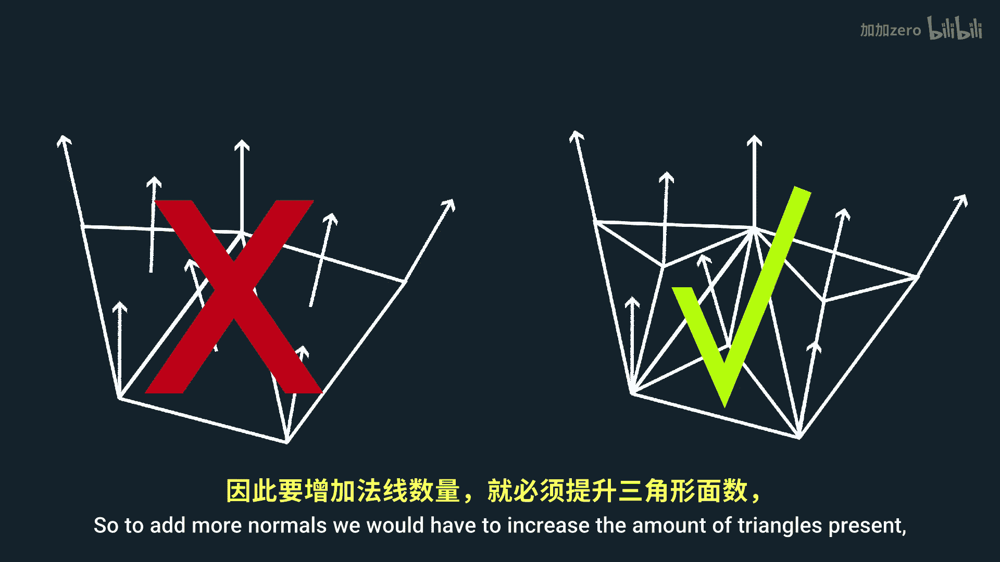
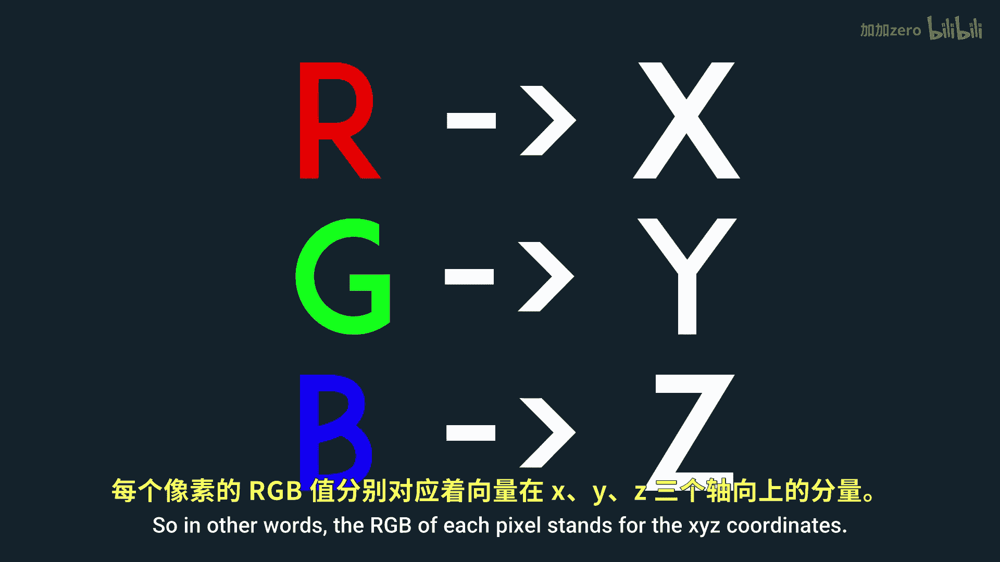
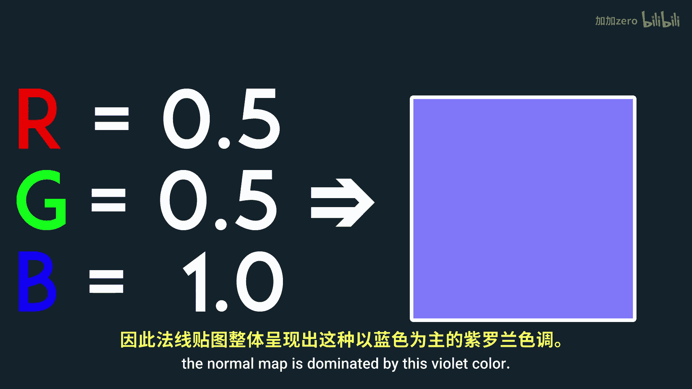
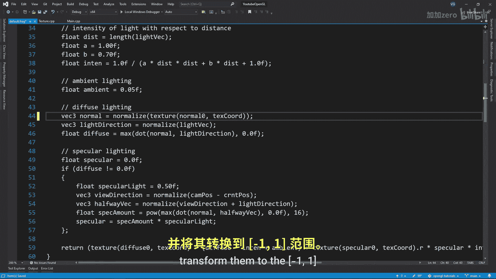
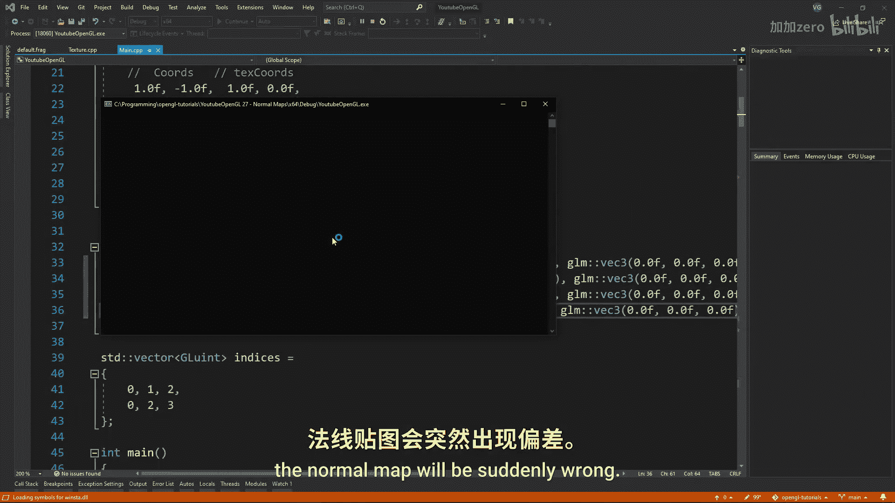
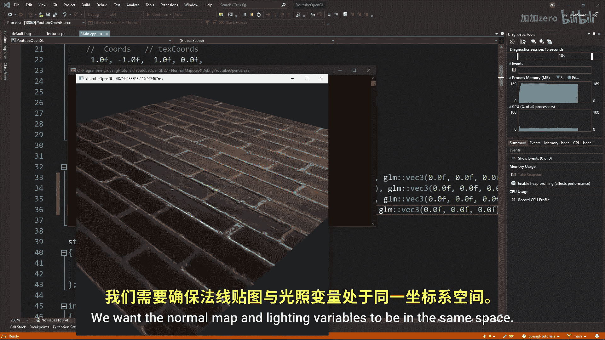
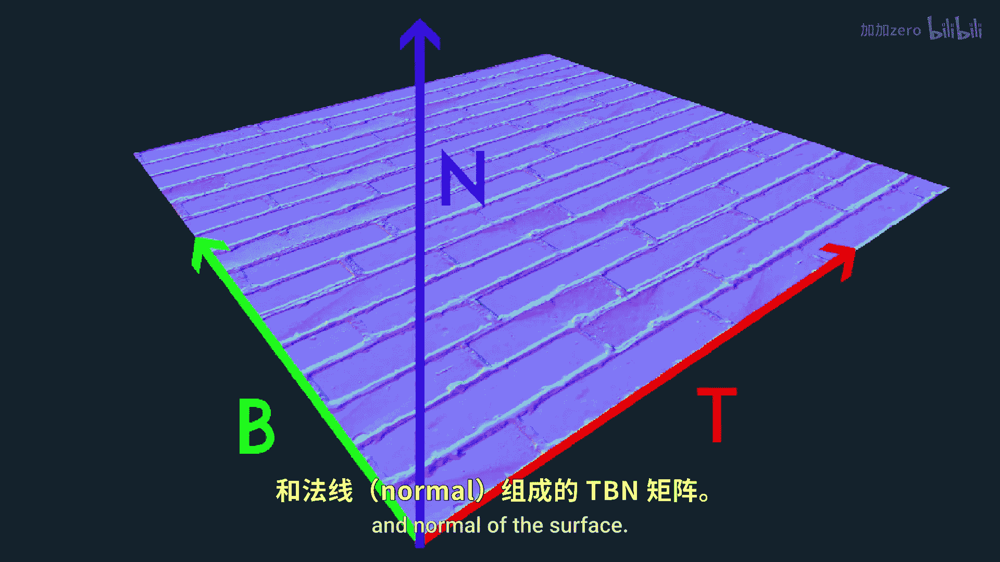
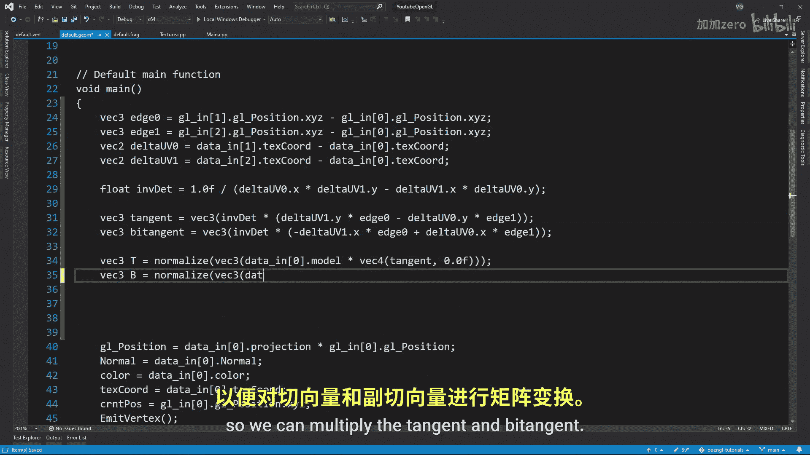

# 028：法线贴图 🗺️

在本教程中，我们将学习什么是法线贴图，以及如何利用它们为网格模型增添大量细节。

## 概述

我们将探讨法线贴图的基本概念、工作原理及其在OpenGL中的实现方法。通过使用法线贴图，可以在不增加模型顶点数量的前提下，显著提升模型表面的光照细节和视觉真实感。

## 什么是法线贴图？

假设我们有一个由三角形构成的表面，我们希望为其增添更多细节。

一个增加细节的有效方法是添加更多的法线，这样光线就能更好地与表面交互。

但我们只能在有顶点的位置拥有法线。因此，要增加法线数量，就必须增加三角形的数量，这可能会严重影响程序性能。

这正是法线贴图的精妙之处。我们可以保持原有的三角形数量，而只需将一张法线贴图包裹在模型表面。

现在，法线贴图上的每个像素都将代表模型表面的一个法线方向。这样，我们就能在几乎不影响程序性能的情况下，极大地改善模型的外观。

## 法线贴图详解

让我们更仔细地观察一张法线贴图。通常，它们看起来与漫反射贴图非常相似，但整体呈紫罗兰色调。

这是因为法线贴图的每个像素都代表一个三维空间中的向量。

换句话说，每个像素的RGB值分别代表该法线向量的X、Y、Z坐标。

Z轴（即蓝色分量）垂直于表面向外。由于法线通常垂直于其所在的表面，因此法线贴图主要由这种紫罗兰色主导。

如果某个区域偏红色，则表示该处的法线指向右侧（正X方向）。如果偏绿色，则表示法线指向上方（正Y方向）。

需要注意的最后一点是，RGB值的范围是[0, 1]，但我们希望法线的范围是[-1, 1]，以便它们也能指向负的X、Y、Z轴方向。

因此，在从贴图中读取法线时，需要进行一个简单的转换。

## 在OpenGL中实现

现在让我们开始编码。我们将从一个面向正Z轴的平面开始。

我们需要稍微修改纹理类，使其能够加载法线贴图。关于法线贴图以及除漫反射贴图之外的任何纹理，关键一点是我们不希望对其应用伽马校正。

因此，我们需要以RGB格式（而非sRGB格式）加载法线贴图。

不要忘记加载纹理并将其传递到片段着色器。

接下来需要做的，就是从法线贴图中读取法线数据，将其转换到[-1, 1]的范围，然后我们就完成了。

你的平面上现在应该显示法线贴图的效果了。这看起来不错，但你会发现，如果我移动平面的位置，法线贴图的效果会突然出错。

这是因为法线贴图始终指向正Z方向，而在这个例子中，我们的平面平放在地面上，指向正Y方向。

这种不一致导致了我们看到的错误。我们希望法线贴图和光照变量处于同一个空间。

为了实现这一点，我们需要一个所谓的TBN矩阵，它由表面的切线（Tangent）、副切线（Bitangent）和法线（Normal）构成。

要计算这个矩阵，可以使用以下公式：

如果你对这个公式的推导感兴趣，我在描述中留下了一些相关文章的链接。

由于公式需要三角形的所有三个顶点信息，你可以在CPU上计算TBN矩阵，也可以在几何着色器中计算。我选择在几何着色器中完成。

在默认的几何着色器中，我们首先需要根据公式计算两条边向量以及纹理坐标的差值。

然后计算一个除数因子，最后得出切线和副切线。

我们需要将模型矩阵传入几何着色器，以便用它来变换切线和副切线向量。

至于法线，我们希望它垂直于三角形表面，通常可以通过两个边向量的叉积来计算。

## 总结

在本节课中，我们一起学习了法线贴图的核心概念。我们了解到，法线贴图是一种利用RGB颜色存储表面法线方向信息的技术，它能在不增加模型几何复杂度的前提下，通过改变光照计算来模拟高精度表面的凹凸细节。

我们探讨了法线贴图的工作原理，即每个像素的颜色值对应一个三维法线向量。接着，我们实现了在OpenGL中加载和使用法线贴图的基本步骤，并解决了因模型空间与贴图空间不一致而导致光照错误的问题，关键是通过构建TBN矩阵将法线从切线空间转换到世界空间。

通过本教程，你现在应该能够理解法线贴图的价值，并掌握在渲染管线中集成法线贴图来显著提升模型视觉细节的方法。