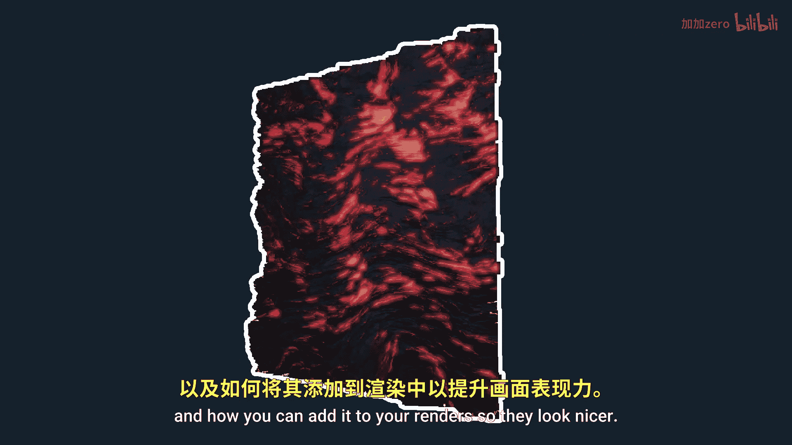
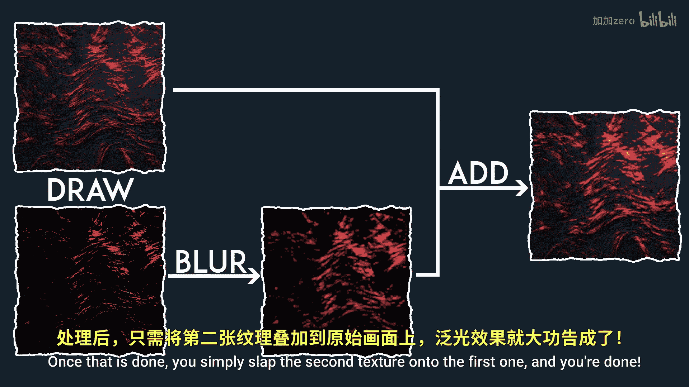
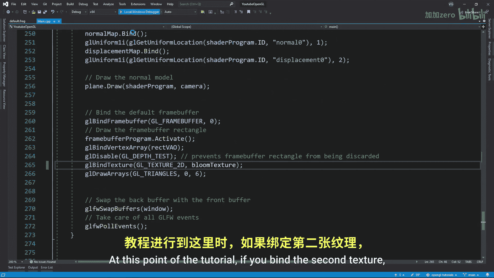
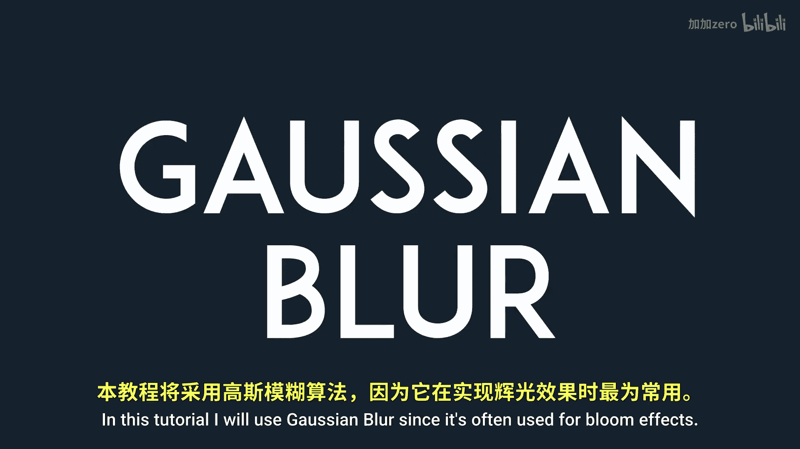
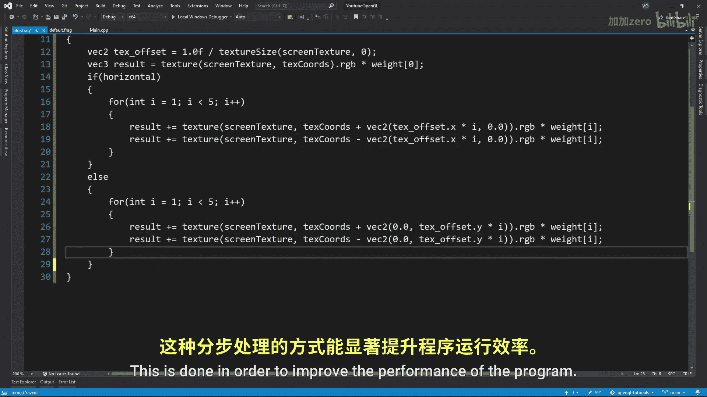
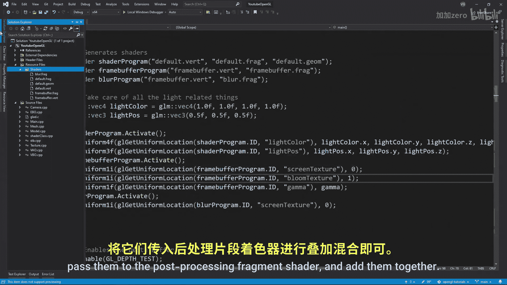

# 031：Bloom效果实现指南 🌟

在本节课中，我们将学习什么是Bloom效果，以及如何通过一系列步骤将其添加到渲染中，使明亮光源周围产生光晕，从而提升画面的视觉表现力。

Bloom效果是明亮光源周围类似光晕的色彩，它使光源看起来比实际更亮。实现此效果的基本步骤相当直接。

## 概述与原理

上一节我们介绍了Bloom的基本概念。本节中，我们来看看其核心实现流程。

实现Bloom效果的步骤如下：
1.  正常渲染场景图像。
2.  将场景中的高亮部分提取到另一个纹理中。
3.  对提取出的高亮纹理进行模糊处理。
4.  将模糊后的纹理叠加到原始场景图像上。



以下是实现第一步“提取高亮”的具体操作。




## 提取高亮区域

首先，需要为后处理缓冲区创建第二个纹理。确保使用 `GL_COLOR_ATTACHMENT1` 将其附加到帧缓冲的第二个颜色附件位置。

接着，需要告知OpenGL我们将渲染到多个纹理。这通过使用 `glDrawBuffers` 函数并传入所使用的附件数组来实现。

然后，在片段着色器中指定输出到两个纹理，并按如下方式分配片段颜色：
```glsl
// 增强红色通道，使熔岩线条更突出
FragColor.r *= 2.0;
// 计算片段的亮度（灰度值）
float brightness = dot(FragColor.rgb, vec3(0.2126, 0.7152, 0.0722));
// 根据亮度阈值决定是否输出到第二个纹理（高亮纹理）
if(brightness > 1.0)
    BrightColor = vec4(FragColor.rgb, 1.0);
else
    BrightColor = vec4(0.0, 0.0, 0.0, 1.0);
```
此时，如果绑定第二个纹理进行查看，其内容应类似于仅包含场景中高亮部分的图像。

## 应用高斯模糊

上一节我们成功提取了高亮区域。接下来，需要对这个图像进行模糊处理。本教程将使用高斯模糊，因为它常用于实现Bloom效果。

首先，创建一个用于模糊的着色器程序，并将我们希望修改的纹理传递给它。





以下是模糊着色器的核心思路：为了提高性能，我们采用两步法。首先在一次渲染中计算所有像素的水平方向模糊，然后在另一次渲染中计算垂直方向模糊。若需更详细的解释，可访问 learnopengl.com 或搜索“两步法高斯模糊”。

准备好着色器后，需要创建两个帧缓冲，每个附带一个纹理。这两个帧缓冲将用于运行上述两个模糊通道，它们被称为“乒乓”帧缓冲，因为数据会在两者之间来回传递。

在主循环中，我们需要在它们之间传递数据。纹理在两者之间“反弹”的次数取决于你想要的模糊程度。注意，在第一次“反弹”时，我使用了之前生成的高亮图像作为输入。此后，所有的传递都在乒乓缓冲的纹理之间进行。

不要忘记通过一个布尔值（`uniform bool horizontal`）告知着色器当前正在进行的是水平还是垂直模糊通道。

经过数次数据传递后，你应该能得到一个类似下图的模糊图像。

## 最终合成



经过之前的步骤，我们得到了原始场景纹理和模糊后的高亮纹理。最后一步是将它们合成。


现在，只需绑定原始颜色纹理和模糊后的纹理，将它们传递到后处理的片段着色器中，并将两者相加混合。

作为最后一步，别忘了启用HDR颜色，以便在Bloom效果中获得更丰富的色彩变化。

## 总结



本节课中，我们一起学习了Bloom效果的原理与完整实现流程。我们首先提取了场景中的高亮区域到独立纹理，然后使用乒乓帧缓冲和两步高斯模糊算法对该纹理进行模糊处理，最后将模糊结果叠加回原始图像，从而创造出光源周围的光晕效果，显著提升了渲染画面的视觉吸引力。