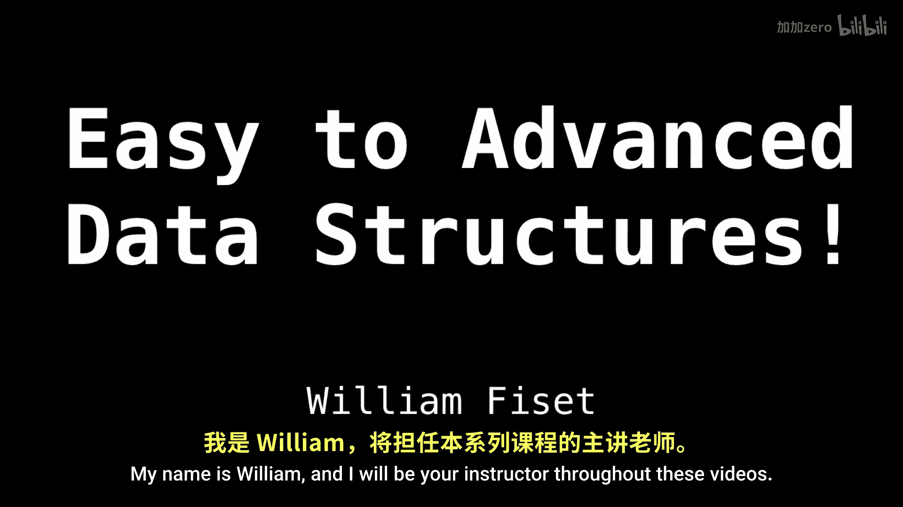
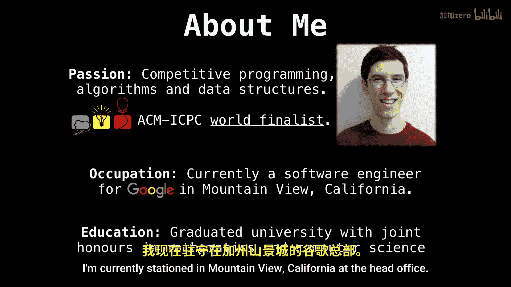
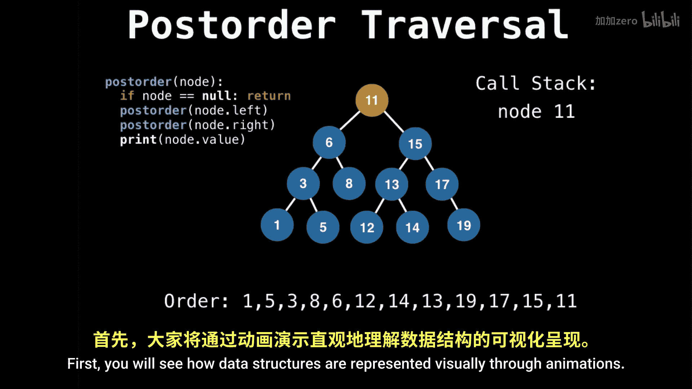
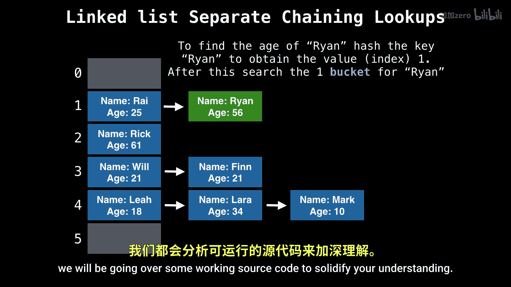
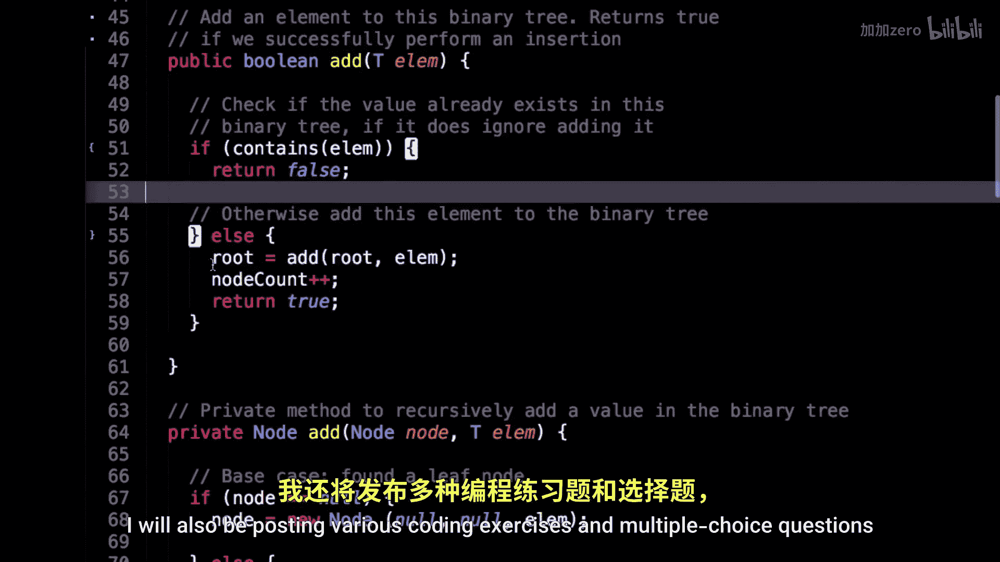
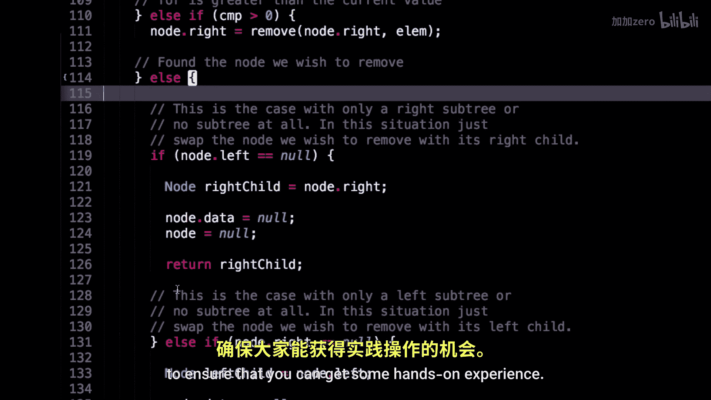
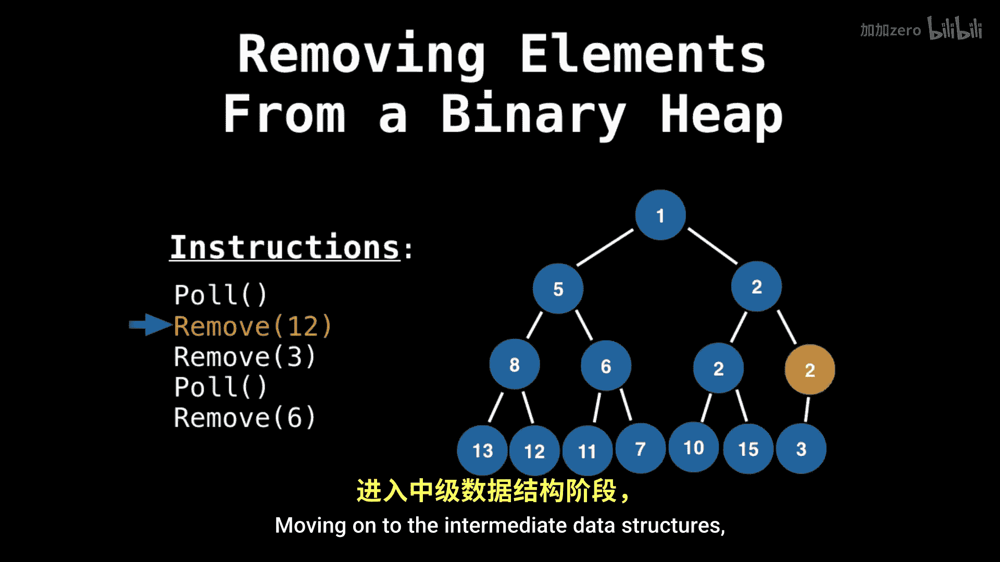
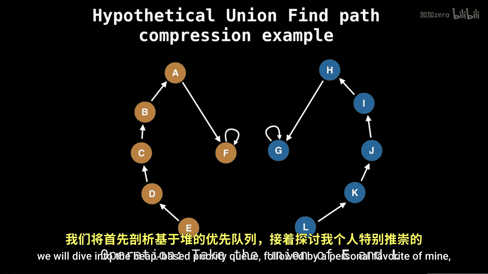

# 001：课程介绍与概览

在本节课中，我们将要学习这门数据结构系列课程的整体安排、学习目标以及讲师背景。课程将从最基础的数据结构开始，逐步深入到更复杂的主题，并通过动画、代码和练习来帮助你掌握核心概念。

## 讲师介绍

我是William，是这门课程的讲师。我的热情在于算法和数据结构，这使我参与了大量的编程竞赛，并在2017年获得了ACM-ICPC世界总决赛的参赛资格。目前，我在谷歌担任软件工程师，工作地点位于加利福尼亚州山景城的总部。

## 课程学习方法

本课程将采用多种方法来帮助你高效学习数据结构。

以下是课程的核心学习方法：

*   **动画演示**：所有视频都将包含动画，以直观的方式展示数据结构的工作原理。动画是学习体验中必不可少的部分。
*   **代码实现**：我们将一起为每个数据结构编写代码，并提供简单易懂的逐步指导。我们会分析可运行的源代码来巩固理解。
*   **动手练习**：我将发布各种编程练习和选择题，确保你能获得实际操作数据结构的经验。

## 课程内容安排

我们将从最简单、最基础的数据结构开始，然后逐步增加难度。

以下是初级数据结构的学习顺序：

1.  **动态数组**
2.  **链表**
3.  **栈**
4.  **队列**

上一节我们介绍了初级数据结构，本节中我们来看看中级数据结构。

以下是中级数据结构的学习顺序：

1.  **基于堆的优先队列**
2.  **并查集**
3.  **二叉树与二叉搜索树**

## 总结

本节课中我们一起学习了本系列课程的总体框架。我们了解了讲师的背景，明确了课程将通过**动画演示**、**代码实现**和**动手练习**三种核心方法来教学。课程内容将遵循从易到难的顺序，从动态数组、链表等基础结构开始，逐步过渡到优先队列、并查集等中级主题。准备好开始你的数据结构学习之旅吧。