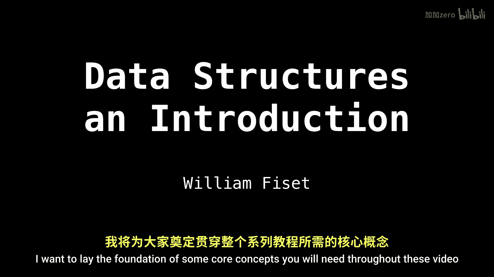
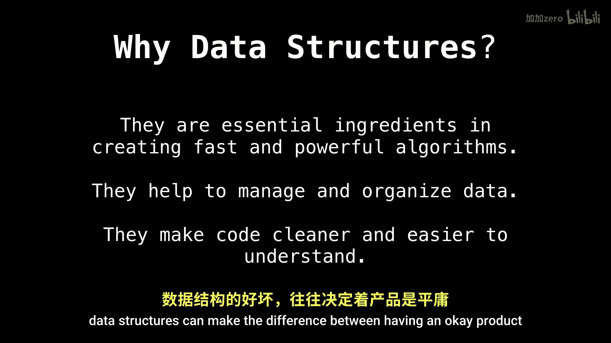

数据结构入门：01：核心概念与抽象数据类型 🧱

在本节课中，我们将学习数据结构的基础核心概念，包括数据结构的定义、重要性，以及抽象数据类型（ADT）的含义与作用。

---



### 什么是数据结构？

数据结构是一种组织数据的方式，目的是使数据能够被高效地使用。本质上，它是以某种形式组织数据，以便后续能够快速、便捷地访问、查询或更新。

---

### 为什么数据结构很重要？

数据结构之所以重要，主要有以下几个原因。

以下是几个关键点：
*   **算法基石**：它们是构建快速、强大算法的核心要素。
*   **数据管理**：它们以一种非常自然的方式帮助我们管理和组织数据。
*   **代码质量**：它们能使代码更清晰、更易于理解。

一个值得注意的现象是，区分普通程序员与优秀程序员的关键因素之一，就在于是否从根本上理解如何以及何时为特定任务选择合适的数据结构。数据结构的好坏，可能直接决定一个产品是“尚可”还是“卓越”。


---

### 抽象数据类型（ADT）

上一节我们介绍了数据结构的基本概念，本节中我们来看看一个与之紧密相关的核心思想：抽象数据类型。

抽象数据类型是一种数学模型，它定义了一组数据以及基于这些数据的一系列操作。关键在于，ADT只规定了“做什么”，而不规定“如何做”。它是对数据结构的逻辑描述，隐藏了具体的实现细节。

例如，我们可以定义一个“列表”ADT，它支持添加元素、删除元素、获取元素等操作。至于这个列表是用数组还是链表来实现，ADT本身并不关心。

---

### 数据结构 vs. 抽象数据类型

初学者有时会混淆这两个概念。简单来说：
*   **抽象数据类型（ADT）** 是**逻辑层面**的描述，是接口或规范。
*   **数据结构** 是**物理层面**的实现，是具体的代码。

我们可以用以下伪代码来理解这种关系：
```
// 这是一个“栈”（Stack）ADT的接口定义（逻辑）
interface StackADT {
    void push(Item item); // 入栈操作
    Item pop();           // 出栈操作
    boolean isEmpty();    // 检查是否为空
}

// 这是一个使用数组实现“栈”ADT的具体数据结构（物理）
class ArrayStack implements StackADT {
    private Item[] items;
    private int top;

    public void push(Item item) { /* 具体实现代码 */ }
    public Item pop() { /* 具体实现代码 */ }
    public boolean isEmpty() { /* 具体实现代码 */ }
}
```
同一个ADT（如栈），可以用不同的数据结构（如数组、链表）来实现。

---



本节课中我们一起学习了数据结构的基础。我们明确了数据结构的定义与重要性，并深入理解了抽象数据类型（ADT）作为逻辑蓝图的概念，以及它与具体数据结构实现之间的区别。掌握这些核心思想，是后续学习各种具体数据结构（如链表、树、图）的坚实基础。