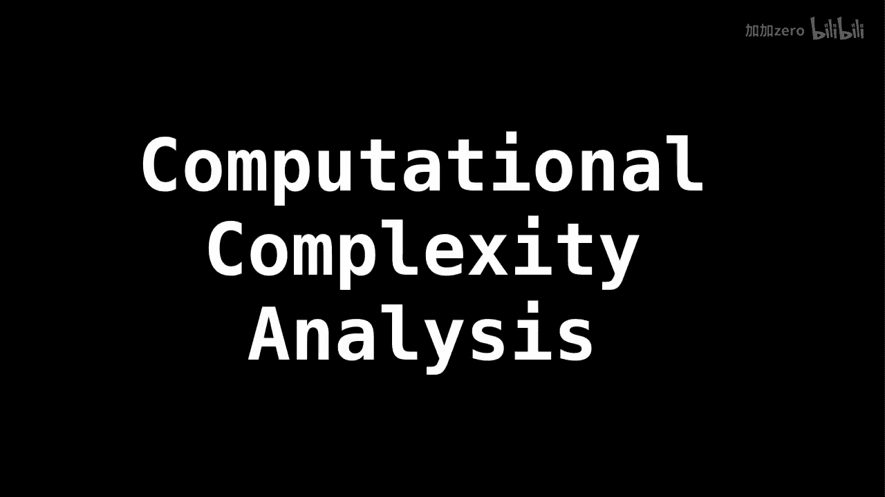

# 003：大O表示法入门 🚀

在本节课中，我们将学习一个至关重要的概念——大O表示法。它是衡量算法性能的标准工具，帮助我们理解算法在时间和空间上的效率。理解大O表示法是学习数据结构和算法的基石。

## 从抽象数据类型到算法性能



上一节我们介绍了抽象数据类型，现在我们需要快速了解一下计算复杂度的广阔世界，以理解我们设计的数据结构所提供的性能。

作为程序员，我们经常反复问自己两个相同的问题：这个算法需要多少时间来完成？以及这个算法需要多少空间来进行计算？

如果你的程序需要宇宙生命周期那么长的时间才能完成，那它显然是不行的。同样，如果你的程序在常数时间内运行，但需要的空间等于互联网上所有文件字节的总和，你的算法也是无用的。

## 大O表示法的作用

为了标准化地讨论算法运行所需的时间和空间，理论计算机科学家发明了大O表示法。此外还有大Θ、大Ω等符号，但我们主要关注大O，因为它告诉我们的是最坏情况。


大O表示法只关心最坏情况。例如，如果你的算法是排序数字，就想象输入是你的特定排序算法可能遇到的最糟糕的数字排列。

或者举一个具体例子：假设你有一个无序的唯一数字列表，你正在搜索数字7或其位置。

## 核心概念与表示

大O表示法用数学方式描述了算法复杂度随输入规模增长的趋势。它忽略了常数因子和低阶项，专注于主导项。

以下是几种常见的复杂度类别：

*   **O(1)** - 常数时间复杂度：执行时间不随输入数据规模变化。
    *   **示例**：访问数组中的某个元素。
    *   **代码示例**：`array[index]`
*   **O(log n)** - 对数时间复杂度：执行时间随输入规模呈对数增长。
    *   **示例**：二分查找。
*   **O(n)** - 线性时间复杂度：执行时间与输入规模成正比。
    *   **示例**：遍历一个列表。
    *   **代码示例**：
        ```python
        for item in list:
            print(item)
        ```
*   **O(n log n)** - 线性对数时间复杂度：常见于高效的排序算法。
    *   **示例**：归并排序、快速排序的平均情况。
*   **O(n²)** - 平方时间复杂度：执行时间与输入规模的平方成正比。
    *   **示例**：简单的双重循环（如冒泡排序）。
    *   **代码示例**：
        ```python
        for i in range(n):
            for j in range(n):
                # 执行操作
        ```
*   **O(2^n)** - 指数时间复杂度：通常出现在递归求解所有组合的问题中，性能随规模增长急剧下降。

## 总结


本节课中，我们一起学习了算法分析的核心工具——大O表示法。我们了解到它用于描述算法在最坏情况下的时间或空间复杂度随输入规模增长的趋势，并且它关注的是增长的量级而非具体时间。掌握大O表示法，将帮助你在未来设计和选择数据结构与算法时，做出更明智、更高效的决策。