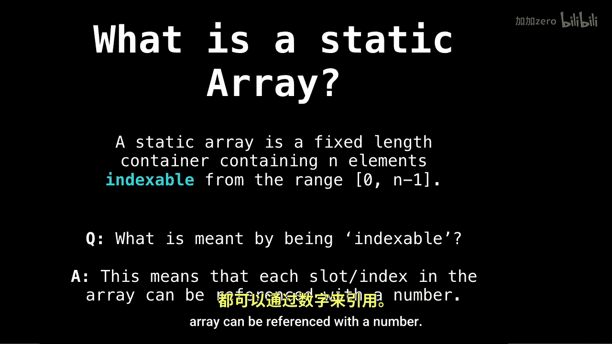

# 004：静态与动态数组

在本节课中，我们将学习数组这一最基本的数据结构。数组是所有其他数据结构的基石，仅通过数组和指针，我们几乎可以构建出任何复杂的数据结构。本节课是数组专题的第一部分。

## 数组概述与基本问题

首先，我们将讨论数组并回答一些基本问题：数组是什么？在哪里以及如何使用数组？

接下来，我们将解释数组的基本结构以及可以在数组上执行的常见操作。

最后，我们将进行一些复杂度分析，并查看如何仅使用静态数组来构建动态数组的源代码示例。

## 什么是静态数组？

上一节我们介绍了数组的基本概念，本节中我们来看看静态数组的具体定义。


静态数组是一个固定长度的容器，包含 **n** 个可索引的元素。索引范围通常是从 **0**（包含）到 **n-1**（包含）。

那么，一个随之而来的问题是：什么是“可索引”？

这意味着数组中的每个槽位或索引都可以用一个数字来引用。

此外，我想补充说明静态数组的特点。

## 静态数组的使用

以下是静态数组的一些典型使用场景：

*   存储和访问顺序数据。
*   用作其他数据结构的底层实现（如堆栈、队列）。
*   用于迭代访问元素的临时存储。

## 数组的基本操作

了解定义后，我们来看看可以对数组执行哪些基本操作。以下是常见的数组操作：


1.  **访问**：通过索引获取或修改元素。时间复杂度为 O(1)。
2.  **遍历**：按顺序访问每个元素。时间复杂度为 O(n)。
3.  **查找**：在数组中搜索特定元素。线性查找的时间复杂度为 O(n)。

## 复杂度分析与动态数组

我们讨论了静态数组的操作，现在来分析其复杂度，并探索如何构建动态数组。

静态数组的主要限制在于其大小固定。为了克服这一点，我们可以用静态数组实现动态数组。其核心思想是，当数组容量不足时，创建一个更大的新数组，并将所有元素复制过去。

以下是一个简化的动态数组扩容过程的伪代码描述：

```
function insertEnd(array, element):
    if array is full:
        new_capacity = array.capacity * 2
        new_array = allocate new array with size new_capacity
        for i from 0 to array.size - 1:
            new_array[i] = array[i]
        array = new_array
    array[array.size] = element
    array.size = array.size + 1
```

虽然单次扩容操作的成本较高（O(n)），但通过均摊分析，在动态数组末尾插入元素的**均摊时间复杂度**仍然是 O(1)。



## 总结

本节课中我们一起学习了数组的基础知识。我们定义了静态数组——一个固定大小、可索引的容器，并探讨了其基本操作。最后，我们了解了动态数组的原理，即通过静态数组扩容来实现可调整大小的数组，并分析了其操作的复杂度。理解数组是掌握更高级数据结构的关键第一步。