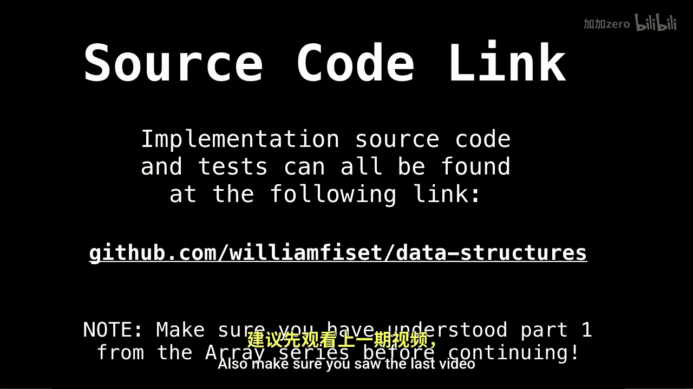
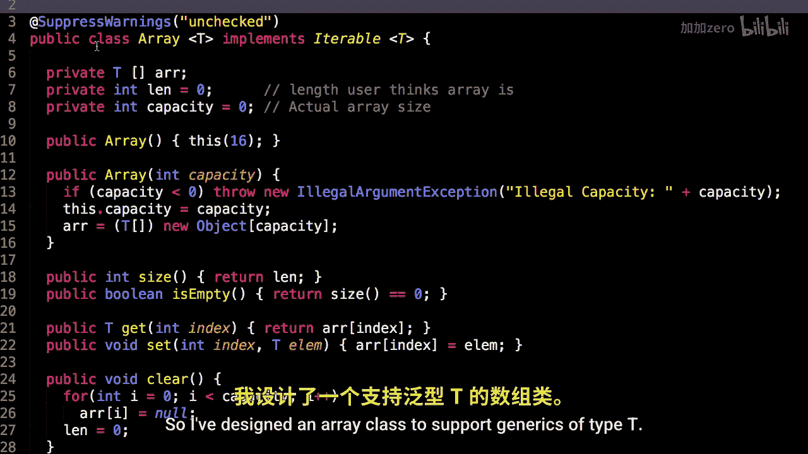
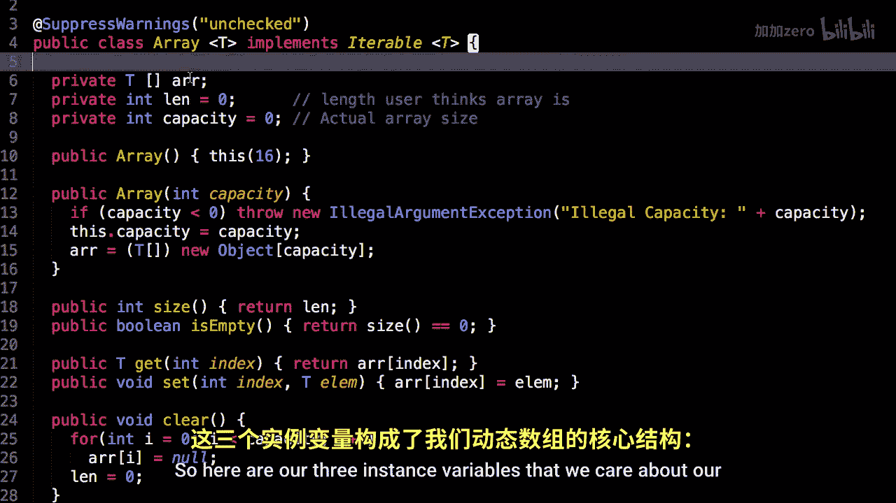
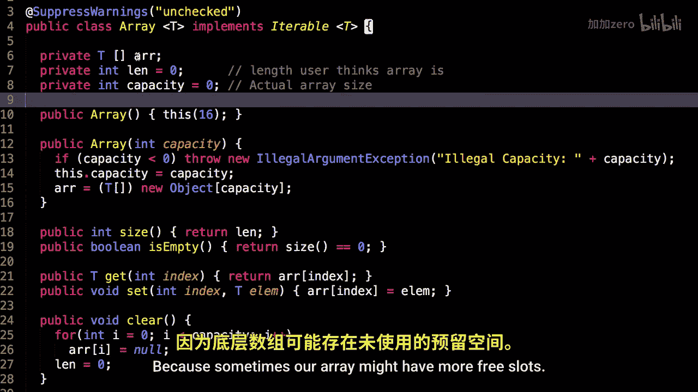
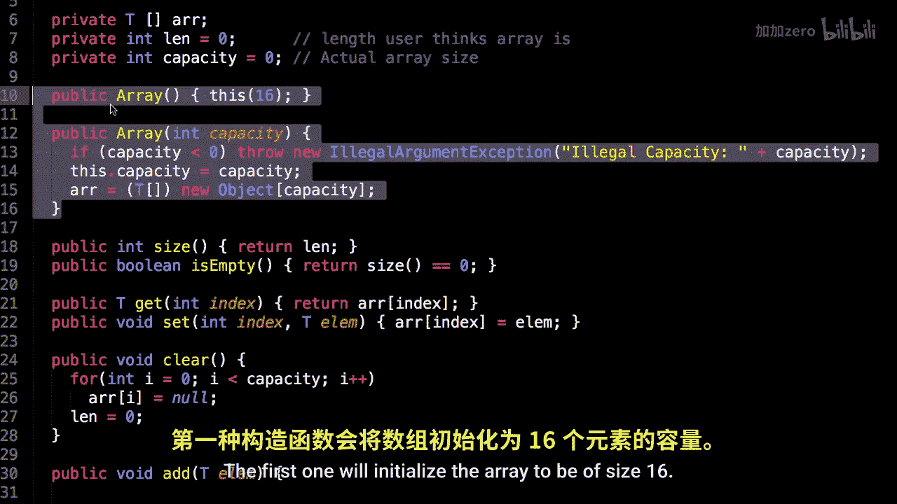
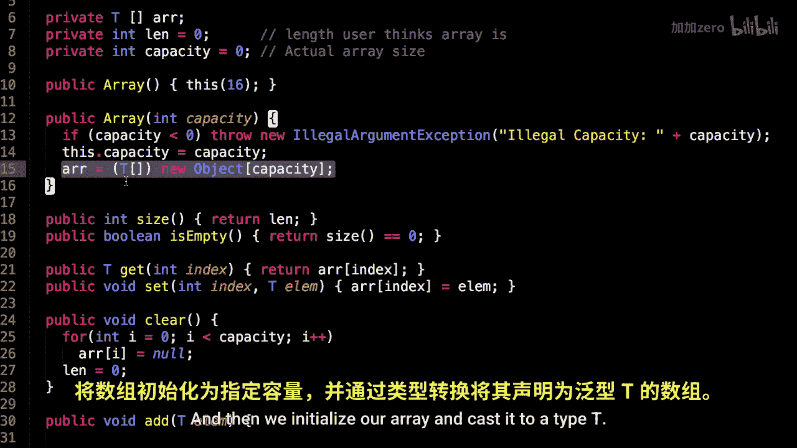

# 005：动态数组代码实现 📝


在本节课中，我们将学习如何用代码实现一个动态数组。我们将深入探讨其内部结构、核心方法以及如何管理容量。通过本教程，你将理解动态数组的工作原理，并能够自己实现一个。

---

上一节我们介绍了动态数组的基本概念。本节中，我们来看看具体的代码实现。

## 类结构与成员变量

首先，我们定义一个支持泛型 `T` 的 `Array` 类。这意味着我们的数组可以存储任意类型的数据。





以下是类的核心成员变量：

*   `arr`：这是内部的静态数组，用于实际存储数据。
*   `len`：这是用户感知的数组长度。
*   `capacity`：这是内部数组 `arr` 的实际容量。有时 `capacity` 会大于 `len`，这意味着数组中有未使用的空闲槽位，但这属于内部实现细节，不对外暴露。



```java
public class Array<T> {
    private T[] arr;
    private int len = 0; // 用户认为的长度
    private int capacity = 0; // 数组的实际容量
}
```

## 构造函数

我们的数组类提供了两个构造函数。


以下是构造函数的实现：




1.  无参构造函数：将内部数组的初始容量设置为默认值 16。
2.  带参构造函数：允许用户指定初始容量。容量必须大于或等于 0。



```java
public Array() {
    this(16); // 调用另一个构造函数，设置默认容量为16
}

public Array(int capacity) {
    if (capacity < 0) throw new IllegalArgumentException("Illegal Capacity: " + capacity);
    this.capacity = capacity;
    // 初始化泛型数组需要进行类型转换
    arr = (T[]) new Object[capacity];
}
```


注意：在初始化泛型数组 `arr` 时，我们需要创建 `Object` 数组并将其转换为 `T[]` 类型。这通常会产生一个编译器警告，但在此上下文中是安全的。


---



本节课中我们一起学习了动态数组类的基本框架，包括其成员变量和构造函数的实现。我们了解了 `len` 与 `capacity` 的区别，以及如何初始化一个泛型数组。在接下来的课程中，我们将继续实现数组的添加、删除、扩容等核心方法。