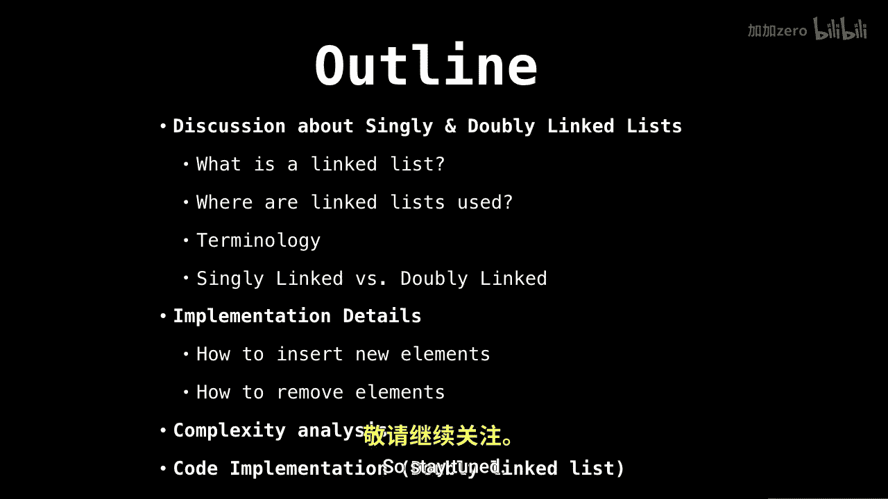

# 006：链表入门 🧩

在本节课中，我们将要学习链表，这是一种极其有用的数据结构。我们将探讨单链表和双链表的基本概念、术语、优缺点以及基本操作。这是关于链表的两部分教程的第一部分，在第二部分中，我们将通过源代码学习如何实现一个双链表。

---

## 什么是链表？ 🤔

上一节我们介绍了课程概述，本节中我们来看看链表的定义。

链表是一个由节点组成的顺序列表，每个节点包含数据，并指向其他也包含数据的节点。

下图是一个包含任意数据的单链表示例。


请注意，每个节点都有一个指向下一个节点的指针。同时，最后一个节点指向 `null`，这意味着在此之后没有更多节点。最后一个节点总是指向 `null`。为了简洁，在后续的幻灯片中我将省略这一点。


---

## 链表的应用场景 🏗️

了解了链表的基本定义后，我们来看看它在哪些地方被广泛使用。

以下是链表的一些常见应用场景：
*   **列表、队列和栈的实现**：链表是构建这些抽象数据类型的理想底层数据结构。
*   **循环列表**：例如用于操作系统中的循环调度。
*   **哈希表的冲突处理**：在哈希表中，链表可用于解决键冲突。
*   **图的邻接表表示**：链表可用于高效地表示图结构。

---

## 链表术语 📖

在深入讨论操作之前，我们需要统一一些关键术语，以便后续理解。

以下是链表相关的核心术语：
*   **头节点**：链表中的第一个节点。
*   **尾节点**：链表中的最后一个节点。
*   **指针/引用**：指向另一个节点的变量。
*   **节点**：包含数据和指针的对象。

---

## 单链表与双链表的优缺点 ⚖️

现在我们已经熟悉了基本术语，本节我们来对比分析单链表和双链表的优缺点。

### 单链表的优缺点

以下是单链表的主要特点：
*   **优点**：使用的内存较少（每个节点少一个指针）。插入和删除操作相对简单。
*   **缺点**：无法轻易访问前驱节点。若需反向遍历链表，则实现较为困难。

### 双链表的优缺点

以下是双链表的主要特点：
*   **优点**：可以双向遍历链表。在给定节点前插入或删除该节点的操作更简单。
*   **缺点**：每个节点需要额外的内存来存储指向前驱节点的指针。插入和删除操作需要处理更多指针。



---

## 插入与删除操作 🔧

理解了优缺点后，我们来看看链表的核心操作：插入和删除元素。

### 单链表的插入与删除

在单链表中插入或删除节点，主要涉及调整 `next` 指针的指向。

**在节点 `X` 之后插入节点 `Y`**：
1.  将 `Y` 的 `next` 指针指向 `X` 原来的下一个节点。
2.  将 `X` 的 `next` 指针指向 `Y`。

用伪代码表示：
```pseudocode
Y.next = X.next
X.next = Y
```

**删除节点 `X` 之后的节点**：
1.  找到 `X` 之后的节点（记为 `Y`）。
2.  将 `X` 的 `next` 指针指向 `Y` 的下一个节点（即 `Y.next`）。

用伪代码表示：
```pseudocode
X.next = X.next.next
// 注意：在实际编程中，可能需要处理内存释放（如Java的GC或C++的delete）。
```

### 双链表的插入与删除

双链表的操作需要同时维护 `prev`（前驱）和 `next`（后继）指针。

**在节点 `X` 之后插入节点 `Y`**：
1.  将 `Y` 的 `prev` 指针指向 `X`。
2.  将 `Y` 的 `next` 指针指向 `X` 原来的下一个节点（记为 `Z`）。
3.  如果 `Z` 不为空（即 `X` 不是尾节点），则将 `Z` 的 `prev` 指针指向 `Y`。
4.  将 `X` 的 `next` 指针指向 `Y`。

用伪代码表示：
```pseudocode
Y.prev = X
Y.next = X.next
if X.next != null:
    X.next.prev = Y
X.next = Y
```

**删除节点 `X`**：
1.  如果 `X` 有前驱节点（`X.prev` 不为空），则将前驱节点的 `next` 指针指向 `X` 的后继节点（`X.next`）。
2.  如果 `X` 有后继节点（`X.next` 不为空），则将后继节点的 `prev` 指针指向 `X` 的前驱节点（`X.prev`）。


用伪代码表示：
```pseudocode
if X.prev != null:
    X.prev.next = X.next
if X.next != null:
    X.next.prev = X.prev
// 同样，注意实际的内存管理。
```

---


## 总结 📚

本节课中我们一起学习了链表的基础知识。我们首先定义了链表是由节点组成的顺序集合。然后探讨了链表的常见应用场景，并学习了头节点、尾节点等关键术语。接着，我们对比了单链表和双链表的优缺点。最后，我们详细讲解了如何在单链表和双链表中执行插入与删除操作，这是操作链表的基石。

在下一部分，我们将通过实际的源代码来深入实现一个双链表。