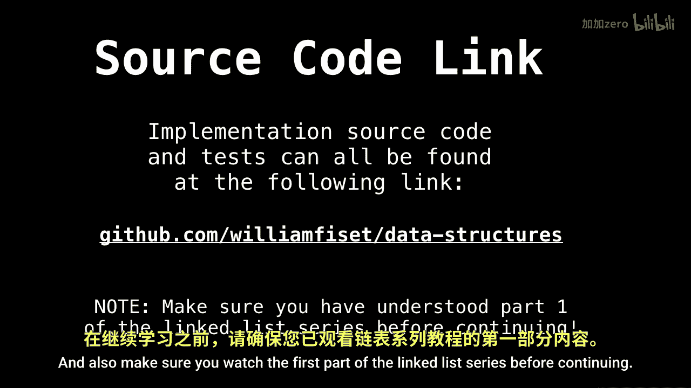
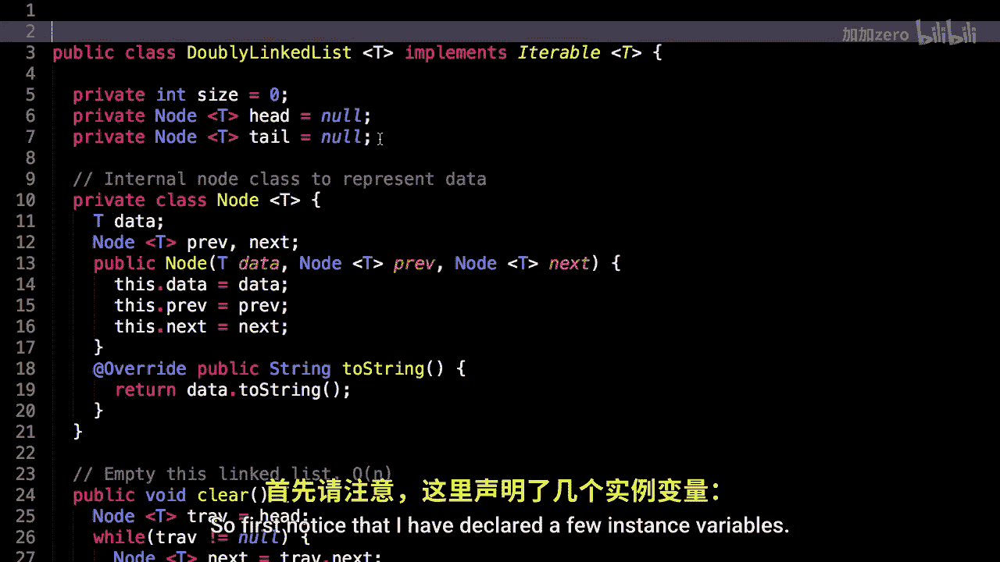
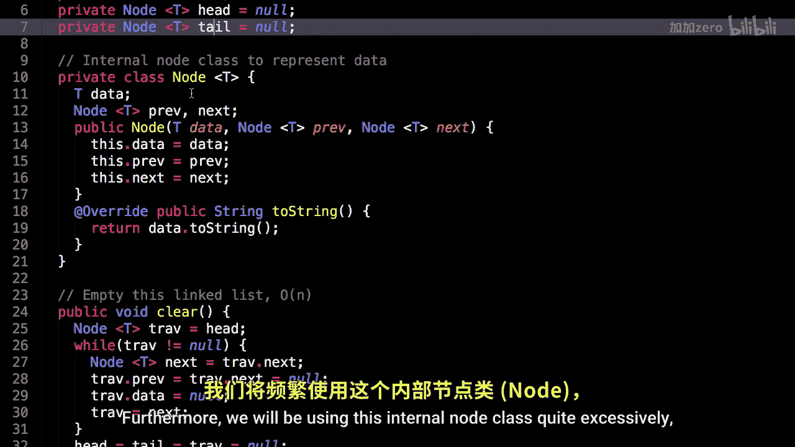

# 007：双向链表代码实现 🧩

在本节课中，我们将学习如何用Java代码实现一个双向链表。我们将从定义节点类开始，逐步实现链表的清空、大小获取、检查是否为空、添加和移除元素等核心操作。课程内容基于实际源代码，力求简单明了，适合初学者理解。

---

上一节我们介绍了双向链表的基本概念。本节中，我们来看看具体的代码实现。

首先，我们定义链表类并声明几个实例变量。我们需要跟踪链表的大小，以及当前的头节点和尾节点。初始时，链表为空，因此头节点和尾节点都设为`null`。

```java
private int size = 0;
private Node<T> head = null;
private Node<T> tail = null;
```

此外，我们将频繁使用一个内部节点类，因为它封装了每个节点的数据以及指向前后节点的指针，这是双向链表的关键。

```java
private static class Node<T> {
    T data;
    Node<T> prev, next;
    public Node(T data, Node<T> prev, Node<T> next) {
        this.data = data;
        this.prev = prev;
        this.next = next;
    }
}
```

---

接下来，我们实现第一个方法：清空链表。这个方法以线性时间复杂度遍历所有节点，并通过将节点引用设为`null`来帮助垃圾回收器释放内存。

```java
public void clear() {
    Node<T> trav = head;
    while (trav != null) {
        Node<T> next = trav.next;
        trav.prev = trav.next = null;
        trav.data = null;
        trav = next;
    }
    head = tail = trav = null;
    size = 0;
}
```


---



在学习了如何清空链表后，我们来看几个简单的工具方法。这些方法用于获取链表当前的状态。

以下是获取链表大小和检查链表是否为空的实现：

```java
public int size() {
    return size;
}

public boolean isEmpty() {
    return size() == 0;
}
```

---

掌握了基础状态查询后，我们开始学习如何向链表中添加元素。首先实现的是在链表末尾添加一个节点。

```java
public void add(T elem) {
    addLast(elem);
}
```

`addLast`方法处理两种情况：如果链表为空，新节点即成为头节点和尾节点；如果链表不为空，则将新节点链接到当前尾节点之后，并更新尾节点。

```java
public void addLast(T elem) {
    if (isEmpty()) {
        head = tail = new Node<T>(elem, null, null);
    } else {
        tail.next = new Node<T>(elem, tail, null);
        tail = tail.next;
    }
    size++;
}
```

---



学会了在末尾添加，我们再来看看如何在链表开头添加一个节点。其逻辑与`addLast`对称。


```java
public void addFirst(T elem) {
    if (isEmpty()) {
        head = tail = new Node<T>(elem, null, null);
    } else {
        head.prev = new Node<T>(elem, null, head);
        head = head.prev;
    }
    size++;
}
```

有时我们需要在特定位置插入节点。`addAt`方法实现了这一功能，它首先检查索引是否有效，然后根据索引位置决定是在开头插入、末尾插入还是在中间插入。

```java
public void addAt(int index, T data) throws Exception {
    if (index < 0 || index > size) {
        throw new Exception("Illegal Index");
    }
    if (index == 0) {
        addFirst(data);
        return;
    }
    if (index == size) {
        addLast(data);
        return;
    }
    Node<T> temp = head;
    for (int i = 0; i < index - 1; i++) {
        temp = temp.next;
    }
    Node<T> newNode = new Node<>(data, temp, temp.next);
    temp.next.prev = newNode;
    temp.next = newNode;
    size++;
}
```

---



添加元素是构建链表的基础，与之对应，移除元素也是核心操作。我们首先实现查看（但不移除）头节点和尾节点数据的方法。

```java
public T peekFirst() {
    if (isEmpty()) throw new RuntimeException("Empty list");
    return head.data;
}

public T peekLast() {
    if (isEmpty()) throw new RuntimeException("Empty list");
    return tail.data;
}
```

现在，我们实现移除头节点的方法`removeFirst`。它需要处理链表为空、只有一个节点和多个节点的情况。


```java
public T removeFirst() {
    if (isEmpty()) throw new RuntimeException("Empty list");
    T data = head.data;
    head = head.next;
    --size;
    if (isEmpty()) {
        tail = null;
    } else {
        head.prev = null;
    }
    return data;
}
```

类似地，移除尾节点的方法`removeLast`逻辑与之对称。

```java
public T removeLast() {
    if (isEmpty()) throw new RuntimeException("Empty list");
    T data = tail.data;
    tail = tail.prev;
    --size;
    if (isEmpty()) {
        head = null;
    } else {
        tail.next = null;
    }
    return data;
}
```

最后，我们实现一个通用的移除方法`remove`，它遍历链表找到与给定对象匹配的第一个节点并将其移除。

```java
public boolean remove(Object obj) {
    Node<T> trav = head;
    if (obj == null) {
        for (trav = head; trav != null; trav = trav.next) {
            if (trav.data == null) {
                remove(trav);
                return true;
            }
        }
    } else {
        for (trav = head; trav != null; trav = trav.next) {
            if (obj.equals(trav.data)) {
                remove(trav);
                return true;
            }
        }
    }
    return false;
}
```


内部的`remove`方法负责处理节点断开连接的具体逻辑。

```java
private T remove(Node<T> node) {
    if (node.prev == null) return removeFirst();
    if (node.next == null) return removeLast();
    node.next.prev = node.prev;
    node.prev.next = node.next;
    T data = node.data;
    node.data = null;
    node = node.prev = node.next = null;
    --size;
    return data;
}
```

为了查找元素，我们还需要一个`indexOf`方法，它返回给定对象在链表中首次出现的索引。

```java
public int indexOf(Object obj) {
    int index = 0;
    Node<T> trav = head;
    if (obj == null) {
        for (; trav != null; trav = trav.next, index++) {
            if (trav.data == null) {
                return index;
            }
        }
    } else {
        for (; trav != null; trav = trav.next, index++) {
            if (obj.equals(trav.data)) {
                return index;
            }
        }
    }
    return -1;
}
```

---

最后，为了检查链表中是否包含某个元素，我们可以简单地利用`indexOf`方法。


```java
public boolean contains(Object obj) {
    return indexOf(obj) != -1;
}
```


---

本节课中我们一起学习了双向链表的完整Java代码实现。我们从定义节点结构开始，逐步实现了链表的初始化、清空、状态检查、添加元素（在开头、末尾和指定位置）以及移除元素（移除头节点、尾节点和特定对象）等所有核心功能。理解这些基础操作是掌握更复杂数据结构的基石。