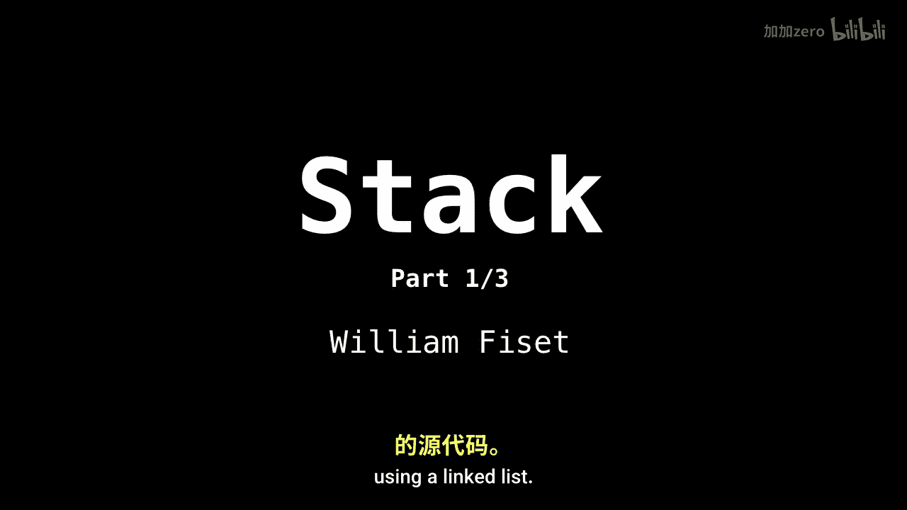
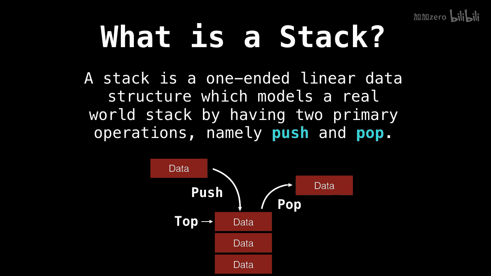

# 008：栈（Stack）入门 🥞

在本节课中，我们将要学习一种非常出色的数据结构——栈。我们将了解栈是什么、它在哪里被使用，并初步探讨其核心操作。这是关于栈的三个视频中的第一部分。

栈是一种单端线性数据结构，它通过两个主要操作——**压入（push）** 和 **弹出（pop）** ——来模拟现实世界中的堆叠行为。在栈中，元素的添加和移除总是发生在顶部，这种行为通常被称为 **后进先出（LIFO）**。

---

## 什么是栈？🤔

栈是一种单端线性数据结构，它通过两个主要操作——**压入（push）** 和 **弹出（pop）** ——来模拟现实世界中的堆叠行为。

下图展示了一个栈的示例。有一个数据成员正从栈顶被弹出，同时另一个数据成员正被添加到栈中。请注意，有一个 **顶部指针（top pointer）** 始终指向栈顶的元素。

这是因为栈中的元素总是在堆的顶部被移除和添加。这种行为通常被称为 **后进先出（LIFO，Last In First Out）**。

---

## 栈的核心操作 ⚙️

栈的核心操作非常简单，主要围绕栈顶进行。

以下是栈的两种基本操作：

1.  **压入（Push）**：将一个元素添加到栈的顶部。
    *   **公式/代码表示**：`stack.push(item)`
2.  **弹出（Pop）**：移除并返回栈顶的元素。
    *   **公式/代码表示**：`top_item = stack.pop()`

除了这两个主要操作，通常还有一个 **查看栈顶（Peek）** 操作，它只返回栈顶元素的值而不移除它。

---

## 栈的应用场景 🛠️

栈在计算机科学中有着广泛的应用。理解这些应用场景能帮助我们更好地掌握栈的概念。

以下是栈的一些常见用途：

*   **函数调用栈**：在程序执行时，用来管理函数调用和返回地址。
*   **撤销（Undo）功能**：许多编辑器将操作历史保存在栈中，以便撤销。
*   **括号匹配**：编译器使用栈来检查代码中的括号是否成对且正确嵌套。
*   **深度优先搜索（DFS）**：在图和树的遍历算法中，栈用于跟踪待访问的节点。

---

## 栈的实现与复杂度 📊

上一节我们介绍了栈的概念和应用，本节中我们来看看栈是如何实现的以及其操作的效率。

栈通常可以使用数组或链表来实现。无论采用哪种底层结构，其核心操作的时间复杂度都是常数时间。

以下是栈主要操作的时间复杂度：

*   **压入（Push）**：O(1)
*   **弹出（Pop）**：O(1)
*   **查看栈顶（Peek）**：O(1)
*   **搜索（Search）**：O(n) （因为可能需要遍历整个栈）

这意味着添加和移除元素的操作非常高效。

---

## 总结 📝

本节课中我们一起学习了栈数据结构的基础知识。我们了解到栈是一种遵循LIFO原则的线性数据结构，其核心操作是压入和弹出。我们还探讨了栈在编程中的多种实际应用，并了解了其操作具有很高的效率。

在接下来的视频中，我们将深入探讨栈的具体实现方式，并查看使用链表实现栈的源代码。