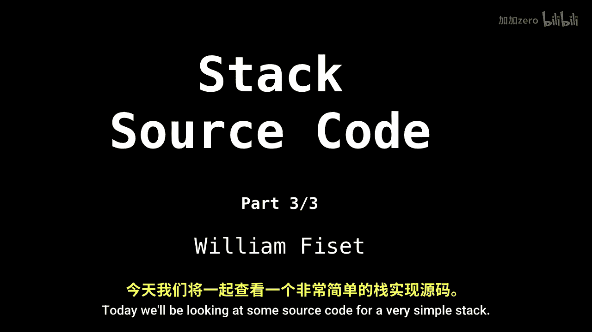
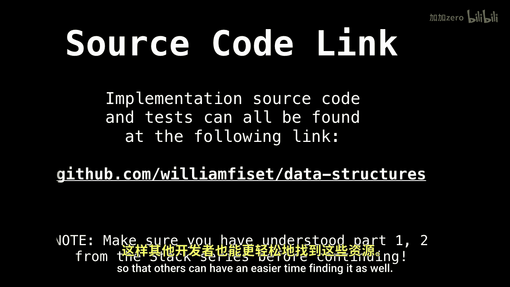
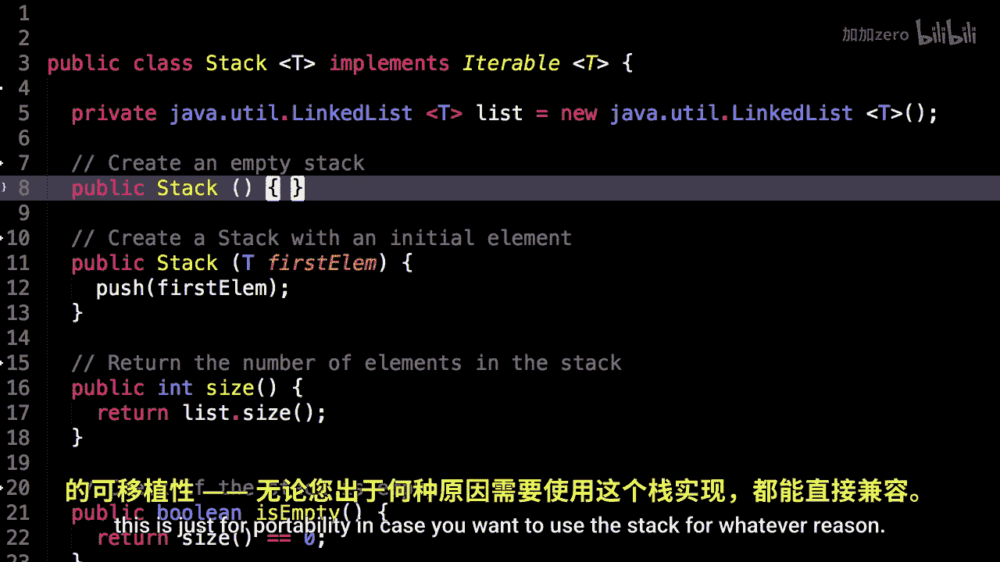
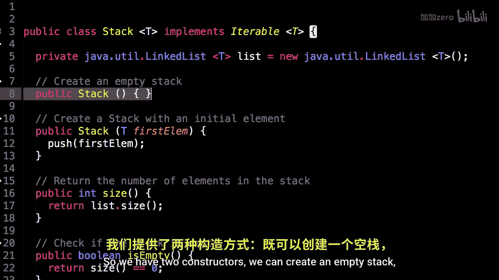
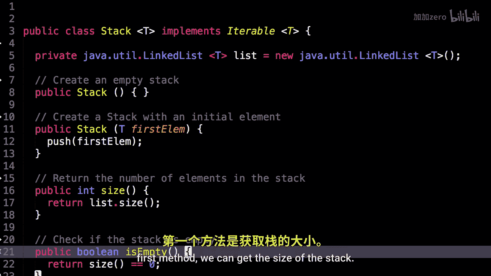

# 010：栈的代码实现 📚

在本节课中，我们将学习如何使用Java语言实现一个简单的栈数据结构。我们将基于Java内置的`LinkedList`来构建栈，并实现其核心方法，如入栈、出栈、查看栈顶元素以及获取栈的大小。

---

## 栈的实现概述



上一节我们介绍了栈的理论概念和基于链表的实现原理。本节中，我们来看看具体的代码实现。我们将创建一个名为`Stack`的类，它内部使用Java的`LinkedList`来存储数据。

以下是栈类的基本结构：

```java
import java.util.LinkedList;

public class Stack<T> {
    private LinkedList<T> list = new LinkedList<T>();

    // 构造方法和其他方法将在这里实现
}
```

## 构造方法

栈类提供了两种构造方式。一种是创建一个空栈，另一种是创建一个包含初始元素的栈。

以下是两种构造方法的实现：

```java
// 创建空栈
public Stack() {
    // 初始化一个空的链表
}

// 创建包含一个初始元素的栈
public Stack(T firstElem) {
    push(firstElem);
}
```



## 核心方法实现

现在，我们来实现栈的核心操作。这些方法包括获取栈的大小、检查栈是否为空、入栈、出栈和查看栈顶元素。

### 获取栈的大小

要获取栈中元素的数量，我们只需返回内部链表的长度。

```java
public int size() {
    return list.size();
}
```

### 检查栈是否为空

如果栈中没有元素，则栈为空。我们可以通过检查内部链表是否为空来判断。


```java
public boolean isEmpty() {
    return size() == 0;
}
```

### 入栈操作

向栈中添加一个元素。根据栈的后进先出特性，新元素应被添加到链表的头部。

```java
public void push(T elem) {
    list.addFirst(elem);
}
```

### 出栈操作

从栈中移除并返回顶部的元素。这对应于移除链表的第一个元素。

```java
public T pop() {
    if (isEmpty()) {
        throw new java.util.EmptyStackException();
    }
    return list.removeFirst();
}
```

### 查看栈顶元素


返回栈顶的元素但不移除它。这对应于获取链表的第一个元素。



```java
public T peek() {
    if (isEmpty()) {
        throw new java.util.EmptyStackException();
    }
    return list.getFirst();
}
```



## 使用示例


为了帮助理解，这里有一个简单的示例，展示如何使用我们实现的栈类。

```java
public class Main {
    public static void main(String[] args) {
        Stack<Integer> stack = new Stack<>();

        // 入栈操作
        stack.push(10);
        stack.push(20);
        stack.push(30);

        // 查看栈顶元素
        System.out.println("栈顶元素: " + stack.peek()); // 输出 30

        // 出栈操作
        System.out.println("出栈: " + stack.pop()); // 输出 30

        // 获取栈的大小
        System.out.println("栈的大小: " + stack.size()); // 输出 2
    }
}
```

## 总结



本节课中我们一起学习了如何使用Java实现一个栈数据结构。我们基于`LinkedList`构建了栈类，并实现了其核心方法：`size`、`isEmpty`、`push`、`pop`和`peek`。通过具体的代码示例，我们进一步理解了栈的后进先出特性及其基本操作。掌握栈的实现是理解更复杂数据结构和算法的重要基础。