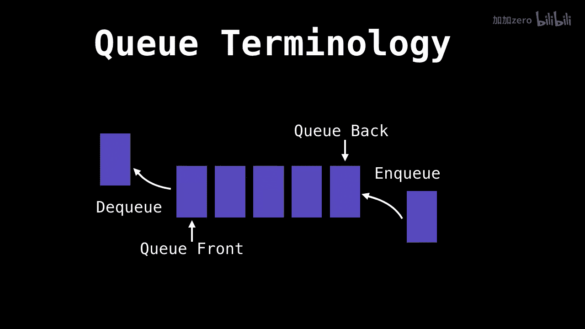
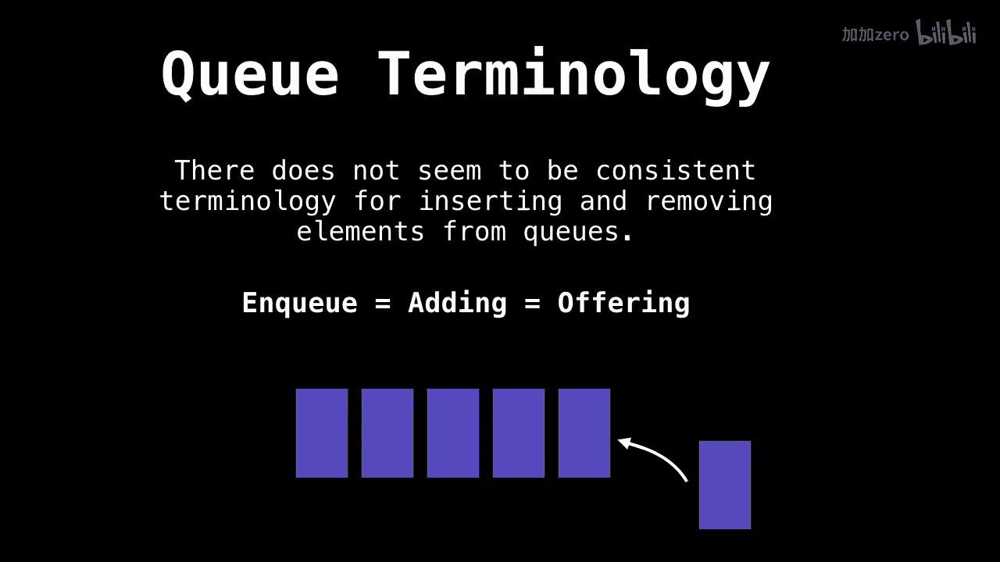
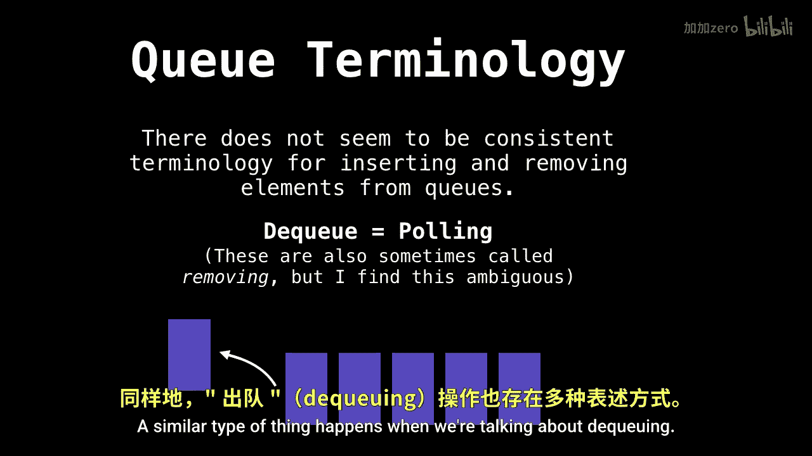

# 011：队列入门 🚶‍♂️➡️🚶‍♀️

在本节课中，我们将要学习一种在计算机科学中极为有用的数据结构——队列。这是队列系列三部分中的第一部分。

## 概述 📋

首先，我们将探讨队列是什么。接着，我们会分析队列操作的时间复杂度。然后，我们将详细讨论如何实现队列的入队和出队操作。在本系列的最后一部分，我们将提供相关的源代码示例。

## 什么是队列？ 🤔

队列是一种线性数据结构，它模拟了现实世界中的排队现象。队列主要支持两种基本操作：入队和出队。

下图展示了一个队列的示例：

## 队列的结构与操作 🔄

每个队列都有一个前端和一个后端。元素从后端插入，从前端移除。

*   将元素添加到队列后端称为 **入队**。
*   从队列前端移除元素称为 **出队**。

下图清晰地展示了这一过程：

## 关于队列的术语 📝

围绕队列的术语存在一些不一致的情况，许多人会使用不同的词语来描述相同的操作。

以下是常见的同义词：

*   **入队** 也可称为 **添加** 或 **提供**。

*   类似地，**出队** 也有其他叫法。

具体来说，当我们从队列前端移除元素时，这个过程就是出队。

## 总结 🎯

本节课我们一起学习了队列的基本概念。我们了解到队列是一种“先进先出”的线性数据结构，包含前端和后端，核心操作是入队和出队。同时，我们也注意到描述这些操作的术语存在多种表达方式。

在接下来的课程中，我们将深入分析这些操作的时间复杂度，并开始探讨如何具体实现一个队列。