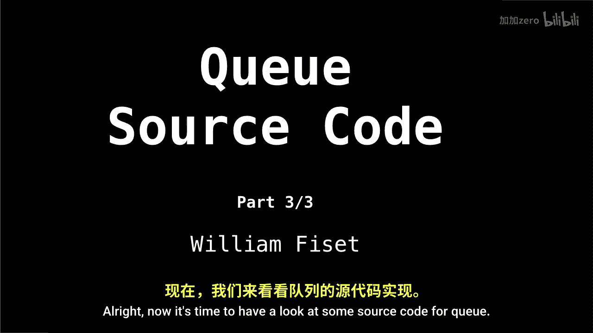
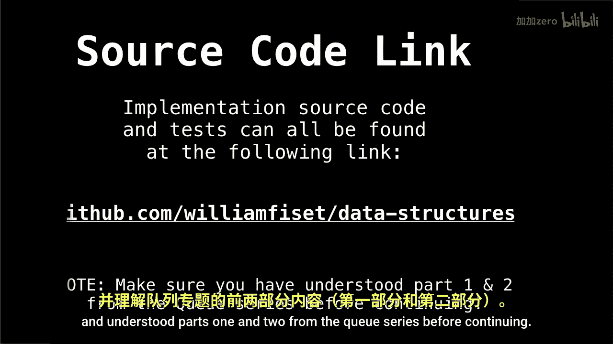
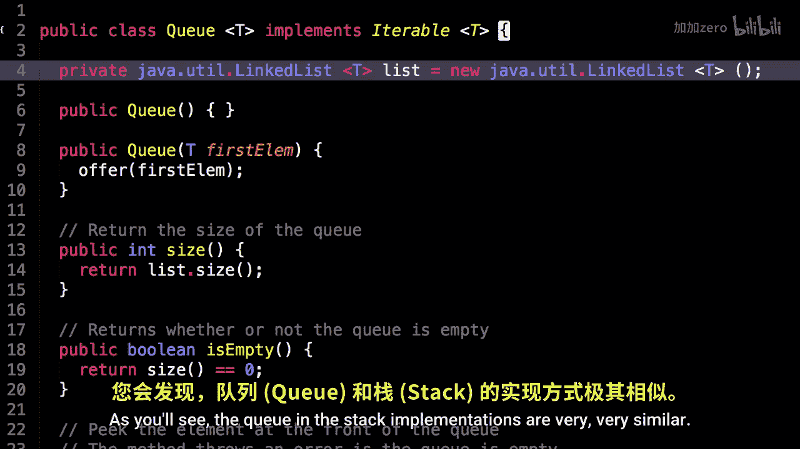
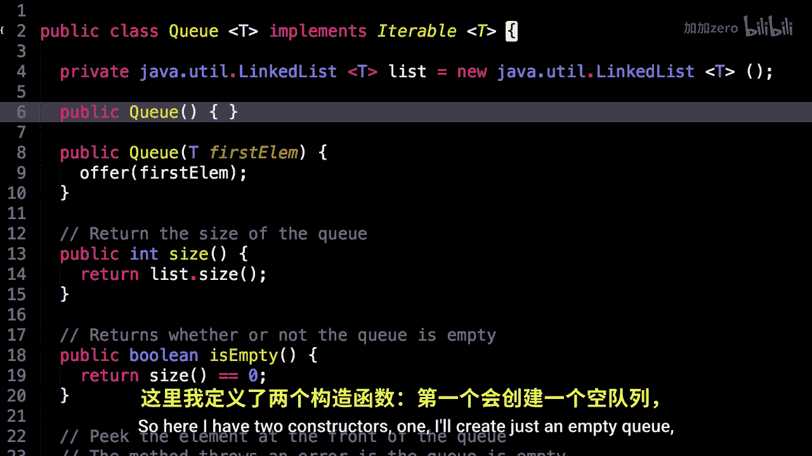

# 013：队列代码实现 🧱

在本节课中，我们将学习如何用代码实现一个队列数据结构。我们将基于Java语言，使用双向链表作为底层存储结构来构建一个队列。通过分析核心方法的实现，你将理解队列“先进先出”原则在代码层面的具体体现。



---

上一节我们介绍了队列的理论概念，本节中我们来看看如何用代码实现它。

首先，我们定义队列类并声明其核心数据结构。这里使用Java内置的`LinkedList`作为底层存储，它是一个双向链表。

```java
public class Queue<T> {
    private LinkedList<T> list = new LinkedList<T>();
}
```



接下来，我们为队列类创建构造函数。以下是两种初始化队列的方式。

*   一个默认构造函数，用于创建一个空队列。
*   一个带参数的构造函数，允许在创建队列时传入第一个元素。

```java
// 构造函数1：创建空队列
public Queue() { }

// 构造函数2：创建包含第一个元素的队列
public Queue(T firstElem) {
    offer(firstElem);
}
```


---

上一部分我们完成了队列的初始化，现在我们来添加一些基础方法。

获取队列大小和检查队列是否为空是两个基础操作。它们的实现非常直接，直接委托给底层的链表。

```java
// 返回队列中的元素数量
public int size() {
    return list.size();
}

// 检查队列是否为空
public boolean isEmpty() {
    return size() == 0;
}
```



---



了解了基础状态查询后，我们进入队列的核心操作部分。

`peek`方法用于查看队列前端的元素（即下一个要出队的元素），但不会将其从队列中移除。

```java
// 查看队首元素（不移除）
public T peek() {
    if (isEmpty()) {
        throw new RuntimeException("Queue Empty");
    }
    return list.peekFirst();
}
```


---

查看元素之后，我们自然需要实现元素的入队和出队操作。


以下是队列的两个核心修改操作：`offer`（入队）和`poll`（出队）。

*   `offer`方法将一个新元素添加到队列的末尾。
*   `poll`方法移除并返回队列前端的元素。

```java
// 入队：将元素添加到队尾
public void offer(T elem) {
    list.addLast(elem);
}

// 出队：移除并返回队首元素
public T poll() {
    if (isEmpty()) {
        throw new RuntimeException("Queue Empty");
    }
    return list.removeFirst();
}
```


---

本节课中我们一起学习了如何使用双向链表在Java中实现一个完整的队列数据结构。我们涵盖了从类定义、构造函数，到核心方法`peek`、`offer`和`poll`的实现。这个实现清晰地展示了队列“先进先出”的访问顺序，即所有元素从尾部加入，从头部离开。理解这个基础实现是进一步学习更复杂队列变体（如循环队列、优先队列）的重要基石。