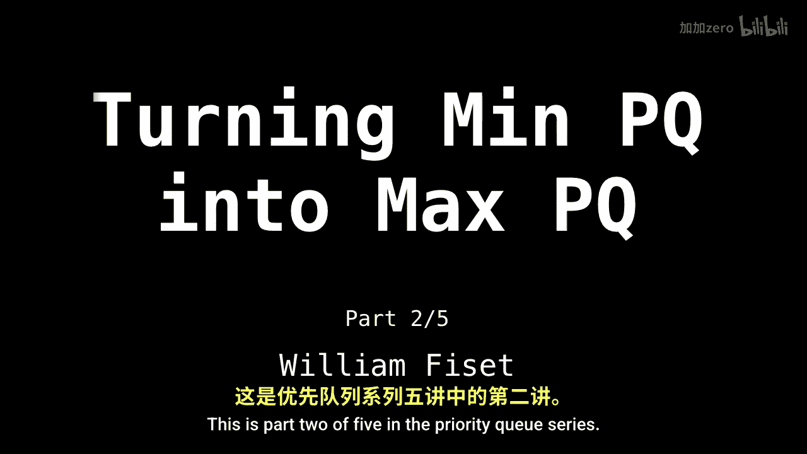
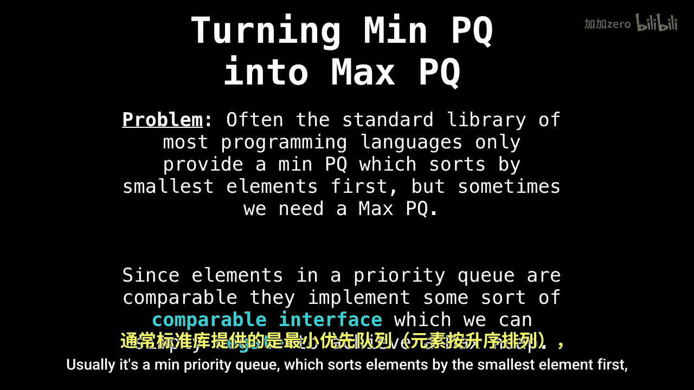
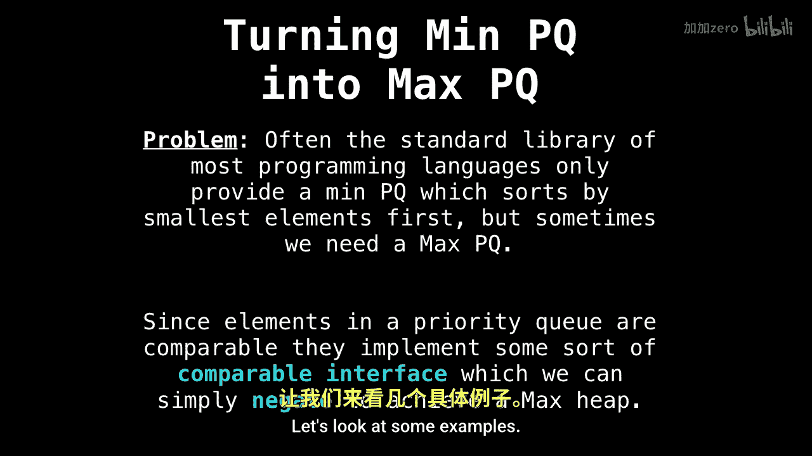

# 015：最小堆与最大堆的转换 🔄

在本节课中，我们将学习如何将一个最小优先队列转换为一个最大优先队列。这是一个非常实用的技巧，因为许多编程语言的标准库通常只提供一种类型的优先队列（通常是基于最小堆的最小优先队列）。理解这种转换机制，能让你在需要相反排序逻辑时，灵活运用现有的数据结构。



## 为什么需要转换？🤔

你可能会问，为什么需要知道如何转换优先队列的类型？问题在于，大多数编程语言的标准库通常只提供最小优先队列或最大优先队列中的一种，最常见的是最小优先队列。最小优先队列会优先处理最小的元素。

然而，根据编程任务的不同，我们有时需要的是最大优先队列，即优先处理最大的元素。

## 转换的核心思想 💡


那么，我们如何进行这种转换呢？如何将一种类型的优先队列转变为另一种类型？我们可以利用一个技巧：滥用优先队列中所有元素都必须实现某种可比较接口这一事实。




通过简单地取反或反转比较逻辑，我们就可以得到另一种类型的堆。让我们来看一些例子。

## 通过取反比较逻辑实现转换 🔧

假设我们有一个最小优先队列，其中的元素如屏幕右侧所示。如果 `x` 和 `y` 是优先队列中的数字，并且 `x <= y`，那么在最小优先队列中，`x` 会先于 `y` 被取出。

这个逻辑的取反是 `x >= y`。在这种情况下，`y` 会先于 `x` 被取出，因为所有元素仍然在优先队列中，但排序逻辑被反转了。



以下是实现这种转换的几种方法：

1.  **数值取反法**：如果优先队列存储的是数值，可以在插入元素时将其取反（乘以-1）。这样，最小堆在处理取反后的值时，实际上会表现得像最大堆。
    ```python
    # 示例：将数值取反后插入最小堆，以实现最大堆行为
    min_heap.push(-value)  # 插入时取反
    max_value = -min_heap.pop()  # 取出后再取反回来
    ```

2.  **自定义比较器/比较函数**：许多优先队列实现允许传入自定义的比较函数。要获得最大堆，只需提供一个反转默认顺序的比较逻辑。
    ```java
    // Java示例：使用自定义比较器创建最大优先队列
    PriorityQueue<Integer> maxHeap = new PriorityQueue<>(Collections.reverseOrder());
    ```

3.  **包装对象法**：创建一个包装类，在类的 `compareTo` 方法（或等效方法）中实现相反的比较逻辑。
    ```python
    class ReverseComparable:
        def __init__(self, value):
            self.value = value
        def __lt__(self, other):
            # 反转小于号的定义，使最小堆表现为最大堆
            return self.value > other.value
    ```


## 总结 📝

本节课我们一起学习了将最小优先队列转换为最大优先队列的核心技巧。关键在于理解并操作元素的比较逻辑：通过对数值取反、使用自定义比较器或包装对象来反转排序顺序，我们可以让一个最小堆表现出最大堆的行为，反之亦然。掌握这一方法能极大地提高你使用标准库数据结构的灵活性。