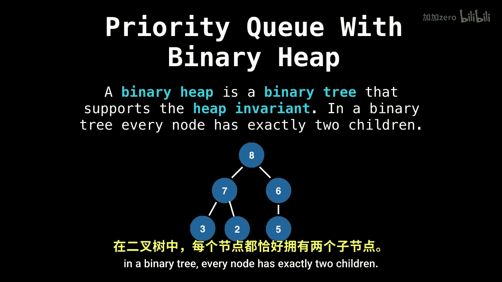

数据结构与算法：P16：优先队列插入元素

在本节课中，我们将学习如何向二叉堆中添加元素。这是优先队列系列五部分中的第三部分。我们将首先介绍一些重要的术语和概念，以便有效地向优先队列中添加元素。

---

上一节我们介绍了优先队列的基本概念，本节中我们来看看其核心实现结构——堆。

一种非常流行的实现优先队列的方法是使用某种堆。这是因为堆这种数据结构，能为我们执行优先队列所需操作提供最佳可能的时间复杂度。

然而，需要明确的是：**优先队列不是堆**。优先队列是一种抽象数据类型，它定义了优先队列应有的行为。而堆只是让我们实际实现该行为的一种方式。例如，我们也可以使用无序列表来实现优先队列所需的行为，但这无法提供最佳的时间复杂度。

---

了解了优先队列与堆的关系后，我们来具体看看堆的类型。

关于堆，存在许多不同的类型，包括二叉堆、斐波那契堆、二项堆、配对堆等等。为了简化，本教程将仅使用**二叉堆**。

---

上一节我们提到了二叉堆，现在我们来明确其定义。

一个二叉堆是一个支持堆性质的二叉树。在二叉树中，每个节点恰好有两个子节点。下图展示了一个二叉树的例子。

---

本节课中，我们一起学习了优先队列与堆的关系，明确了优先队列是抽象数据类型而堆是其一种高效实现。我们还介绍了二叉堆作为本系列重点使用的具体堆类型，并给出了其基本定义。下一节我们将深入探讨堆的性质及其维护方法。