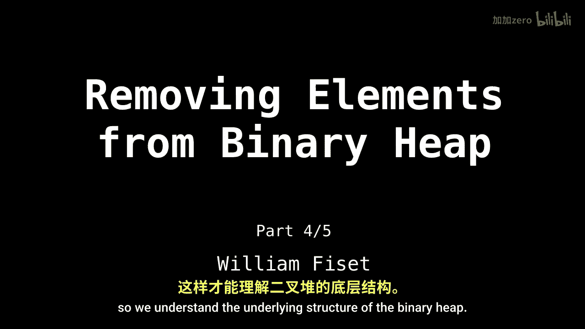
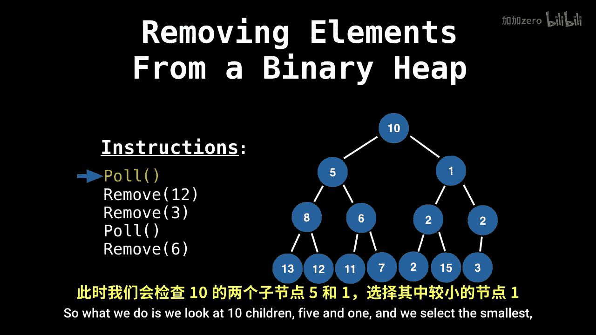

# 017：优先队列移除元素

在本节课中，我们将学习如何从二叉堆中移除元素。这是优先队列系列的第45部分。请确保您已观看上一视频，以理解二叉堆的基本结构。

## 概述

在二叉堆中，移除操作通常针对根节点进行，因为根节点存储了最高优先级（最小或最大）的元素。移除根节点的过程称为“轮询”。由于在数组实现中，根节点始终位于索引0处，因此我们无需搜索其位置。

## 移除根节点的步骤



上一节我们介绍了二叉堆的结构，本节中我们来看看移除根节点的具体过程。以下是移除根节点的标准步骤：

1.  **交换根节点与末尾节点**：将堆数组中的最后一个元素与根节点（索引0处的元素）进行交换。
2.  **移除末尾节点**：移除并返回（或丢弃）现在位于数组末尾的原根节点元素。
3.  **下沉新根节点**：由于新放置在根节点的元素可能破坏了堆的性质（堆序性），需要将其“下沉”到正确位置。

## 下沉（Bubbling Down）过程

交换并移除元素后，堆的性质可能被破坏。此时，我们需要通过“下沉”操作来恢复堆序性。这与插入元素时的“上浮”操作相对应。

下沉操作的核心是比较新根节点与其子节点，并根据堆的类型（最小堆或最大堆）决定交换方向。

以下是下沉操作的具体步骤：

1.  从当前节点（初始为根节点）开始。
2.  比较当前节点与其左右子节点的值。
    *   对于**最小堆**，找出值**最小**的子节点。
    *   对于**最大堆**，找出值**最大**的子节点。
3.  如果当前节点的值违反了堆序性（例如在最小堆中，当前节点值大于最小子节点值），则将其与该子节点交换。
4.  将当前节点指针移动到交换后的子节点位置。
5.  重复步骤2-4，直到当前节点不再违反堆序性，或者到达了叶子节点（没有子节点）。

让我们通过一个最小堆的例子来可视化这个过程。初始时，我们移除了根节点（值为2），并将末尾节点（值为10）交换到根位置。


现在，根节点10破坏了最小堆的性质（父节点应小于子节点）。我们开始下沉操作：
*   比较根节点10的两个子节点5和1。
*   选择值更小的子节点1。
*   将根节点10与子节点1交换。



交换后，节点10位于新的位置。我们继续检查其子节点3和4。由于10大于3，需要再次交换。这个过程持续进行，直到节点10到达一个满足堆性质的位置，或者成为叶子节点。

## 代码实现要点

在代码中实现“轮询”操作时，关键步骤可以概括如下：

```python
def poll(self):
    if self.size == 0:
        return None
    # 1. 保存根节点的值用于返回
    root_value = self.heap[0]
    # 2. 将末尾元素移动到根节点
    self.heap[0] = self.heap[self.size - 1]
    self.size -= 1
    # 3. 执行下沉操作
    self.sink(0)
    return root_value

def sink(self, index):
    while self.has_left_child(index):
        # 找出更小的子节点（对于最小堆）
        smaller_child_index = self.get_left_child_index(index)
        if (self.has_right_child(index) and
            self.heap[self.get_right_child_index(index)] < self.heap[smaller_child_index]):
            smaller_child_index = self.get_right_child_index(index)
        # 如果当前节点已经小于等于最小子节点，停止下沉
        if self.heap[index] <= self.heap[smaller_child_index]:
            break
        # 否则交换并继续
        self.swap(index, smaller_child_index)
        index = smaller_child_index
```

## 总结


本节课中我们一起学习了从二叉堆（优先队列）中移除最高优先级元素的方法。核心操作是“轮询”，它通过**交换根节点与末尾节点 -> 移除原根节点 -> 下沉新根节点**这三步来完成。下沉操作通过不断将节点与其最优先的子节点交换，直到堆序性恢复，从而保证了堆结构的正确性。理解这个过程对于掌握优先队列的内部机制至关重要。