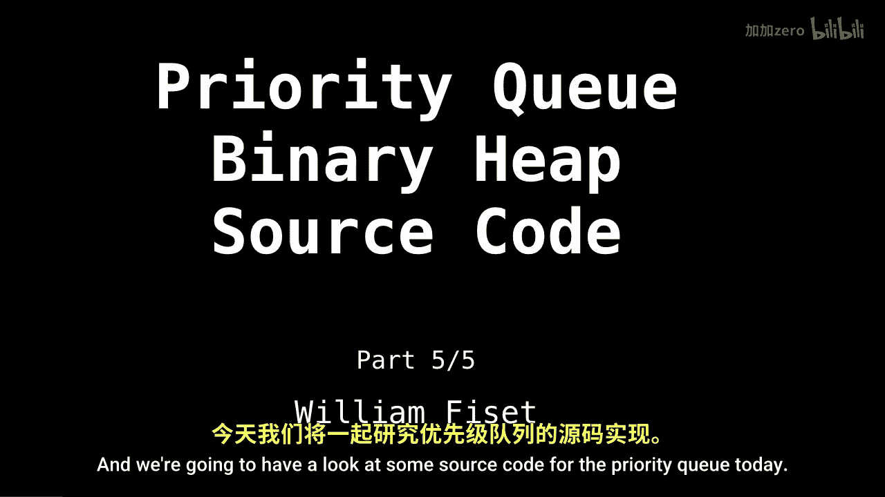
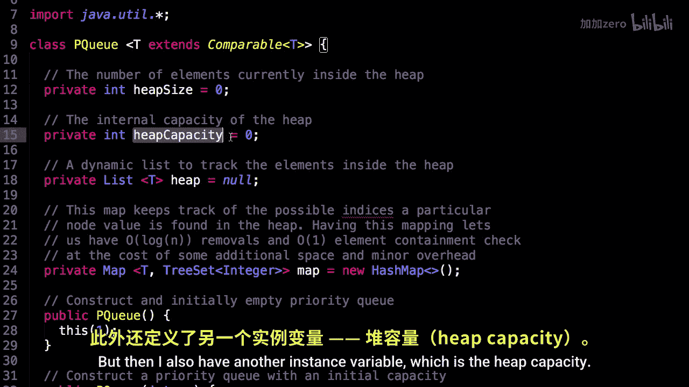
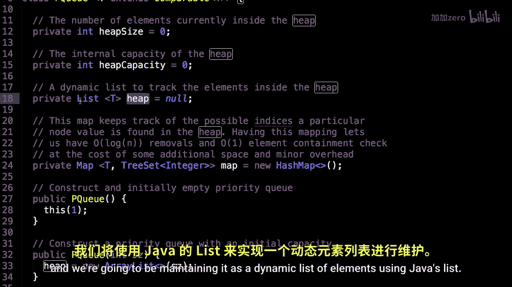

# 018：优先队列代码实现 🧱



在本节课中，我们将学习如何用代码实现一个优先队列。我们将基于之前讨论的堆数据结构，构建一个支持插入、删除和查看最高优先级元素的操作。课程将涵盖类的结构、核心方法以及内部使用的映射表。


---

上一节我们介绍了优先队列的理论基础，本节中我们来看看具体的代码实现。

首先，我们定义优先队列类。它使用泛型 `T`，并要求 `T` 必须实现 `Comparable` 接口，以确保元素可以相互比较。这允许我们存储诸如字符串、整数等可比较对象。


```java
public class PriorityQueue <T extends Comparable<T>> {
    // 类的主体
}
```



以下是类的实例变量：


*   `heapSize`：表示堆中当前实际存储的元素数量。
*   `heapCapacity`：表示底层动态列表（`heap`）的总容量，它可能大于 `heapSize`。
*   `heap`：一个用于存储堆元素的动态列表，在Java中使用 `List<T>` 实现。
*   `map`：一个映射表（例如 `TreeMap`），用于高效跟踪每个元素在堆中的位置，这对于实现对数时间复杂度的删除操作至关重要。




---


本节课中我们一起学习了优先队列类的基本框架。我们明确了类需要使用泛型和 `Comparable` 接口来保证元素可比性，并介绍了四个核心实例变量：`heapSize`、`heapCapacity`、存储元素的 `heap` 列表以及用于优化操作的 `map` 映射表。在接下来的章节中，我们将深入探讨这些变量如何协同工作，以及具体方法的实现逻辑。