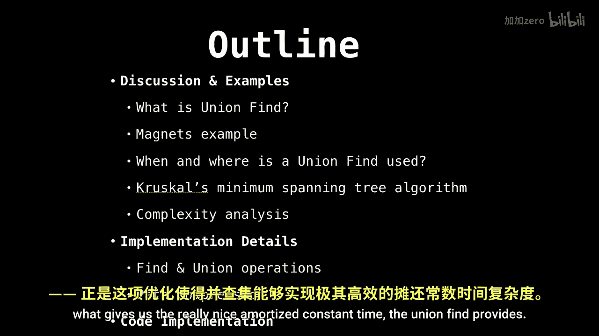
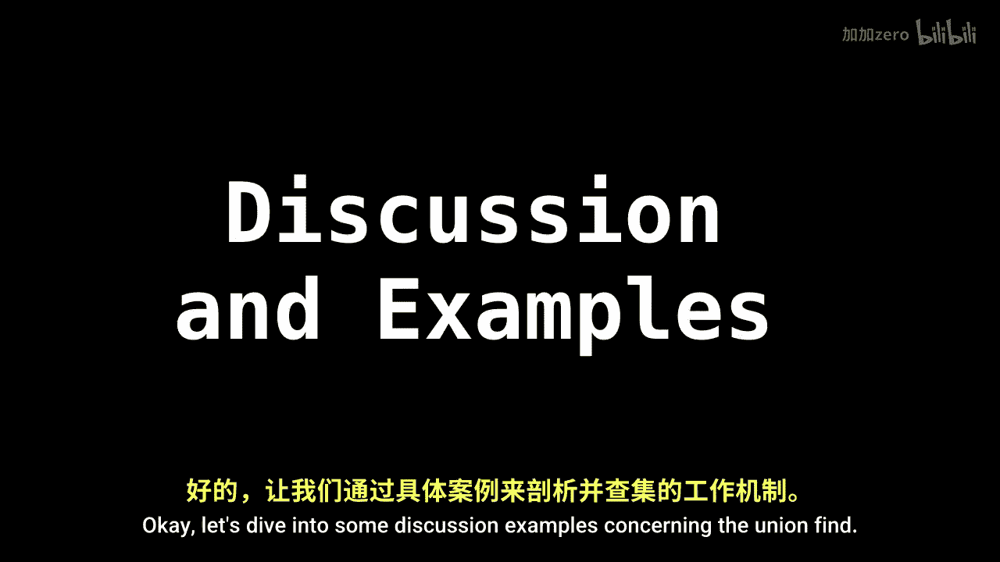

# 019：并查集入门 🧲

在本节课中，我们将要学习一种名为“并查集”的数据结构。并查集有时也被称为“不相交集合”。这是一种用于跟踪被分割成一个或多个互不相交集合的元素的数据结构。它有两个核心操作：`find`（查找）和 `union`（合并）。我们将通过生动的例子来理解它的工作原理和应用场景。

## 课程大纲 📋

以下是本节课我们将要涵盖的内容概览：

首先，我们将通过一个关于磁铁的生动例子，来说明并查集的实际用途。

接着，我们会探讨一个经典的使用并查集的算法——克鲁斯卡尔最小生成树算法。这个算法非常优雅，你将看到为什么它需要并查集来实现其高效的复杂度。

然后，我们将深入探讨并查集的两个核心操作：`find` 和 `union`。

最后，我们将了解“路径压缩”技术，正是这项技术赋予了并查集极佳的摊还常数时间复杂度。

## 什么是并查集？ 🤔

并查集是一种数据结构，它跟踪被分割成一个或多个**互不相交集合**的元素。它有两个主要操作：

*   **`find`（查找）**：给定一个元素，并查集会告诉你这个元素属于哪个组。
*   **`union`（合并）**：将两个组合并在一起。

## 一个生动的例子：磁铁 🧲

为了更直观地理解，让我们来看一个关于磁铁的例子。

假设我们有一些磁铁，它们可以相互吸引或排斥。我们可以用并查集来管理哪些磁铁是连接在一起的（即属于同一个组）。

通过这个例子，我们可以清晰地看到 `find` 操作如何确定某块磁铁属于哪个连接组，而 `union` 操作如何将两个独立的连接组合并成一个更大的组。

---

在本节课中，我们一起学习了并查集数据结构的基本概念。我们了解了它的两个核心操作 `find` 和 `union`，并通过磁铁的例子看到了它的直观应用。在接下来的章节中，我们将深入探讨这些操作的具体实现以及它们如何应用于像克鲁斯卡尔算法这样的经典问题中。