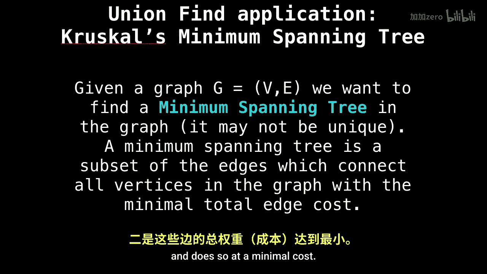
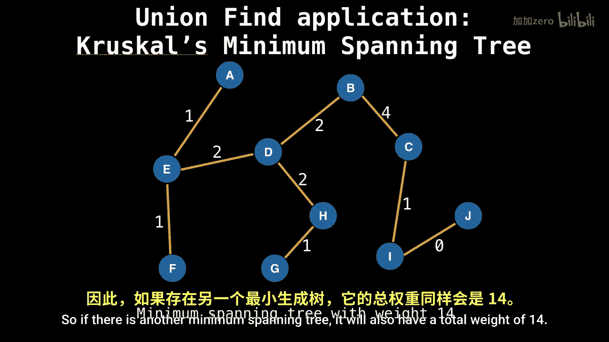
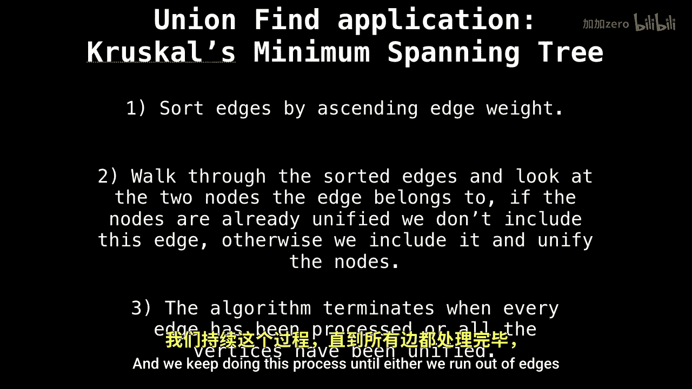

# 020：克鲁斯卡尔算法与并查集应用

在本节课中，我们将学习并查集的一个非常实用的应用场景：**克鲁斯卡尔最小生成树算法**。我们将了解什么是最小生成树，并详细拆解克鲁斯卡尔算法的工作原理和实现步骤。

## 什么是最小生成树？🌲

你可能会问，什么是最小生成树？假设我们有一个包含若干顶点和边的图，最小生成树是图中边的一个子集。这个子集需要连接图中所有的顶点，并且所有边的总权重（或成本）达到最小。

例如，如果这是我们的图，那么一个可能的最小生成树如下所示，其总边权重为14。需要注意的是，最小生成树不一定是唯一的。如果存在另一个最小生成树，它的总权重也同样是14。

## 克鲁斯卡尔算法如何工作？⚙️

了解了最小生成树的定义后，我们来看看克鲁斯卡尔算法是如何构建它的。该算法可以分解为三个核心步骤。

以下是算法的具体步骤：

1.  **排序边**：首先，取出图中所有的边，并按照边的权重进行**升序排序**。
2.  **遍历与检查**：接着，遍历排序后的边列表。对于每一条边，检查该边连接的两个顶点。
3.  **合并或忽略**：使用并查集来判断这两个顶点当前是否属于同一个连通分量（即同一组）。
    *   如果它们**已经属于同一组**，则忽略这条边，因为加入它会**在生成树中形成环**，而最小生成树要求是无环的。
    *   如果它们**属于不同的组**，则使用并查集的 `union` 操作将这两个组合并，并将这条边加入到最小生成树的边集合中。
4.  **终止条件**：重复步骤2和3，直到我们遍历完所有边，或者所有顶点都已经被合并到同一个连通分量中（即最小生成树已包含 `V-1` 条边，`V` 为顶点数）。

## 总结📚

本节课中，我们一起学习了并查集的一个重要应用——克鲁斯卡尔算法。我们首先定义了**最小生成树**是连接图中所有顶点且总权重最小的边子集。然后，我们详细剖析了克鲁斯卡尔算法的三个步骤：**对边按权重排序**、**遍历边并检查顶点连通性**、以及**使用并查集合并不同分量的顶点**。该算法高效地避免了环路的产生，从而构建出最小生成树。理解并查集在此过程中的核心作用，是掌握该算法的关键。