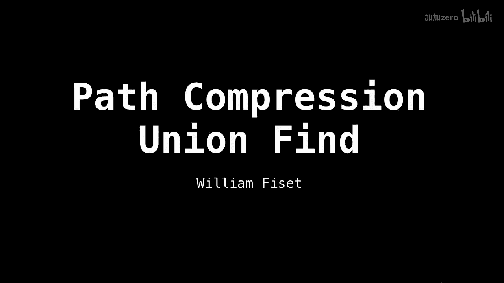
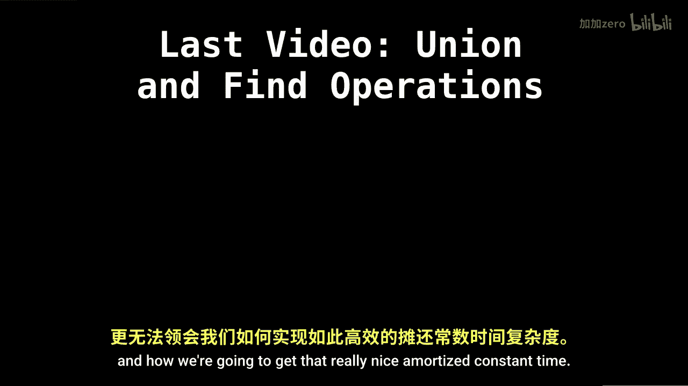
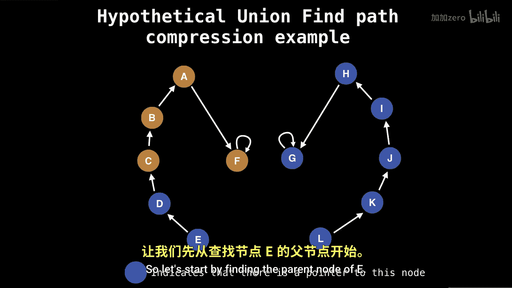

# 022：并查集路径压缩 🚀

在本节课中，我们将要学习并查集数据结构中一个极其重要的优化技术——路径压缩。这项操作是并查集能够实现高效性能的关键所在。

上一节我们介绍了并查集的基本查找与合并操作。本节中我们来看看如何通过路径压缩来大幅提升查找操作的效率。

## 路径压缩的核心思想



路径压缩的目标是在执行查找操作时，**扁平化树的结构**，使得后续的查找操作更加快速。其核心思想是：在查找某个节点的根节点过程中，**将沿途访问的所有节点直接指向最终的根节点**。

以下是路径压缩在查找操作中的具体实现方式：

*   **递归实现**：在递归回溯时，将每个节点的父指针指向根节点。
    ```python
    def find(x):
        if parent[x] != x:
            parent[x] = find(parent[x]) # 递归查找并压缩路径
        return parent[x]
    ```
*   **迭代实现（两步法）**：先找到根节点，然后再遍历一次路径，将所有节点的父指针指向根节点。

## 路径压缩操作示例



让我们通过一个具体的例子来理解路径压缩是如何工作的。假设我们有以下一个深度较大的并查集结构（尽管在实际应用中，经过路径压缩后很难出现这样的结构，但它是一个很好的教学示例）。


现在，假设我们要合并节点 **E** 和节点 **L**（或者说合并橙色和蓝色两个组）。我们会对 **E** 和 **L** 调用合并操作。

合并操作的第一步是找到它们各自的根节点。查找 **E** 的根节点过程如下：

1.  **E** 的父节点是 **D**。
2.  **D** 的父节点是 **C**。



在没有路径压缩的普通查找中，我们只是简单地向上遍历直到根节点。但在路径压缩中，我们会在找到根节点后，**将沿途经过的所有节点（如 E 和 D）的父指针直接指向根节点 C**。

这样，当下次再查找 **E** 或 **D** 时，就可以在常数时间内直接找到根节点 **C**，而不需要再遍历中间节点。这个“压缩”过程极大地减少了树的深度，为后续操作带来了近乎常数时间的摊还复杂度。

> **重要提示**：为了充分理解路径压缩的原理和效果，确保你已经观看了上一个讲解并查集基本查找与合并操作的视频。否则，你可能难以理解路径压缩是如何运作并带来卓越效率的。

## 为何路径压缩如此强大

路径压缩之所以强大，是因为它主动地、持续地优化数据结构本身。每次查找操作不仅完成了任务，还顺便修复了树的形态，使得整个集合的表示越来越扁平。这种“自我优化”的特性，结合按秩合并，使得并查集操作的摊还时间复杂度接近常数级 **O(α(n))**，其中 **α(n)** 是增长极其缓慢的反阿克曼函数。


本节课中我们一起学习了并查集的路径压缩优化。我们了解了它的核心思想是在查找根节点的过程中，将路径上的所有节点直接链接到根节点，从而大幅降低树高。我们还通过示例观察了其工作过程，并理解了它是实现并查集超高效率的关键技术之一。掌握路径压缩，你就能真正领略并查集这一数据结构的精妙与强大。