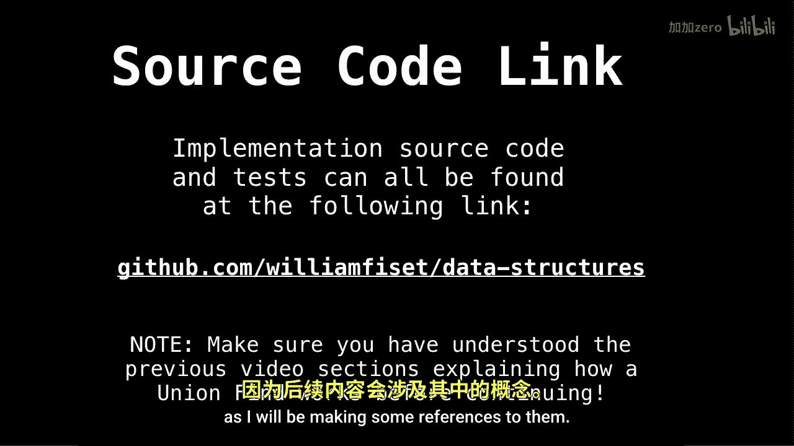
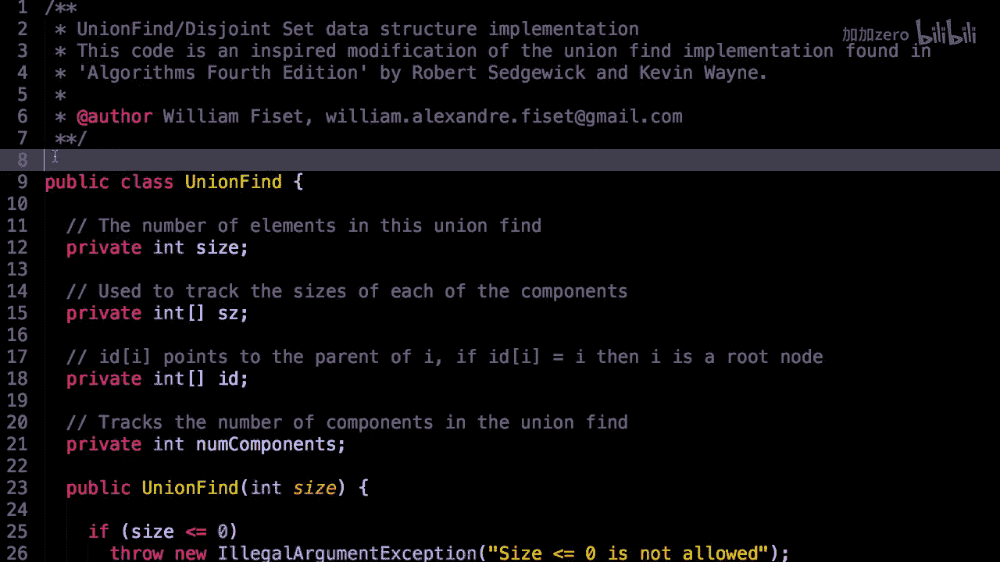
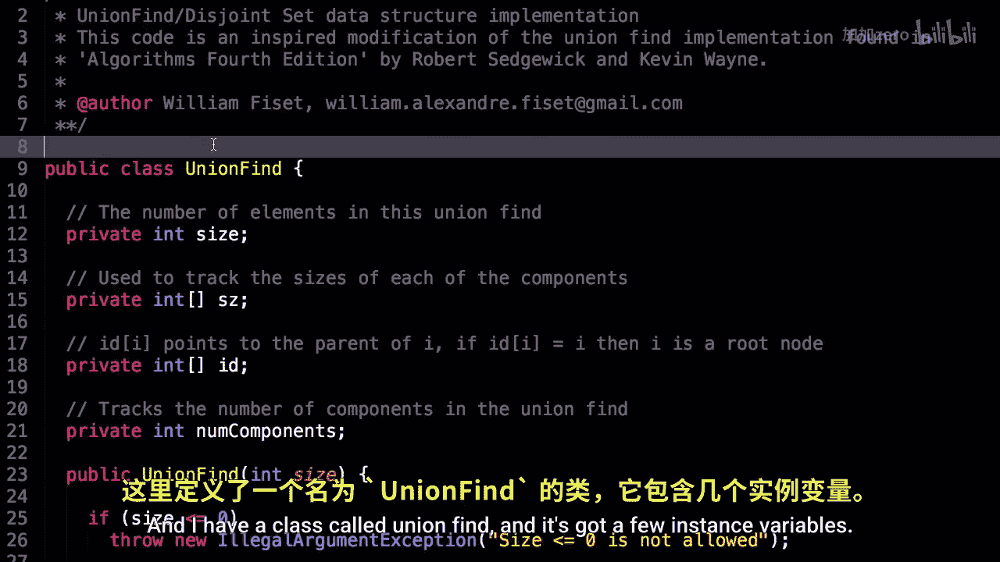
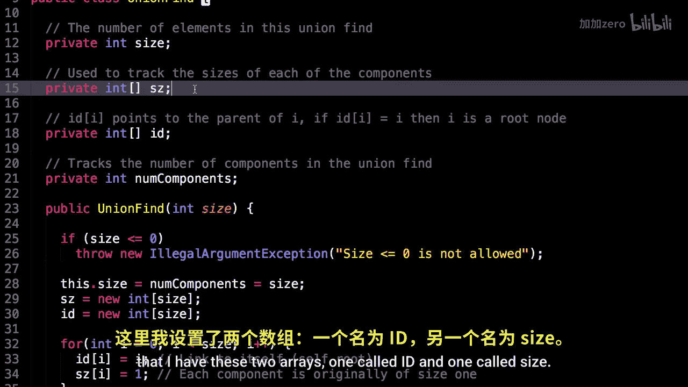
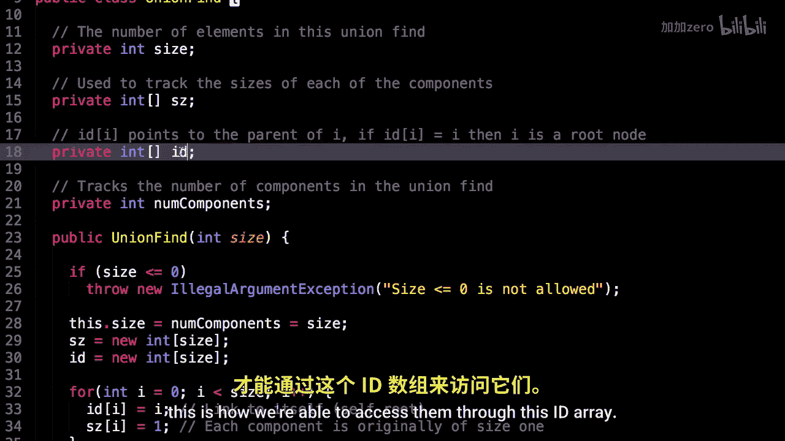

# 023：并查集代码实现 🔧

在本节课中，我们将学习并查集（Union Find）数据结构的具体代码实现。我们将详细解析其核心类结构、实例变量以及关键方法，确保你能理解每一行代码的含义和作用。

## 概述


并查集是一种用于处理不相交集合合并与查询问题的数据结构。本节我们将深入其源代码，了解如何用数组高效地表示树形结构，并实现查找与合并操作。

---

## 类结构与实例变量

首先，我们来看并查集类的整体结构及其包含的实例变量。

```java
public class UnionFind {
    private int size;
    private int[] id;
    private int[] sz;
    private int numComponents;
}
```

以下是各个变量的详细说明：

*   **`size`**： 这个变量表示并查集中元素的总数量。
*   **`id[]` 与 `sz[]`**： 这是两个核心数组。`id` 数组尤为重要，`id[i]` 的值表示索引 `i` 所对应元素的父节点索引。如果 `id[i] == i` 成立，则表明元素 `i` 是一个根节点。我们正是通过这个数组，在内部以树形结构来组织所有元素，这种方法非常高效实用。同时，由于我们在元素和数字索引之间建立了一一映射关系，才能通过这个 `id` 数组来访问它们。
*   **`numComponents`**： 这个变量是为了方便而记录的，它表示当前并查集中连通分量的数量。



---

## 构造函数

上一节我们介绍了并查集的核心变量，本节我们来看看如何初始化这些变量。



```java
public UnionFind(int size) {
    if (size <= 0) throw new IllegalArgumentException("Size must be positive.");
    this.size = numComponents = size;
    id = new int[size];
    sz = new int[size];

    for (int i = 0; i < size; i++) {
        id[i] = i; // 每个元素初始时都是自己的根
        sz[i] = 1; // 每个集合的初始大小是1
    }
}
```

构造函数接收一个 `size` 参数来设定并查集的大小。它主要完成以下工作：
1.  参数校验，确保大小为正数。
2.  初始化 `size` 和 `numComponents`。
3.  为 `id` 和 `sz` 数组分配空间。
4.  通过循环，将每个元素的父节点设为自己（形成独立的集合），并将每个集合的大小初始化为1。

---



## 核心方法：查找


在初始化之后，我们需要能够查找一个元素属于哪个集合。这就是 `find` 方法的作用。

```java
public int find(int p) {
    int root = p;
    // 找到根节点
    while (root != id[root]) {
        root = id[root];
    }
    // 路径压缩：将查找路径上的所有节点直接指向根
    while (p != root) {
        int next = id[p];
        id[p] = root;
        p = next;
    }
    return root;
}
```


`find` 方法接收一个元素索引 `p`，返回其所在集合的根节点索引。它包含两个关键步骤：
1.  **向上追溯**： 通过 `while` 循环，沿着父指针不断向上，直到找到根节点（满足 `id[root] == root`）。
2.  **路径压缩**： 在找到根节点后，再次遍历从 `p` 到根节点的路径，将路径上所有节点的父指针直接指向根节点。这能显著降低后续查询的耗时。

---

## 核心方法：合并与连通性检查



查找操作让我们能确定元素所属的集合，而合并操作则能将两个集合连接起来。

```java
public void union(int p, int q) {
    int root1 = find(p);
    int root2 = find(q);

    if (root1 == root2) return; // 已经在同一集合中

    // 将较小的树合并到较大的树下（按大小加权）
    if (sz[root1] < sz[root2]) {
        sz[root2] += sz[root1];
        id[root1] = root2;
    } else {
        sz[root1] += sz[root2];
        id[root2] = root1;
    }
    numComponents--; // 合并后，连通分量总数减1
}

public boolean connected(int p, int q) {
    return find(p) == find(q);
}
```

以下是这两个方法的说明：

*   **`union(int p, int q)`**： 该方法用于合并元素 `p` 和 `q` 所在的集合。它首先找到各自的根节点 `root1` 和 `root2`。如果根节点相同，则无需操作。否则，它会比较两个根节点对应集合的大小（`sz` 数组），**总是将较小的树连接到较大的树的根节点上**。这种“按大小加权”的策略有助于保持树的平衡。最后，连通分量计数 `numComponents` 减1。
*   **`connected(int p, int q)`**： 该方法通过比较 `p` 和 `q` 的根节点是否相同，来判断两个元素是否连通（属于同一集合）。

---

## 辅助方法

除了核心操作，类中还提供了一些有用的辅助方法，用于获取当前状态。

```java
public int componentSize(int p) {
    return sz[find(p)];
}

public int size() {
    return size;
}

public int components() {
    return numComponents;
}
```



这些方法功能如下：
*   `componentSize(int p)`： 返回元素 `p` 所在连通分量（集合）的大小。
*   `size()`： 返回并查集中的元素总数。
*   `components()`： 返回当前的连通分量总数。

---


## 总结

本节课中，我们一起学习了并查集数据结构的完整代码实现。我们从类变量开始，理解了如何用 `id` 和 `sz` 数组表示森林与集合大小。接着，我们逐步分析了构造函数、核心的 `find`（包含路径压缩）、`union`（按大小加权合并）以及 `connected` 方法。最后，我们了解了一些获取状态的辅助方法。掌握这份代码，你就具备了实现高效并查集的基础。